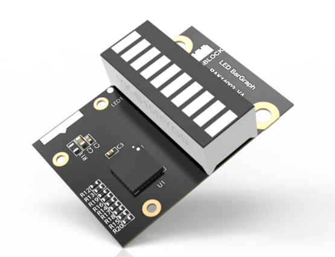
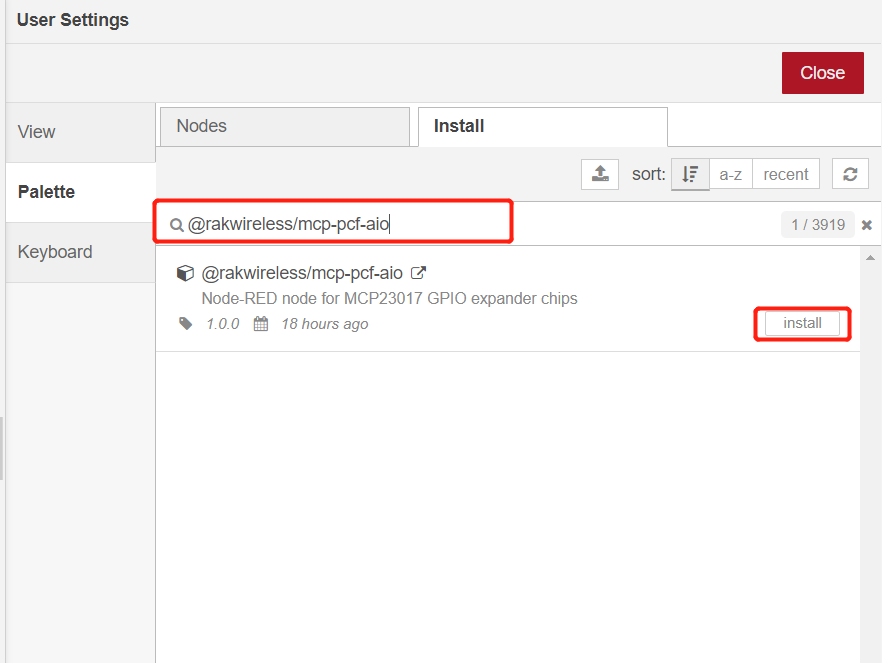

# Control LED using RAK14003 WisBlock LED Bar Graph Module from Node-RED 

[TOC]

## 1 Introduction

This guide explains how to use the [RAK14003 WisBlock LED Bar Graph Module](https://docs.rakwireless.com/Product-Categories/WisBlock/RAK14003/Overview/) in combination with RAK6421 Pi Hat  to control LED using Node-RED.  

### 1.1 RAK14003

 RAK14003 is an LED Bar Graph that is part of WisBlock Display modules. It consists of 10 configurable LEDs (5 green color LEDs, 3 yellow color LEDs, and 2 red color LEDs).  RAK14003 uses the **MCP23017** from Microchip as an I/O Expander and **KEM-102510A-RYG** from Hongke Lighting as the LED bar. Each LED in the module can be controlled separately so the module can build a multipurpose graphic feedback display.For more information about RAK14003, refer to the [Datasheet](https://docs.rakwireless.com/Product-Categories/WisBlock/RAK14003/Datasheet/).



## 2 Preparation


### 2.1 Access setup

In this example, we are going to deploy a flow in Node-RED to measure temperature and humidity. To make the measurements, ensure you have access to I2C devices. 

If you are using Node-RED locally (in the host machine without using docker containers), you need to make sure the Node-RED user has access to the i2c bus (/dev/i2c-1 by default) on your host machine. You can enable I2C either by using **raspi-config** or just change `/boot/config.txt`.

If your Node-RED is deployed inside a container, you need to mount `/dev/i2c-1` to the Node-RED container, and also make sure the user inside the container is assigned to the right group so that it has access to I2C devices.

For detailed "docker run" command, docker-compose file, and information about how to use a pre-configured Portainer template, please check this [instruction](../../../README-Docker/README.md), we provide all the information you need to know about using containerized Node-RED.

### 2.2 Hardware

The easiest way to set up the hardware is to use the RAK6421 Pi Hat that exposes all the Wisbock high-density connector pins.  The RAK14003 can be mounted to the Pi HAT, and the Pi HAT goes to the 40-pin headers located on Raspberry Pi 4B or RAK7391 board. 


### 2.3 Software

Please make sure `libgpiod-dev` has been installed before, if not, please install it.

```
sudo apt update
sudo apt install libgpiod-dev
```

Now we need to install the required nodes for the example flow. Browse to http://{host-ip}:1880 to access Node-Red's web interface. In this example, you need to install only one node: [@rakwireless/mcp-pcf-aio](https://www.npmjs.com/package/@rakwireless/mcp-pcf-aio).

To install this node , go to the top right **Menu**, and then select **Manage palette**. In the **User Settings** page, you need to select **Install**, and search the keyword **@rakwireless/mcp-pcf-aio **.



## 3 Run example

### 3.1 Deploy the Example Flow 

Import  [**rak14003-example.json**](rak14003-example.json) flow. After the import is done, the new flow should look like this:


### 3.2 Nodes Configurations 

MCP23017 has 16 pins (0-15). Can be individually selected as in or out. There is a global (hidden) `MCP-PCF-chip` node you can set, with following attributes:


**I2C bus Number:** the i2c bus index for MCP23017,  in this example, the value is 1.

**Address A2-A1-A0:**  the i2c bus address for MCP23017, in this example, the value is 0x24.

**Interval:** is used to determine how frequently all inputs are polled.

**Reset Pin:** select Reset pin number for the RAK14003 , if you mount RAK14003 on the Pi Hat IO Slot 1, the value is 16, if you use IO Slot 2, change it to 24.

**Start All Outputs High:** Some relay boards turn OFF if sending HIGH signal from the chip. To prevent accidentally turn ON all the realays on startup, use this checkbox.

### 3.3 Flow Deploy

Hit the `Deploy` button on the top right to deploy the flow, then click inject node to turn on or turn off LED.


## 4. License

This project is licensed under MIT license.
