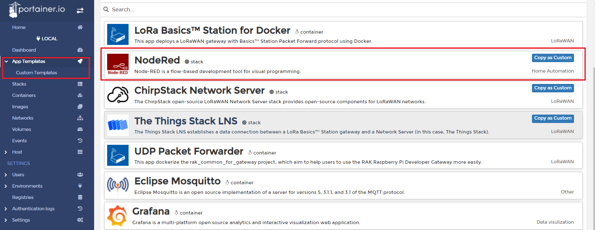

# Control LED using RAK14003 WisBlock LED Bar Graph Module from Node-RED 

[TOC]

## 1 Introduction

This guide explains how to use the [RAK14003 WisBlock LED Bar Graph Module](https://docs.rakwireless.com/Product-Categories/WisBlock/RAK14003/Overview/) in combination with RAK6421 Pi Hat  to control LED using Node-RED.  

### 1.1 RAK14003

 RAK14003 is an LED Bar Graph that is part of WisBlock Display modules. It consists of 10 configurable LEDs (5 green color LEDs, 3 yellow color LEDs, and 2 red color LEDs).  RAK14003 uses the **MCP23017** from Microchip as an I/O Expander and **KEM-102510A-RYG** from Hongke Lighting as the LED bar. Each LED in the module can be controlled separately so the module can build a multipurpose graphic feedback display.For more information about RAK14003, refer to the [Datasheet](https://docs.rakwireless.com/Product-Categories/WisBlock/RAK14003/Datasheet/).

## 2 Preparation


### 2.1 Access setup

Ensure you have access to both I2C devices and GPIO when using the sensor. The MCP23017 chip on RAK14003 uses I2C protocol  and a GPIO pin as RESET pin, if you are using Node-RED in the host machine directly (without using the docker container), you won't need to change anything, just make sure the Node-RED user has access to the i2c bus (/dev/i2c-1 by default) and gpio(/dev/gpiochip0 by default) on your host machine. 

If running Node-RED using docker, you need to mount `/dev/i2c-1` device and `/dev/gpiochip0` to the Node-RED container using the docker command we provided below;  you also need to make sure you have access to the GPIO devices inside the container. If you use the Portainer template provided by us, you don't need to change anything, as we have already mounted the device for you.

#### 2.1.1 Docker compose

The example docker-compose is provided below:

```
version: '3.9'

services:

  nodered:
    image: sheng2216/nodered-docker:1.1
    container_name: NodeRed
    restart: unless-stopped
    user: node-red
    group_add:
      - 998
      - 997
    volumes:
        - 'node-red-data:/data'
    ports:
        - "1880:1880/tcp"
    devices:
        - "/dev/i2c-1:/dev/i2c-1"
        - "/dev/gpiochip0:/dev/gpiochip0"
    networks:
      - node-red
  
volumes:
  node-red-data:

networks:
  node-red:
```

To bring up the service, save the above file into a file called **docker-compose.yml**, and in the same directory, run `docker-compose up`. To stop the service, just press **ctrl+c** to exit and then run `docker-compose down` to stop the services defined in the Compose file, and also remove the networks defined.

In the docker-compose file provided above, the --device can mount the device to the container, --group-add adds the I2C group (group id 998 in Rakpios) and the GPIO group((group id 997 in Rakpios) to run as. Notice that **998** and **997** in the compose file needs to be changed if you are not using Rakpios, it needs to match your system group setup. Before adding the node-red user to the matching group, you need to get the group number via running the command below on your host:

```
cat /etc/group | grep i2c | awk -F: '{print $3}'
cat /etc/group | grep gpio | awk -F: '{print $3}'
```

#### 2.1.2 Running under Docker Portainer

If you try to run a Node-RED container with Docker Portainer using the template provided by RAKwireless, you won't need to make any changes to the configurations, just deploy the Node-RED container using the template (shown below), 



in the template, we defined a customized Node-RED docker image for you to use, so you don't need to worry about the configuration or permission anymore. After the app is deployed, you can browse to http://{host-ip}:1880 to access Node-Red's web interface.

### 2.2 Hardware preparation 

The easiest way to set up the hardware is to use the RAK6421 Pi Hat that exposes all the Wisbock high-density connector pins.  The RAK14003 can be mounted to the Pi HAT, and the Pi HAT goes to the 40-pin headers located on Raspberry Pi 4B or RAK7391 board. 


## 3 Flow configuration

Whether you are using the Node-Red docker image provided by RAKwireless or the official latest image, or you host your Node-RED service on your host machine, you need to install the node `mcp-pcf-aio`  before you deploy the flow. 

### 3.1 Install nodes  

You need to install  `mcp-pcf-aio`  with the following commands. If you are using docker for Node-RED, you may need to replace `~/.node-red` with `/usr/src/node-red`,

```
git clone -b dev https://git.rak-internal.net/product-rd/gateway/wis-developer/rak7391/node-red-nodes.git
```

then copy  `mcp-pcf-aio`  directory  to  the `node_modules` directory,

```
cp -rf node-red-nodes/mcp-pcf-aio node-red/node_modules
```

lastly, change to the  `mcp-pcf-aio`  directory and install the node, 

```
cd ~/.node-red/node_modules/mcp-pcf-aio && npm install
```

**Tips:**  After the installation of  `mcp-pcf-aio`  is finished, please restart your node-red service/container(s).  Otherwise, the node cannot be found/added to the new flow.

**Warn:**  [mcp-pcf-aio]([mcp-pcf-aio (node) - Node-RED (nodered.org)](https://flows.nodered.org/node/@pizzaprogram/mcp-pcf-aio))  is published by László Szakmári and we made some changes based on it to set RESET pin on the RAK14003. But there is still a serious problem that needs fixing. Please note that once you depoly this example flow, this RESET pin on the RAK14003 will always be used, you will not set it again until NodeRED process exit.

### 3.2 Deploy the Example Flow 

After you deploy the NodeRED container,  you can import  [**rak14003-example.json**](rak14003-example.json) flow.After the import is done, the new flow should look like this:


### 3.3 Nodes Configurations 

MCP23017 has 16 pins (0-15). Can be individually selected as in or out. There is a global (hidden) `MCP-PCF-chip` node you can set, with following attributes:


**I2C bus Number:** the i2c bus index for MCP23017,  in this example, the value is 1.

**Address A2-A1-A0:**  the i2c bus address for MCP23017, in this example, the value is 0x24.

**Interval:** is used to determine how frequently all inputs are polled.

**Reset Pin:** select Reset pin number for the RAK14003 , if you mount RAK14003 on the Pi Hat IO Slot 1, the value is 16, if you use IO Slot 2, change it to 24.

**Start All Outputs High:** Some relay boards turn OFF if sending HIGH signal from the chip. To prevent accidentally turn ON all the realays on startup, use this checkbox.

### 3.4 Flow Deploy

Hit the `Deploy` button on the top right to deploy the flow, then click inject node to turn on or turn off LED

## License

This project is licensed under MIT license.
