#  Control a Servomotor using RAK13004 WisBlock PWM Expansion Module from Node-RED 

[TOC]

## 1. Introduction

This guide explains how to use the [RAK13004 PWM Expansion Module](https://store.rakwireless.com/products/pwm-expansion-module-rak13004?_pos=1&_sid=620300979&_ss=r) in combination with RAK6421 Pi-HAT and RAK7391 to control a servomotor using Node-RED.

### 1.1  RAK13004

The RAK13004 is a PWM expander module that can be mounted to the IO slot of WisBlock Base board. It can be controlled 16-channel LED, and the module uses PCA9685 from NXP, I2C interface. The I2C address of PCA9685 on RAK13004 is configured to 0x64. The RAK13004 WisBlock PWM Expander Module comprises a standard WisConnector(as shown in figure below). 

One important thing to notice is that `OE`  pin is **output enable** pin which is low active and default is high. so set `OE` pin to 0 before output PWM.Please check the [RAK13004‘s hardware datasheet](https://docs.rakwireless.com/Product-Categories/WisBlock/RAK13004/Datasheet/#hardware) for more details. By default, RAK13004 uses `i2c-1` bus when mounted to RAK6421 Pi-HAT. 

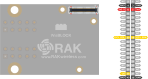


## 2 Preparation


### 2.1 Access setup

Ensure you have access to both I2C devices and GPIO when using RAK13004. The PCA9685 chip on RAK13004 relays on the I2C interface, and we also need access to the GPIO so that we can pull-down the `OE` pin.

If you are using Node-RED locally (in the host machine without using docker containers), you need to make sure the Node-RED user has access to the i2c bus (/dev/i2c-1 by default) and gpio(/dev/gpiochip0 by default) on your host machine. 

If your Node-RED is deployed inside a container, you need to mount `/dev/i2c-1` and `/dev/gpiochip0` to the Node-RED container, and also make sure the user inside the container is assigned to the right group so that it has access to I2C and GPIO devices. 

For detailed "docker run" command, docker-compose file, and information about how to use a pre-configured Portainer template, please check this [instruction](path-to-the-common-README), we provide all the information you need to know about using containerized Node-RED. 

### 2.2 Install dependency & nodes in Node-RED

Before we install the nodes, please make sure `libgpiod-dev` has been installed, if not, please install it.

```
sudo apt update
sudo apt install libgpiod-dev
```

If your Node-RED is deployed inside a container, you need to install `libgpiod-dev` inside container, please also check the [instruction](path-to-the-common-README) on install dependency inside container.

Now we need to install some nodes for the example flow. Browse to http://{host-ip}:1880 to access Node-Red's web interface. In this example, you need to install two nodes: [node-red-contrib-libgpiod](https://flows.nodered.org/node/node-red-contrib-libgpiod) and [node-red-contrib-pca9685](https://flows.nodered.org/node/node-red-contrib-pca9685).

Take `node-red-contrib-libgpiod` as an example. To install this node , go to the top right **Menu**, and then select **Manage palette**. In the **User Settings** page, you need to select **Install**, and search the key word **node-red-contrib-libgpiod**. Now you should be able to install this node.

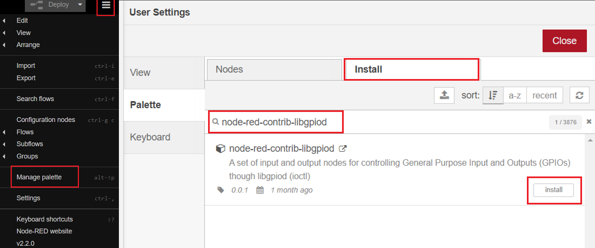

### 2.3 Hardware

You will need a servomotor, a Raspberry Pi (or RAK7391), and also the Pi-HAT RAK6421, as well as a couple of jumper wires. 

The connection diagram is as follows:

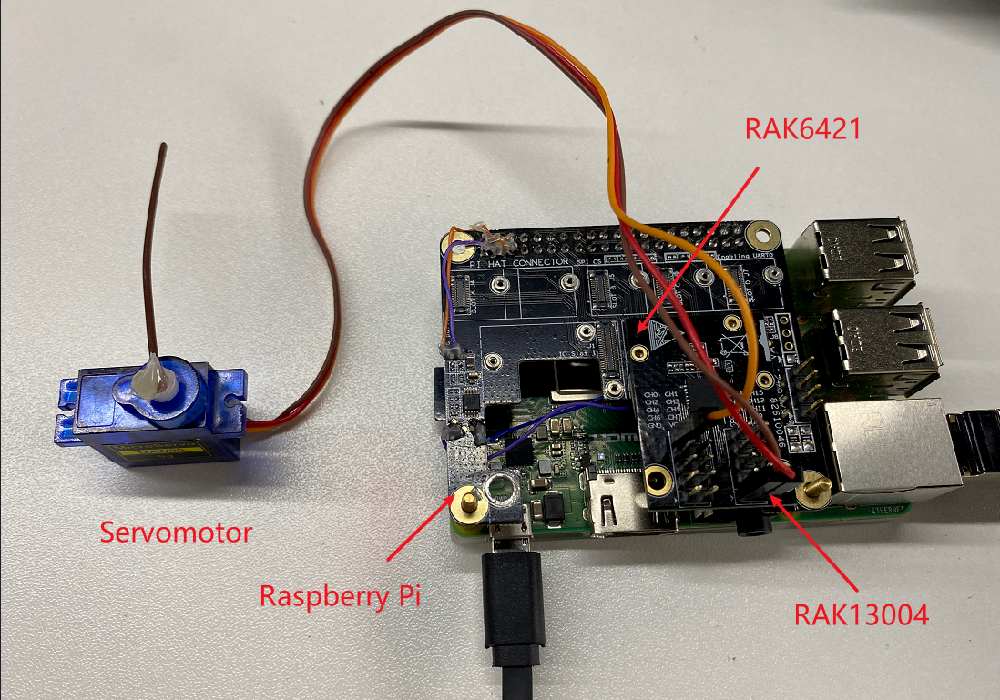

The red wire (power) of the servomotor goes to either one of the Vcc pin on RAK13004; the brown (ground) wire goes to either of the GND pin; while the orange (signal) wire goes to any one of the channel pin you prefer. In the above figure, we connected the servomotor to channel 0.

## 3 Flow configuration

After all the preparations are finished, you can clone/copy the flow example. The example is under `interface/rak13004/rak13004-servo` directory in the [`wisblock-node-red`](https://git.rak-internal.net/product-rd/gateway/wis-developer/rak7391/wisblock-node-red/-/tree/dev/) repository. Then you can import the **rak13004-servo-flow.json** file or just copy and paste the `.json` file contents into your new flow.

After the import is done, the new flow should look like this:

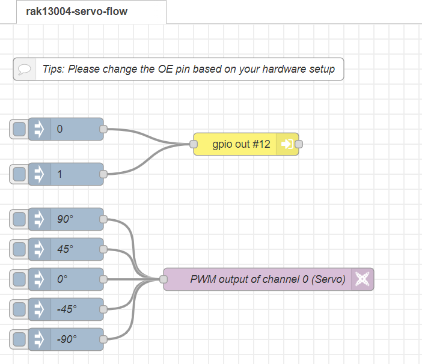

Hit the **Deploy** button on the top right to deploy the flow.

This is a simple flow that turn the servomotor to different angles. 


* GPIO out node

  The GPIO out node is for you to define the **OE** pin, and the pin varies if you have a different hardware setup. The GPIO out node read the payload sent from the two inject nodes, and then pull the **OE** pin high or low.

  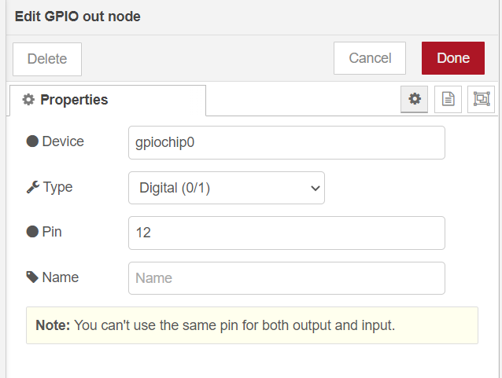

  RAK13004 + RAK6421 slot 1 + Raspberry Pi 4B/RAK7391, set Device to gpiochip0, and pin to 12;
  RAK13004 + RAK6421 slot 2 + Raspberry Pi 4B/RAK7391, set Device to gpiochip0, and pin to 22; RAK13004 + RAK7391's wisblock slot 1, set Device to gpiochip2, and pin to 6;
  RAK13004 + RAK7391's wisblock slot 2, set Device to gpiochip2, and pin to 7.

* PCA9685 out node

  Click the pencil icon to add a new PCA9685 device.

  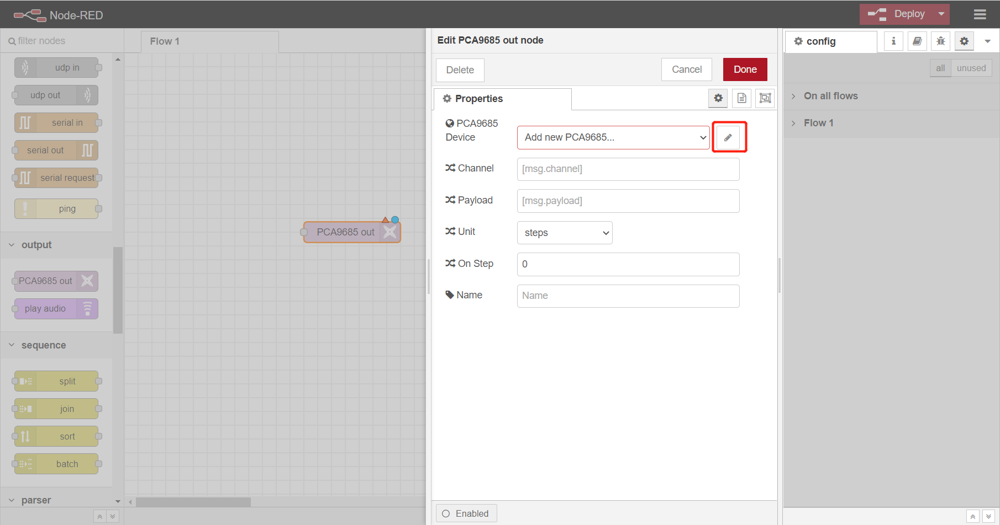


The default i2c address is 64(0x40). We use default settings for RAK13004. Click `Add` to save.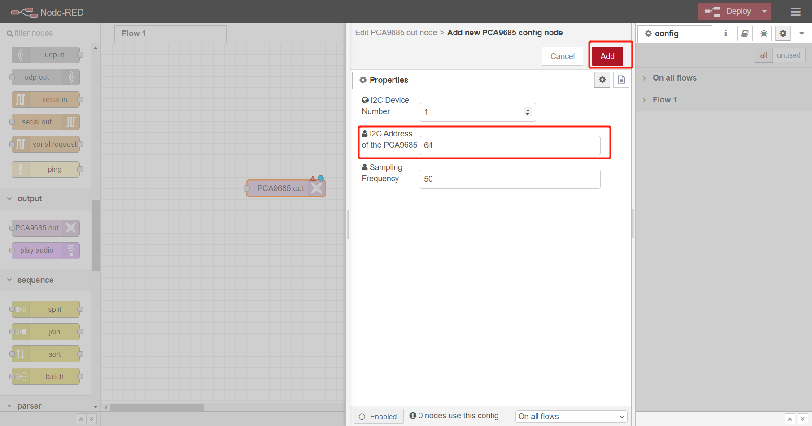

Then we set channel as `0`, because we connect servo with channel 0 of RAK13004. For Unit, please select `micoseconds`, because we use it to control servo. We use a `inject` node to input time to control pwm output to control rotation degree of servo.

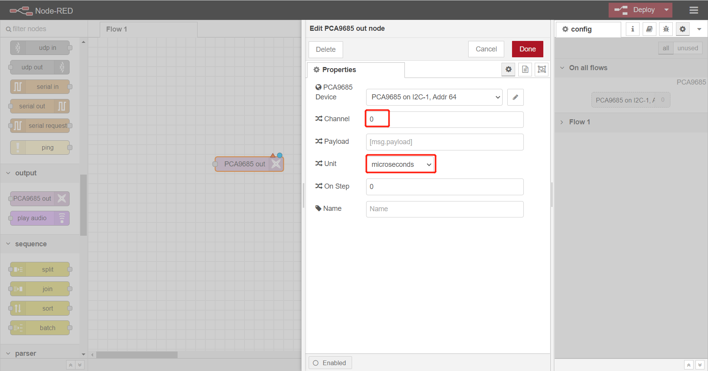

* inject node

  The `inject` number(micoseconds) and rotation degree of servo have a relation. Please read the document of manufacture of servo to find the relation.

  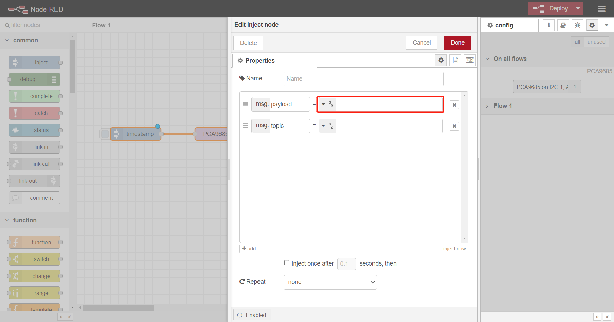

## 4 Flow output

Click `-90°` to turn the servo:

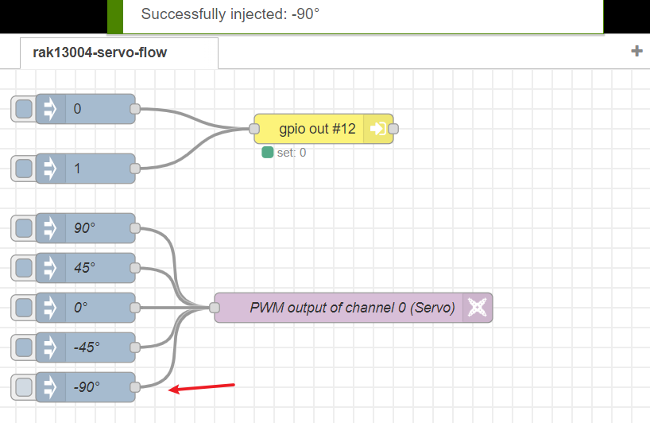

as you can see the servor turns from 0° to -90°.

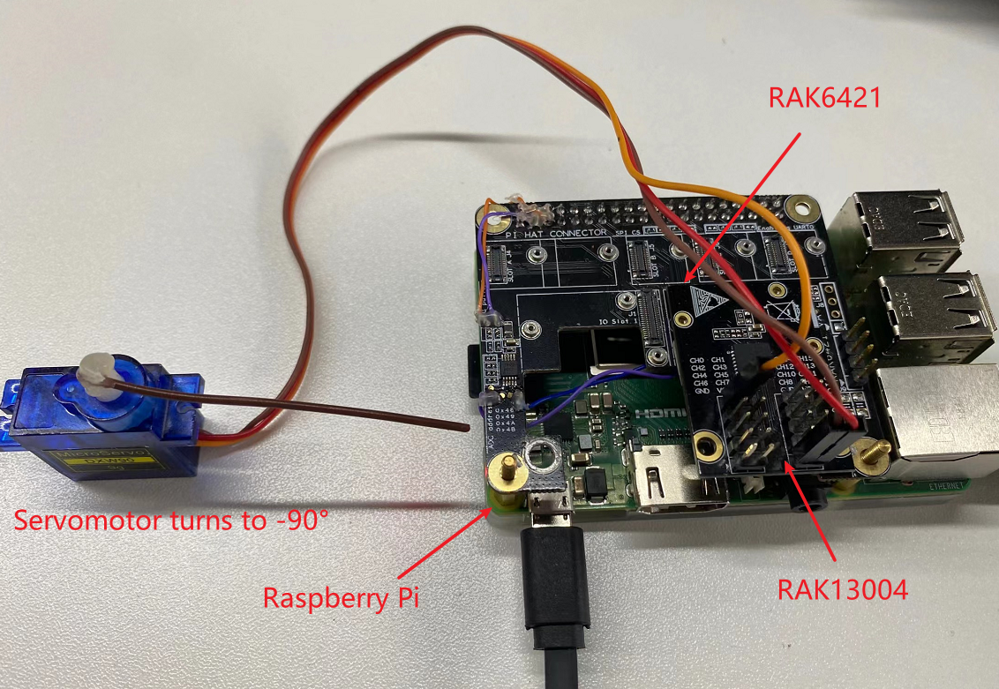

## License

This project is licensed under MIT license.
