#  Using RAK13004 and NodeRed to control servo

[TOC]

## 1. Introduction

This guide explains how to create a flow and then use [RAK13004 PWM Expansion Module](https://store.rakwireless.com/products/pwm-expansion-module-rak13004?_pos=1&_sid=620300979&_ss=r) to control servo.

RAK13004 PWM Expansion Module is powered by `PCA9685` which is an I²C-bus controlled 16-channel PWM controller.

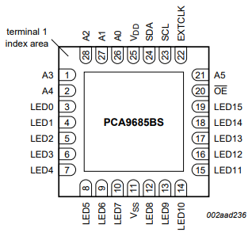

**Tips:** `OE`  pin is **output enable** pin which is low active and default is high. so set `OE` pin to 0 before output PWM.

When RAK13004 being fixed to RAK7391, it uses `i2c-1` bus.  

### 1.1 Requirements

You need to ensure that the user of system has I2C operation permission.


## 2. Preparation

### 2.1. Hardware

RAK13004 and RAK7391 are needed. And a servo as bellow is also needed.

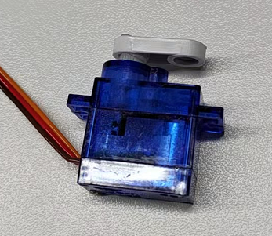


The connection diagram is as follows:

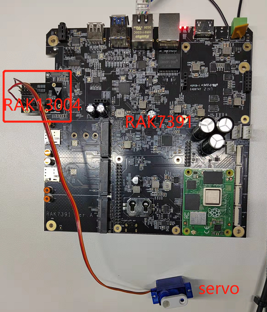

RAK13004 is fixed to  wisblock2 slot of RAK7391. An channel 0 of RAK13004 connect with servo.

### 2.2. Software

When RAK13004 being fixed to Wisblock slot of RAK7391, its OE pin connect with pi4ioe5v96224 IO expander on RAK7391.

So pi4ioe5v96224 node of NodeRED should be installed before.

Please install `node-red-contrib-pi4ioe5v` node with the following commands. If you use docker of Node-RED, you may need to replace `~/.node-red` with `/usr/src/node-red`.

```
git clone -b dev https://git.rak-internal.net/product-rd/gateway/wis-developer/rak7391/node-red-nodes.git
```

```
cp -rf node-red-nodes/node-red-contrib-pi4ioe5v ~/.node-red/node_modules
```

```
cd ~/.node-red/node_modules/node-red-contrib-pi4ioe5v && npm install
```

And because RAK13004 is powered by `PCA9685`, we also need to install `node-red-contrib-pca9685` node of NodeRED.

Please install it with the following commands. 

```
cd ~/.node-red/node_modules && npm install node-red-contrib-pca9685
```

Restarted **node-red**, otherwise the nodes installed cannot be found on the page.

## 3. Configure

You can skip this step and run example directly if you do not want to known how to configure`node-red-contrib-pca9685`node.

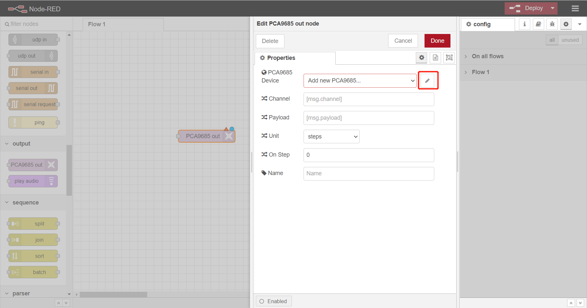

Click pencil picture to add a new PCA9685.

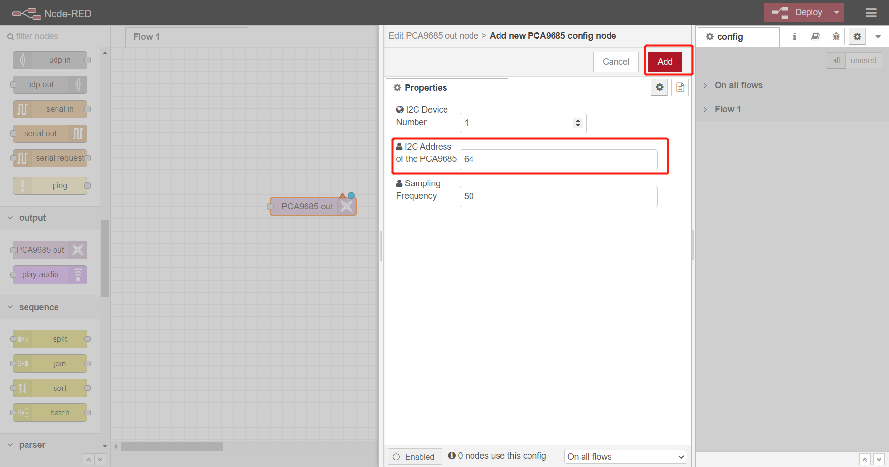

The default i2c address is 64(0x40). We use default settings for RAK13004. Click `Add` to save.

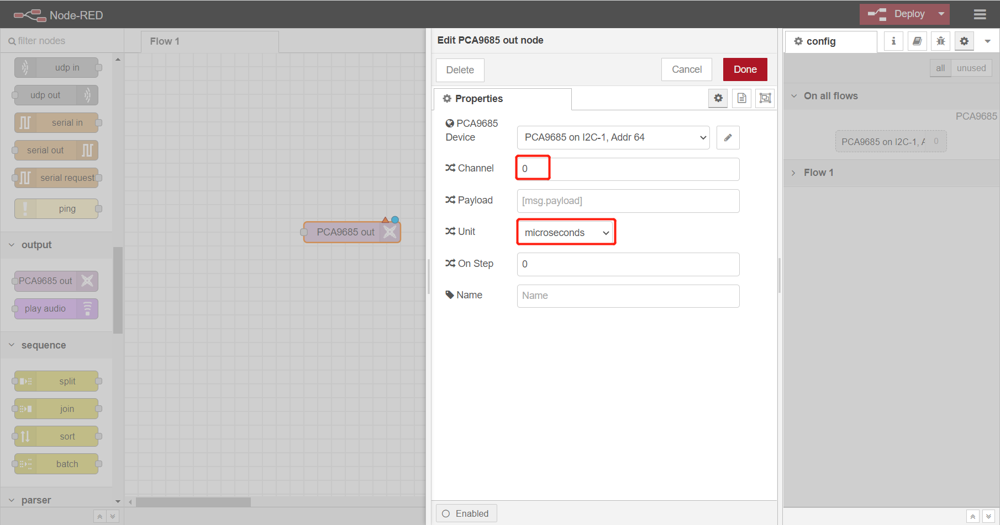

Then we set channel as `0`, because we connect servo with channel 0 of RAK13004. For Unit, please select `micoseconds`, because we use it to control servo. We use a `inject` node to input time to control pwm output to control rotation degree of servo.

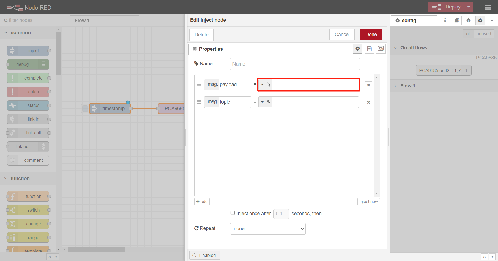

The `inject` number(micoseconds) and rotation degree of servo have a relation. Please read the document of manufacture of servo to find the relation.


## 4. Run example

The example is under `interface/rak13004/rak13004-servo` folder in the [`wisblock-node-red`](https://git.rak-internal.net/product-rd/gateway/wis-developer/rak7391/wisblock-node-red/-/tree/dev/) repository. Then you can import the **rak13004-servo-flow.json** file or just copy and paste the .json file contents into your new flow.

After the import is done, the new flow should look like this:

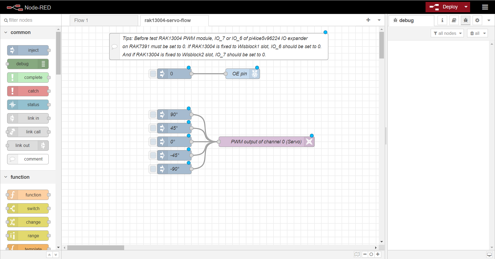

Hit the **Deploy** button on the top right to deploy the flow.

The flow has two sections. The section above is to set `OE` pin 0 to enable pwm of RAK13004.  The example uses `wisblock2` slot of RAK7391. If you also use `wisblock1` slot to fix RAK13004, you must modify OE pin as picture below and hit `Done` to save.

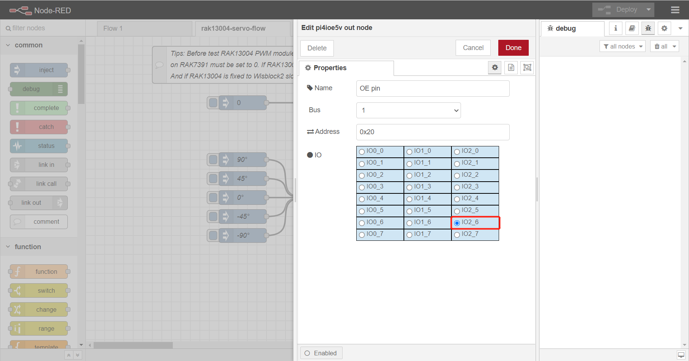

Then, please set OE to 0 before controlling servo.

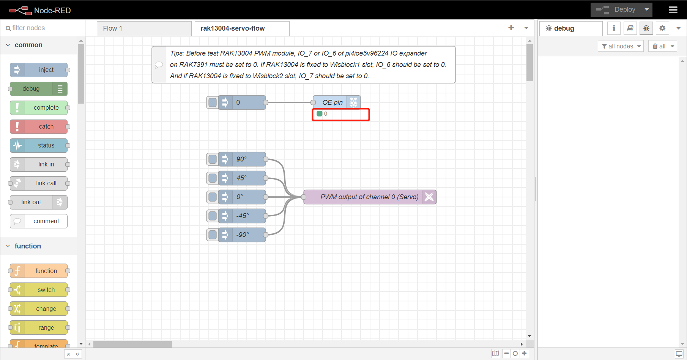

Now let us to use the section bellow of flow to control servo. As it is showed, we can use it to control rotation angle of servo.

We click `90°` then the servo rotates `90°` , and other degree can also work.

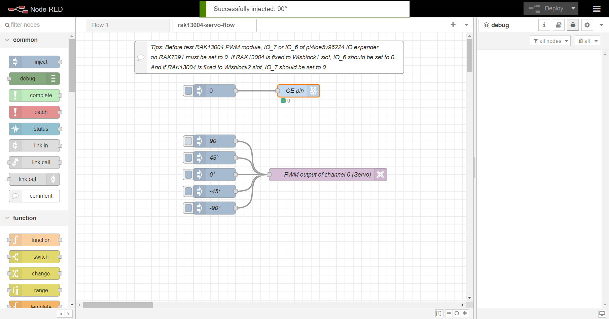

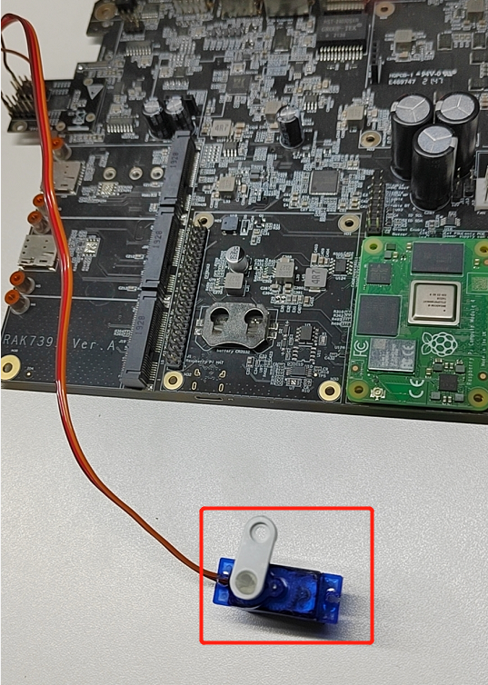

