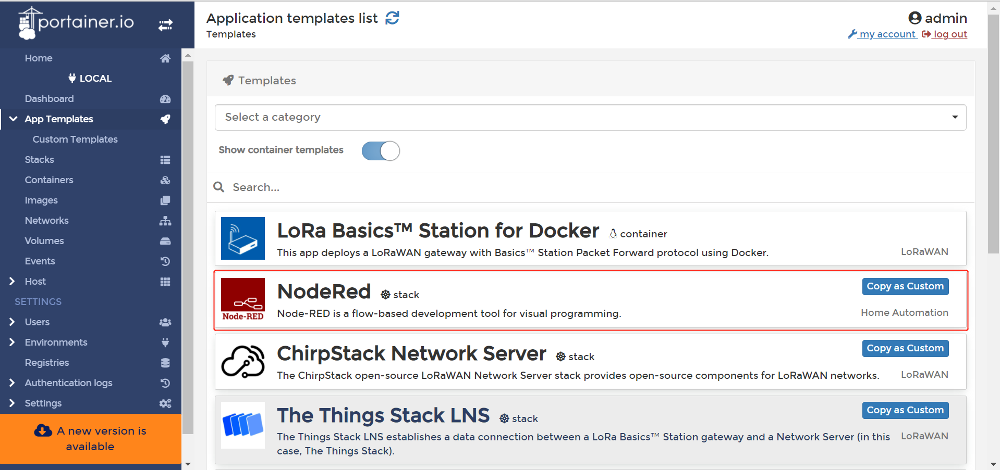
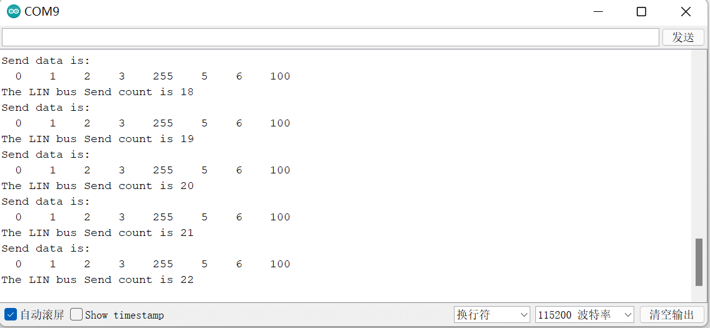

# LinBUS communication using WisBlock LIN MODULE RAK13005 on RAK7391

[TOC]

## 1.Introduction

This guide explains how to use the [RAK13005](https://docs.rakwireless.com/Product-Categories/WisBlock/RAK13005/Overview/) in combination with RAK7391 WisGate Developer Connect to interface a linBUS device using node-red.

### 1.1 linBUS protocol

**LIN** (**Local Interconnect Network**) is a [serial](https://en.wikipedia.org/wiki/Serial_communication) [network protocol](https://en.wikipedia.org/wiki/Network_protocol) used for communication between components in vehicles. It is a single wire, serial network protocol that supports communications up to 19.2 Kbit/s at a bus length of 40 meters. 

### 1.2. RAK13005

The RAK13005 is a **Local Interconnect Network** (LIN) transceiver module, used in automatic technologies that can be mounted on the IO slot of the WisBlock Base board. It is designed for in-vehicle networks using data transmission rates from 2.4 kBaud to 20 kBaud, and it uses the TLE7259-3 chip from Infineon.

## 2.Hardware

### 2.1. Harderware required

In this example we will establish a linBus communication between WisBlock Starter Kit and RAK7391 WisGate Developer Connect with two RAK13005 modules, so we need: 

- RAK7391 WisGate Developer Connect

- WisBlock Starter Kit (WisBlock Base RAK5005-O + WisBlock Core RAK4631)


- RAK13005 


### 2.2. Other hardware

We will need a couple of cables to connect both RAK13005 modules and an external `5-27v` power supply  to RAK13005 modules.

### 2.3. Connection diagram


## 3. Software

In this example, we use `node-red-contrib-linbus` module to cerate node-red flows. there are two nodes in this module,  so we have two flows:

-  [linbus-parse-flow](linbus-parse-example.json) use `linbus-parse` node to receive linbus data from a serial node and and output a message upon valid LinBUS message reception.
- [linbus-builder-flow](linbus-builder-example.json) use `linbus-builder` node to create a valid linbus frame from a frame type and a byte buffer payload, the output will be fed to a serial node.

before you import t and deploy them , you still need some preparation.

### 3.1. Required modules

#### 3.1.1.node-red-contrib-linbus

Install the `node-red-contrib-linbus` moulde from our node-red-nodes repository , 

```plaintext
git clone -b dev https://git.rak-internal.net/product-rd/gateway/wis-developer/rak7391/node-red-nodes.git
```

copy `node-red-contrib-linbus` folder to  `node_modules` folder, `node_modules`  folder is located in the root directory of your node-red install.

```plaintext
cp -rf node-red-nodes/node-red-contrib-linbus ~/.node-red/node_modules
```

then go to the `node-red-contrib-linbus` folder  and run the installation command

```plaintext
cd ~/.node-red/node_modules/node-red-contrib-linbus && npm install
```

#### 3.1.2.node-red-node-serialport

In our flows, `node-red-contrib-linbus`  is used in combination with a serial port node, so we need to install`node-red-node-serialport` , run the following command in the root directory of your node-red install

```
npm install node-red-node-serialport@0.15.0 
```

**Note:** the latest version of node-red-node-serialport is `1.0.1`, but it has a serious bugs in a node-red container, so we use old version `0.15.0`.

### 3.2 Access Setup

In our flows, linBUS frames are transmitted through a serial node so the node-red user must have access to the corresponding serial ports. serial ports are `/dev/ttyUSB0` and `/dev/ttyUSB1` on RAK7391, which correspond to two WisBlock IO Connecter(`Wisblcok1` and `Wisblock2`).

No additional settings are required when you run node-red on your host directly. if running node-red using docker,  you need to mount `/dev/ttyUSB0` and `/dev/ttyUSB1` to the node-red container and add node-red user to the i2c group on your host.

##### Running under Docker Command Line

To run in Docker in its simplest form just run:

```plaintext
docker run -it -p 1880:1880 -v node_red_data:/data --name NodeRed --device /dev/ttyUSB0:/dev/ttyUSB0 --device /dev/ttyUSB1:/dev/ttyUSB1 --user node-red:dialout nodered/node-red
```

In the command above, the `--device` can mount serial device to container, and `--name` can add an user with specified group.

##### Running under Docker Portainer

We strongly recommend you run a Node-Red container with Docker Portainer using the template provided by RAKwireless, you won't need to make any changes to the configurations, just deploy the Node-Red container use the template (shown below),



after the app is deployed, you can browse to http://{host-ip}:1880 to access Node-Red's web interface.

##### Running under Docker Compose

An easier way to deploy node-red container is to use docker compose.  we provide a [docker-compose.yml](docker-compose.yml) file which has configured everything,  there is no additional settings are required, just start up your node-red by running `docker-compose up`.

### 3.3 Flow configuration

#### 3.3.1.linbus-parse-flow

 [linbus-parse-flow](linbus-parse-example.json) receive data from a serial port as a slaver,  so you need to configure WisBlock Starter Kit as a master to send linbus data, the master code can be found under the [rak13005_linbus_device](rak13005_linbus_device/rak13005_linbus_master.ino) folder. you can open it directly with the Arduino IDE but you will first have to have it installed as well as the RAK4630 BSP. 

Check the [RAK4631 Quick Start Guide](https://docs.rakwireless.com/Product-Categories/WisBlock/RAK4631/Quickstart) to know more.

- [ArduinoIDE](https://www.arduino.cc/en/Main/Software)
- [RAK4630 BSP](https://github.com/RAKWireless/RAK-nRF52-Arduino)

At the top of the example sketch you have links to install the required libraries using the Arduino IDE Library Manager.

- [RAK13005-TLE7259-Library](https://github.com/RAKWireless/RAK13005-TLE7259-Library)

when we compile and upload master code successfully, we can open the Serial Monitor on the Arduino IDE and see the serial output 



Now import the flow, the new flow should look like this:


You must configure `ID` option and `Length` option in the `linbus-parse` node,  `ID` specify the identifier of linbus frame that you want to parse, and `Length` specify the data length of linbus frame that you want to parse.


You must select the corresponding serial port and configure it correctly. 


Hit the `Deploy` button on the top right to deploy this flow, once linBUS data arrives,  it is parsed and output to the debug window.


#### 3.3.2.linbus-builder-flow

[linbus-builder-flow](linbus-builder-example.json)  create linBUS frame and feed it to a seriar port as a master,  you also need to configure WisBlock Starter Kit as a slaver to receive linBUS data, the slaver code can be found under the  [rak13005_linbus_device](rak13005_linbus_device/rak13005_linbus_slaver.ino) folder, compile and upload it in the same way. 

Now import the flow , the new flow should look like this:


You must configure `ID` option Specify the identifier of linbus frame that you want to builder.


the payload is generated with an `inject` node, one thing to note is that the payload type must be set to `buffer` in the `inject` node and data length should be 2 bytes or 4 bytes or 8 bytes.


Hit the `Deploy` button on the top right to deploy this flow, then click `inject` node,  we can open the Serial Monitor on the Arduino IDE and see the serial output. 


