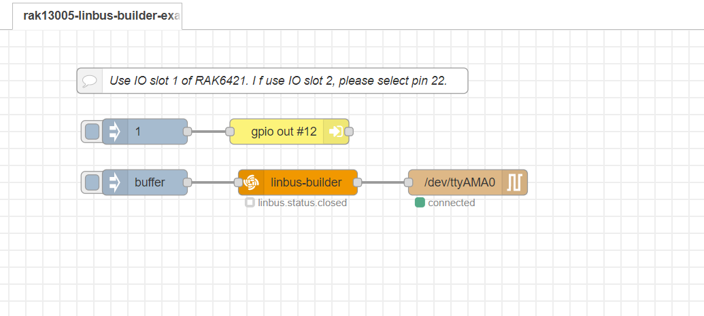

# LinBUS communication using WisBlock LIN MODULE RAK13005

[TOC]

## 1.Introduction

This guide explains how to use the [RAK13005](https://docs.rakwireless.com/Product-Categories/WisBlock/RAK13005/Overview/)  with node-red.

### 1.1 linBUS protocol

**LIN** (**Local Interconnect Network**) is a [serial](https://en.wikipedia.org/wiki/Serial_communication) [network protocol](https://en.wikipedia.org/wiki/Network_protocol) used for communication between components in vehicles. It is a single wire, serial network protocol that supports communications up to 19.2 Kbit/s at a bus length of 40 meters. 

### 1.2. RAK13005

The RAK13005 is a **Local Interconnect Network** (LIN) transceiver module, used in automatic technologies that can be mounted on the IO slot of the WisBlock Base board. It is designed for in-vehicle networks using data transmission rates from 2.4 kBaud to 20 kBaud, and it uses the TLE7259-3 chip from Infineon.


## 2. Preparation

### 2.1. Access Setup

In this example, we are going to deploy a flow in Node-RED to communication with LINBUS protocol. To make the measurements, ensure you have access to serial port devices. 

If you are using Node-RED locally (in the host machine without using docker containers), you need to make sure the Node-RED user has access to the serial port device on your host machine.

For raspberry pi 4B,  we should enable `ttyS0` before with `sudo raspi-config`.  Then, select `Interface Options`  and  `Serial Port ` to disable serial login shell and enable serial interface.


If your Node-RED is deployed inside a container, you need to mount serial port to the Node-RED container, and also make sure the user inside the container is assigned to the right group so that it has access to serial port  devices.

For detailed "docker run" command, docker-compose file, and information about how to use a pre-configured Portainer template, please check this [instruction](https://git.rak-internal.net/product-rd/gateway/wis-developer/rak7391/wisblock-node-red/-/blob/dev/README-Docker/README.md), we provide all the information you need to know about using containerized Node-RED.

### 2.2. Hardware

In this example we will establish a linBus communication between two RAK13005 LINbus modules.  

- **WisBlock Starter Kit (WisBlock Base RAK5005-O + WisBlock Core RAK4631) + RAK13005**

​	we use WisBlock Starter Kit (WisBlock Base RAK5005-O + WisBlock Core RAK4631) and RAK13005 as an accompanying device.


- **The other RAK13005 LINbus module**

  - Connect the other RAK13005 LINbus module with RAK6421 pi-hat and Raspiberry Pi 4B.

    

- **Power supply for RAK13005 **

​	we also need a couple of cables to connect both RAK13005 modules and an external `5-27v` power supply  to RAK13005 modules.

**Connection diagram**

Connect Wisblock starter kit with RAK4621 and RPi 4B.


### 2.3. Software

#### 2.3.1. node-red-contrib-linbus

Install the `node-red-contrib-linbus` moulde from our node-red-nodes repository , 

```plaintext
git clone -b dev https://git.rak-internal.net/product-rd/gateway/wis-developer/rak7391/node-red-nodes.git
```

copy `node-red-contrib-linbus` folder to  `node_modules` folder, `node_modules`  folder is located in the root directory of your node-red install.

```plaintext
cp -rf node-red-nodes/node-red-contrib-linbus ~/.node-red/node_modules
```

then go to the `node-red-contrib-linbus` folder  and run the installation command

```plaintext
cd ~/.node-red/node_modules/node-red-contrib-linbus && npm install
```

#### 2.3.2. node-red-node-serialport

In our flows, `node-red-contrib-linbus`  is used in combination with a serial port node, so we need to install`node-red-node-serialport` , run the following command in the root directory of your node-red install

```
npm install node-red-node-serialport@0.15.0 
```

**Note:** the latest version of node-red-node-serialport is `1.0.1`, but it has a serious bugs in a node-red container, so we use old version `0.15.0`.

## 3. Flow configuration

 There are two flows:

-  [linbus-parse-flow](linbus-parse-example.json) use `linbus-parse` node to receive linbus data from a serial node and and output a message upon valid LinBUS message reception.
-  [linbus-builder-flow](linbus-builder-example.json) use `linbus-builder` node to create a valid linbus frame from a frame type and a byte buffer payload, the output will be fed to a serial node.

#### 3.3.1.linbus-parse-flow

 [linbus-parse-flow](linbus-parse-example.json) receive data from a serial port as a slaver,  so you need to configure WisBlock Starter Kit as a master to send linbus data, the master code can be found under the [rak13005_linbus_device](rak13005_linbus_device/rak13005_linbus_master.ino) folder. you can open it directly with the Arduino IDE but you will first have to have it installed as well as the RAK4630 BSP. 

Check the [RAK4631 Quick Start Guide](https://docs.rakwireless.com/Product-Categories/WisBlock/RAK4631/Quickstart) to know more.

- [ArduinoIDE](https://www.arduino.cc/en/Main/Software)
- [RAK4630 BSP](https://github.com/RAKWireless/RAK-nRF52-Arduino)

At the top of the example sketch you have links to install the required libraries using the Arduino IDE Library Manager.

- [RAK13005-TLE7259-Library](https://github.com/RAKWireless/RAK13005-TLE7259-Library)

when we compile and upload master code successfully, we can open the Serial Monitor on the Arduino IDE and see the serial output 


Now import the flow, the new flow should look like this:


You must configure `ID` option and `Length` option in the `linbus-parse` node,  `ID` specify the identifier of linbus frame that you want to parse, and `Length` specify the data length of linbus frame that you want to parse.


You must select the corresponding serial port and configure it correctly. 


Hit the `Deploy` button on the top right to deploy this flow, once linBUS data arrives,  it is parsed and output to the debug window.


#### 3.3.2.linbus-builder-flow

[linbus-builder-flow](linbus-builder-example.json)  create linBUS frame and feed it to a seriar port as a master,  you also need to configure WisBlock Starter Kit as a slaver to receive linBUS data, the slaver code can be found under the  [rak13005_linbus_device](rak13005_linbus_device/rak13005_linbus_slaver.ino) folder, compile and upload it in the same way. 

Now import the flow , the new flow should look like this:



You must configure `ID` option Specify the identifier of linbus frame that you want to builder.


the payload is generated with an `inject` node, one thing to note is that the payload type must be set to `buffer` in the `inject` node and data length should be 2 bytes or 4 bytes or 8 bytes.


Hit the `Deploy` button on the top right to deploy this flow, then click `inject` node,  we can open the Serial Monitor on the Arduino IDE and see the serial output. 


## 4. RAK7391

We can also use RAK13005 on RAK7391 directly without RAK4621 pi-hat. Its two flow examples is under [rak7391](./rak7391) directory. And we should use `/dev/ttyUSB0` for IO slot 1 and `/dev/ttyUSB1` for IO slot 2.


