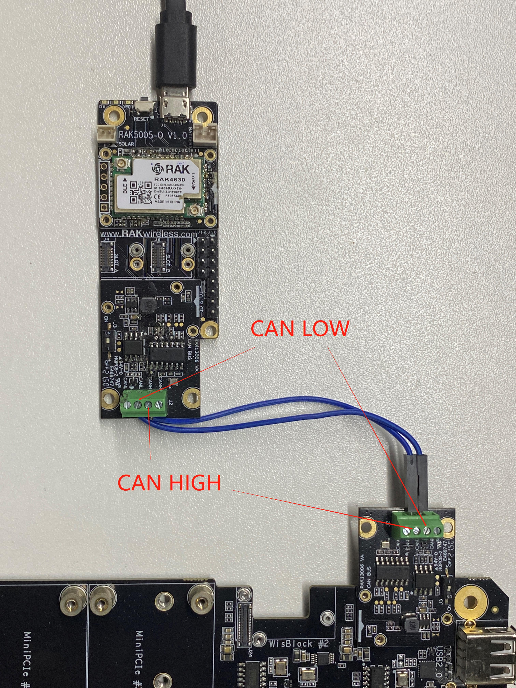
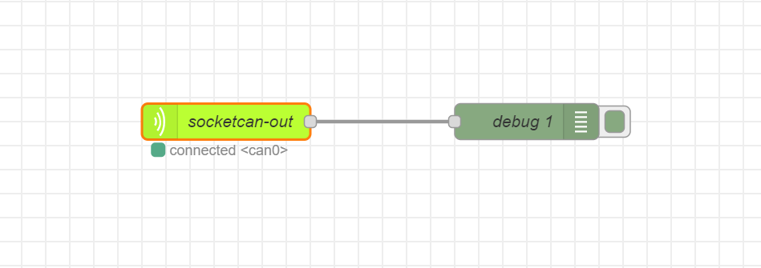

# Get started with use RAK13006 WisBlock CAN Bus module on RAK7391 with NodeRed

[TOC]

## 1.Introduction

This guide explains how to use the [WisBlock IO RAK13006](https://docs.rakwireless.com/Product-Categories/WisBlock/RAK3006/Overview/) CAN Bus module in combination with RAK6421 Wisblock Hat or RAK7391 WisGate Connect using NodeRed. 

### 1.1 RAK13006

**RAK13006** is a CAN Bus communication module which uses [MCP2518FD](https://www.microchip.com/en-us/product/MCP2518FD) CAN controller and [ATA6563](https://www.microchip.com/en-us/product/ata6563) CAN FD transceiver. It's ideal for automotive CAN application. It can be mounted to the IO slots on both RAK6421 Wisblock Hat and RAK7391 WisGate Connect. For more information about **RAK13006**, refer to the [Datasheet]([RAK14003 WisBlock LED Bar Graph Module Datasheet | RAKwireless Documentation Center](https://docs.rakwireless.com/Product-Categories/WisBlock/RAK13006/Datasheet/)).

## 2.Hardware

### 2.1. Hardware

In this example we need two RAK13006 modules, one as the master, and the other one as the slave device. So here is the hardware requirements list:

- 2x RAK13006

- 1x WisBlock Base + WisBlock Core

- RAK7391 or RAK6421+Raspberry Pi

- Two cables

### 2.2. Connection diagram

You can use any CAN bus device as the master devices, but in this example, we used the Wisblock RAK13006 CAN bus module. The master side also includes a RAK5005 base board, and a RAK4631 core module.

The slave side is much easier, it is directly mounted to the high-density connector located on RAK6421 Wisblock Hat or RAK7391 WisGate Connect. The slave code is written in Python. 

The CAN High on master should be connected to the CAN Low pin, while the CAN Low on the slave should be connected to the CAN High pin. Please check the picture below:



## 3. Software

### 3.1. Slave device software

The slave device side is a node-red flow with [node-red-contrib-socketcan](https://flows.nodered.org/node/node-red-contrib-socketcan) module,  the flow file can be found in the [rak13006-example-flow](rak13006-example-flow.json).  before you import this flow and deploy it, you still need some preparation.

You must install `node-red-contrib-modbus` module before import this flow, run the following command in the root directory of your node-red install

```
npm install node-red-contrib-socketcan
```

Another way to install required module is from editor window, open the main menu on the right, select  the `Manage Palette` option,  search node-red-contrib-socketcan modules in the `Install` tab and install it.


You also need to make some changes to the operating system to enable the CAN device.

1. `sudo nano /boot/config.txt`

2. add this line to the file:
   
   `dtoverlay=mcp251xfd,spi0-0,oscillator=40000000,spimaxfrequency=125000`
   
   this is for SPI0.0 (IO slot 1 on RAK6421/Wisblock slot 1 on RAK7391), if your device is on SPI1(for example, IO slot 2 on RAK6421/Wisblock slot 2 on RAK7391) , please add the overlay for SPI1 it to match your set-ups.
   
   
   
   The configuration is based on the datasheet of RAK13006, the oscillator frequency is 40MHz, and the CAN bit rate is 125 kb/s.

3. Now reboot your Raspberry Pi or RAK7391, and then run the following command to check whether the Linux kernel can detect the presence of the MCP2518 CAN controller.
   
   `ip addr | grep can`
   
   
   
   The MCP2518 CAN controller should be detected, and the kernel assign the can0 network inerface to it. 

4. Now we need to load the SocketCAN releated kernel modules to bring up the interface.
   
   `sudo modprobe can;sudo modprobe can_raw`
   
   To verify wheather the kernel module is corectly loaded, please run the following command to check:
   
   `lsmod | grep can`
   
   

5. The final step is to configure the can0 inteface and bring it up:
   
   `sudo ip link set can0 type can bitrate 125000 restart-ms 100`
   
   `sudo ip link set up can0`
   
   you check the status of the can0 interface now, it should be "UP" now:
   
   `ip addr | grep can`
   
   


***Note：*** If you deploy node-red service in a docker, you must set the network mode to host, that make sure you have the access to the can0 interface.

### 3.2. Master device software

The master code sensor code can be found under the [rak13006_canbus_device](rak13006_canbus_device/13006_canbus_device.ino) folder. You need to upload the example script for the master devices to the core using Arduino IDE, the script is stored under the **RAK13006-MCP2518** folder. The library for the MCP2518 is included in the foleder, and you can open it directly with the Arduino IDE but you need to copy the whole folder to Arduino's **libraries** folder, so the library can be corrected included.

### 3.3. Run the example

After all the preparation, you can import the [flow](rak13006-example-flow.json) now, the new flow should look like this:



then hit the `Deploy` button on the top right to deploy it.

On the Arduino side, you can open the serial terminal and check the data sent by the master device:


and you should be able to see the data received by the debug node:


## 4. License

This project is licensed under MIT license.
