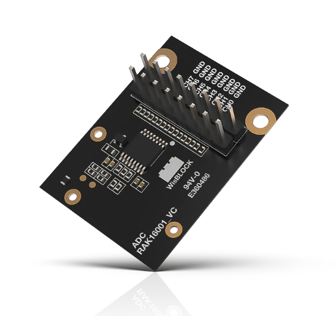
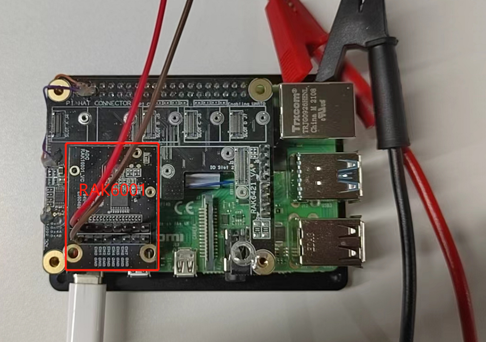

# Extend RAK16001 and test it with NodeRed

[TOC]

## 1. Introduction

This guide explains how to to read 8 channels of [rak16001](https://store.rakwireless.com/products/rak16001-wisblock-adc-module) every 5 seconds in single end mode with pi-hat rak6421. 

### 1.1. RAK16001 

RAK16001 is a WisBlock ADC expansion module based on Texas Instruments ADS7830 which adds 8 additional analog input channels to the WisBlock system.



### 1.2. RAK6421

RAK6421 is a pi-hat for [Wisblock modules](https://docs.rakwireless.com/Product-Categories/WisBlock/). It has **two IO slots** and **four sensor slots**.


## 2. Preparation

### 2.1. Access Setup

In this example, we are going to deploy a flow in Node-RED to measure temperature and humidity. To make the measurements, ensure you have access to I2C devices. 

If you are using Node-RED locally (in the host machine without using docker containers), you need to make sure the Node-RED user has access to the i2c bus (/dev/i2c-1 by default) on your host machine. You can enable I2C either by using **raspi-config** or just change `/boot/config.txt`.

If your Node-RED is deployed inside a container, you need to mount `/dev/i2c-1` to the Node-RED container, and also make sure the user inside the container is assigned to the right group so that it has access to I2C devices.

For detailed "docker run" command, docker-compose file, and information about how to use a pre-configured Portainer template, please check this [instruction](https://git.rak-internal.net/product-rd/gateway/wis-developer/rak7391/wisblock-node-red/-/blob/dev/README-Docker/README.md), we provide all the information you need to know about using containerized Node-RED.

### 2.2. Hardware

There are two method to use RAK16001:

- **Raspberry Pi model 4B + RAK6421 WisBlock Hat +  RAK16001**



- **RAK7391 + Raspberry Pi CM4 +  RAK16001**


### 2.3. Software

Please install `node-red-contrib-ads7830` node with the following commands. If you use docker of Node-RED, you may need to replace `~/.node-red` with `/usr/src/node-red`.

```
git clone https://git.rak-internal.net/product-rd/gateway/wis-developer/rak7391/node-red-nodes.git
```

```
cp -rf node-red-nodes/node-red-contrib-ads7830 ~/.node-red/node_modules
```

```
cd ~/.node-red/node_modules/node-red-contrib-ads7830 && npm install
```

**Tips:**  After `node-red-contrib-ads7830`  installed,  **node-red should be restarted**, otherwise, the node cannot be found on the page.

## 3. Run example

Import the [rak16001-read.json](./rak16001-read.json) file or just copy and paste the .json file contents into your new flow.

After the import is done, the new flow should look like this:


Hit the **Deploy** button on the top right to deploy the flow.

This is a simple flow  contains three nodes, where inject node trigger input every 5 seconds,  ads7830_i2c read 8 channels input with single end mode, and debug node print the read result.

The result  is shown as below.


## 4. License

This project is licensed under MIT license.
