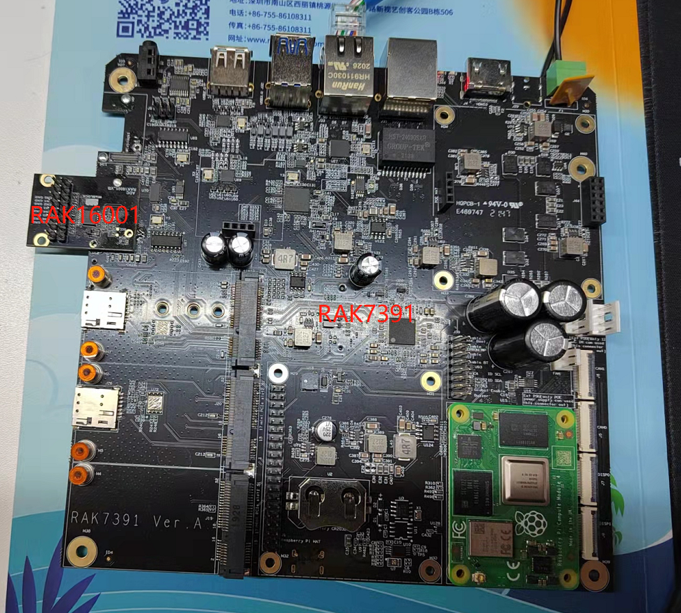
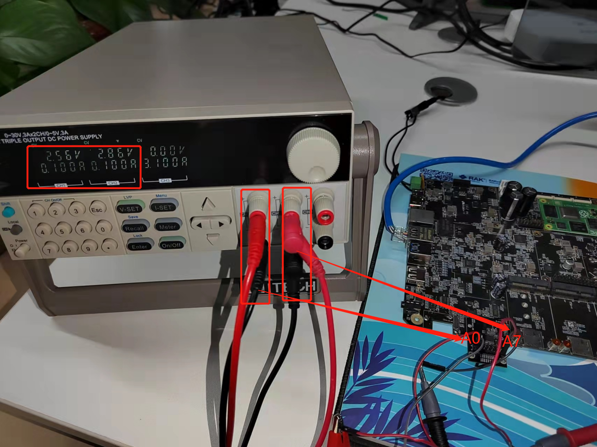
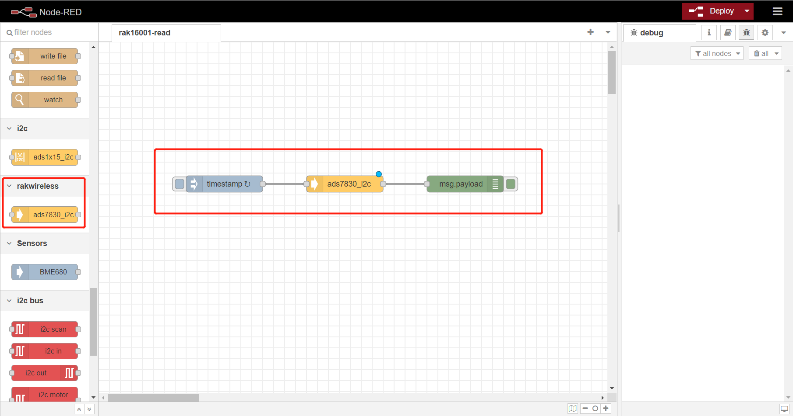

# Extend RAK16001 in RAK7391 board and test it with NodeRed

[TOC]

## 1. Introduction

This guide explains how to create a flow and then use the node **node-red-contrib-ads7830** to read 8 channels of [rak16001](https://store.rakwireless.com/products/rak16001-wisblock-adc-module) every 5 seconds with single end mode. ADS7830 use `i2c-1` of RAK7391 board to add 8 single analog inputs or 4 differential analog input. 

### 1.1 Requirements

If you use docker to run Node-RED,  you need to ensure that the user has I2C operation permission.

## 2. Preparation

### 2.1. Hardware

We should attach the rak16001 to the wisblock expansion slot of rak7391 as shown below.

Then we connect rak16001 with a DC power supply as follows. A0 of rak16001 connect channel 1 of power suply device and A7 connects channel 2.

### 2.2. Software

Install node-red-contrib-ads7830 node according to [README](https://git.rak-internal.net/product-rd/gateway/wis-developer/rak7391/node-red-nodes/-/tree/dev/node-red-contrib-ads7830).

## 2.2. Run

After you deployed the Node-Red container using the [portainer app template](link to our portainer template) by Rakwireless, you can clone /copy the flow example. The example is under `interface/rak16001` folder in the [`wisblock-node-red`](https://git.rak-internal.net/product-rd/gateway/wis-developer/rak7391/wisblock-node-red/-/tree/dev/) repository. Then you can import the  **rak16001-read.json** file or just copy and paste the .json file contents into your new flow.

After the import is done, the new flow should look like this:

Hit the **Deploy** button on the top right to deploy the flow.

This is a simple flow  contains three nodes, where inject node trigger input every 5 seconds,  ads7830_i2c read 8 channels input with single end mode, and debug node print the read result.

The result  is shown as below.

