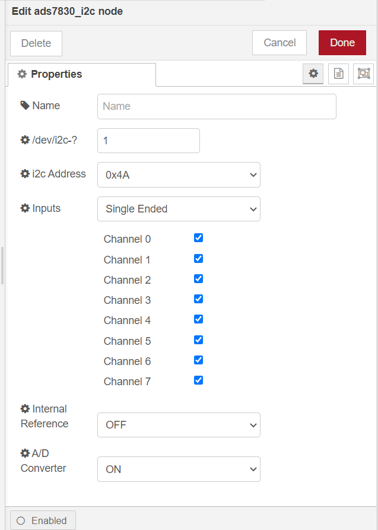
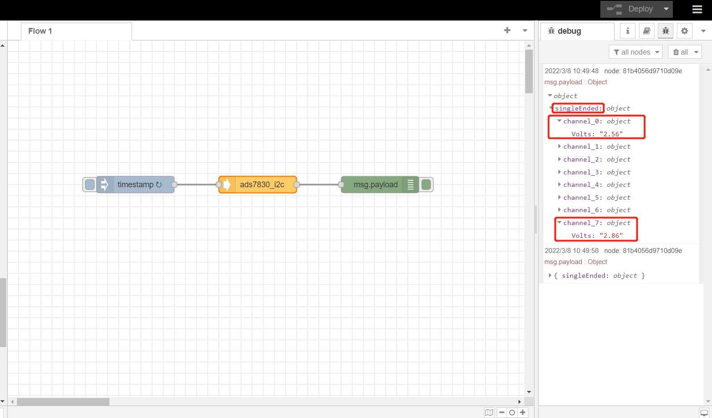

# Extend RAK16001 in RAK7391 board and test it with NodeRed

[TOC]

## 1. Introduction

This guide explains how to create a flow and then use the node **node-red-contrib-ads7830** to read 8 channels of [rak16001](https://store.rakwireless.com/products/rak16001-wisblock-adc-module) every 5 seconds with single end mode. ADS7830 use `i2c-1` of RAK7391 board to add 8 single analog inputs or 4 differential analog input. 

### 1.1 Requirements

If you use docker to run Node-RED,  you need to ensure that the user has I2C operation permission.


## 2. Preparation

### 2.1. Hardware

We should attach the rak16001 to the wisblock expansion slot of rak7391 as shown below.


Then we connect rak16001 with a DC power supply as follows. A0 of rak16001 connect channel 1 of power suply device and A7 connects channel 2.


### 2.2. Software

Please install `node-red-contrib-ads7830` node with the following commands. If you use docker of Node-RED, you may need to replace `~/.node-red` with `/usr/src/node-red`.

```
git clone -b dev https://git.rak-internal.net/product-rd/gateway/wis-developer/rak7391/node-red-nodes.git
```

```
cp -rf node-red-nodes/node-red-contrib-ads7830 ~/.node-red/node_modules
```

```
cd ~/.node-red/node_modules/node-red-contrib-ads7830 && npm install
```

**Tips:**  After `node-red-contrib-ads7830`  installed,  **node-red should be restarted**, otherwise, the node cannot be found on the page.

## 3. Configure

To get a voltage or difference of voltage from a ADS7830  analog to digital converter just select the correct setting for your device and trigger the node.



- **Name**

  Define the msg name if you wish to change the name displayed on the node.

- **/dev/i2c-?**

  Default I2C Bus is 1.  `1` is for `'/dev/i2c-1'`.

- **i2c_Address**

  The Address by default is set to `0x4A`. You can setup the ADS7830 with one of four addresses, 0x48, 0x49, 0x4a, 0x4b. Please see ads7830 documentation for more information.

- **Inputs**

  Inputs may be used for Single-ended measurements (like A0-GND) or Differential measurements (like A0-A1). Single-ended measurements measure voltages relative to a shared reference point which is almost always the main units ground. Differential measurements are “floating”, meaning that it has no reference to ground. The measurement is taken as the voltage difference between the two wires. Example: The voltage of a battery can be taken by connecting A0 to one terminal and A1 to the othe with Common-ground.

- **Internal Reference**

  Open or close internal Reference in chip.

- **A/D Converter**

  Open or close A/D Converter in chip.

## 4. Run example

After you deployed the Node-Red container using the [portainer app template](link to our portainer template) by Rakwireless, you can clone /copy the flow example. The example is under `interface/rak16001` folder in the [`wisblock-node-red`](https://git.rak-internal.net/product-rd/gateway/wis-developer/rak7391/wisblock-node-red/-/tree/dev/) repository. Then you can import the  **rak16001-read.json** file or just copy and paste the .json file contents into your new flow.

After the import is done, the new flow should look like this:


Hit the **Deploy** button on the top right to deploy the flow.

This is a simple flow  contains three nodes, where inject node trigger input every 5 seconds,  ads7830_i2c read 8 channels input with single end mode, and debug node print the read result.

The result  is shown as below.


