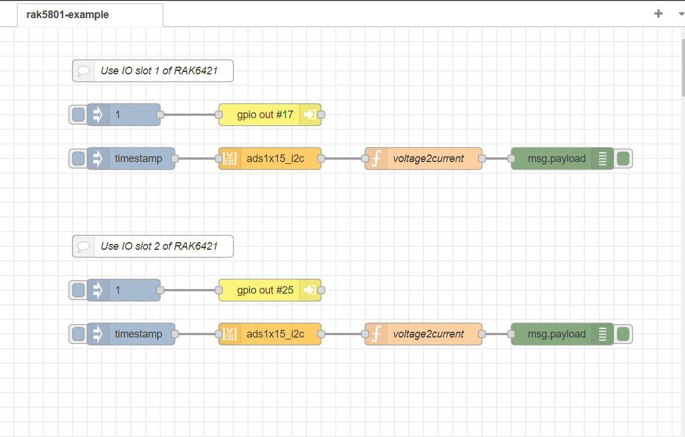

# Read 4-20 mA current input using RAK5801 from NodeRed

[TOC]

## 1.Introduction

This guide explains how to use RAK5801 to measure 4-20 mA current input through a NodeRed flow on the RAK7391 board.

### 1.1. RAK5801

The RAK5801 is a 4-20 mA current loop extension module that allows you to make an IoT solution for analog sensors with 4-20 mA interface. This module converts the 4-20 mA current signal into voltage range supported by the **ADS1115**  for further digitalization and data transmission.  For more information about RAK5801, refer to the [RAK5801 datasheet](https://docs.rakwireless.com/Product-Categories/WisBlock/RAK5801/Datasheet/).


### 1.2. ADS1115

ADS1115 is an onboard ADC chip in the RAK7391. it is a high recision16-bit ADC with 4 channels. it have a programmable gain from 2/3x to 16x so you can amplify small signals and read them with higher precision. Refer to datasheet for more information : [ADS1115 datasheet](https://cdn-shop.adafruit.com/datasheets/ads1115.pdf).


## 2.Preparation

### 2.1.hardware

There are two WisBlock IO connectors (`wisblock#1` and `wisblock#2`)on the RAK7391 already. user can connect RAK5801 module with any one of them. there are two analog input pins(`A0` and `A1`) on the RAK5801, but only `A1` is available now.  you can use it as long as your sensors operate at 3.3 V or 12 V with 4-20 mA operating current. 

In my example, I use an external power supply to simulate changes in the sensor's input current.


### 2.2.software

#### 2.2.1. Access Setup

ADS1115 use an I2C communication protocol to read analog values, in order to ensure this flow works well in your node-red runtime, the node-red user should have access to i2c bus(`/dev/i2c-1` by default) on your host.

No additional settings are required when you run node-red on your host directly. If running node-red using docker, you need to mount `/dev/i2c-1` device to the node-red container. If you use the portainer template provided by us, you don't need to change anything, as we already mount the device for you.

##### Running under Docker Command Line

To run in Docker in its simplest form just run:

```
docker run -it -p 1880:1880 -v node_red_data:/data --name NodeRed --device /dev/i2c-1:/dev/i2c-1 --user node-red:998 nodered/node-red
```

In the command above, the `--device` can mount device to container, and `--name` can add an user with specified group.

Before add node-red user to the local i2c group, you need to get the group number via running command below on your host:

`cat /etc/group | grep i2c | awk -F: '{print $3}'`

##### Running under Docker Portainer

We strongly recommend you run a Node-Red container with Docker Portainer using the template provided by RAKwireless, you won't need to make any changes to the configurations, just deploy the Node-Red container use the template (shown below),


after the app is deployed, you can browse to http://{host-ip}:1880 to access Node-Red's web interface.

##### Running under Docker Compose 

An easier way to deploy node-red container is to use docker compose.  we provide a [docker-compose.yml](docker-compose.yml) file which has configured everything,  there is no additional settings are required, just start up your node-red by running `docker-compose up`.

#### 2.2.2. Required modules

This flow use node-red-contrib-ads1x15_i2c  module, so you must install the module to your node-red first. run the following command in the root directory of your node-red install

```
npm install node-red-contrib-ads1x15_i2c
```

Another way to install required module is from editor window, open the main menu on the right, select  the `Manage Palette` option,  search node-red-contrib-ads1x15_i2c modules in the `Install` tab and install it.


#### 2.2.3. Flow configuration 

Now you can import [rak5801-example](rak5801-example-flow.json) flow. this flow consists of four nodes: `inject` node,  `ads1x15_i2c` node, `voltage2current` node , and  `debug` node. After the import is done, the new flow should look like this:



`ads1x15_i2c` node provides access to onboard ADS1115 , to get a voltage from RAK5801 analog input.  is `voltage2current` is a function node convert voltage to the corresponding current.before you deploy this flow, you need to select the correct channel and other configuration for `ads1x15_i2c` node.


- **Name**: define the msg name if you wish to change the name displayed on the node.

- **Property**: define the msg property name you wish. the payload must be a number! anything else will try to be parsed into a number and rejected if that fails.

- **Chipset**: the chipset by default is set to 1115. the chipset is the version of ads supported. there is no need to change it when using a RAK7391 board.

- **/dev/i2c-?**: the i2c device file you will access, the value by default is set to 1, which means the i2c bus index is 1.  there is no need to change it when using a RAK7391 board.

- **i2c_Address**: the address by default is set to 0x48. you can setup the ADS1X15 with one of four addresses, 0x48, 0x49, 0x4a, 0x4b. please see ads1X15 documentation for more information. again, you don't need to change it on RAK7391 board.

- **Inputs**: please note that input can only be set to `Single Ended`.  `Differential` should not apply to rak5801. at the same time you have to select correct  channel for each wisblock connector you use on rak7391 board.  when you use `wisblock#1`,  you should select `Channel 1`.  `wisblock#2` should select `Channel 3`.

- **Samples**: select the sample per second you want your ADS to make. higher rate equals more samples taken before being averaged and sent back from the ADS. please see ads1X15 documentation for more information

- **Gain**: select proper gain to match the input voltage of 4-20 mA sensor. Do NOT input voltages higher than the range or device max voltage.

## 3.Deploy

After all the preparation, hit the `Deploy` button on the top right to deploy the flow, then click inject node to trigger a reading, debug node will print the current value


