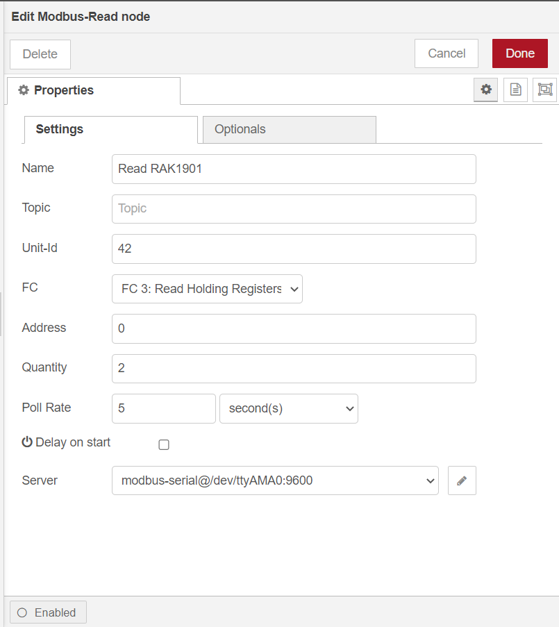

#### Modbus RTU communication using WisBlock IO RAK5802

[TOC]

## 1.Introduction

This guide explains how to use the [WisBlock IO RAK5802](https://store.rakwireless.com/collections/wisblock-interface/products/rak5802-rs485-interface) to interface a Modbus device using node-red.

### 1.1. RAK5802

The RAK5802 is a RS485 Modbus extension module that allows users to provide IoT connectivity to a new/existing solution with an RS485 interface. This module converts the RS485 signals into UART signals.


### 1.2. Modbus protocol

[Modbus](https://en.wikipedia.org/wiki/Modbus) is an industrial protocol published for the first time in 1979 but still widely used in industrial sensors and appliances. The RAK5802 IO Module allows you to interface sensors using Modbus over RS485 serial lines (a.k.a Modbus RTU).

## 2. Preparation

### 2.1. Access Setup

In this example, we are going to deploy a flow in Node-RED to communication with LINBUS protocol. To make the measurements, ensure you have access to serial port devices. 

If you are using Node-RED locally (in the host machine without using docker containers), you need to make sure the Node-RED user has access to the serial port device on your host machine.

For raspberry pi 4B,  we should enable `/dev/ttyAMA0`. To enable it , we should modify `/boot/config.txt` and `/boot/cmdline.txt`.

1. Add two lines to `/boot/config.txt`.

```
enable_uart=1
dtoverlay=pi3-miniuart-bt
```


2. Delete `console=serial0,115200` from `/boot/cmdline.txt`.
   

3. Then, reboot raspberry pi 4B. After reboot,  we can see /dev/serial0 links with ttyAMA0.

   

If your Node-RED is deployed inside a container, you need to mount serial port to the Node-RED container, and also make sure the user inside the container is assigned to the right group so that it has access to serial port  devices.

For detailed "docker run" command, docker-compose file, and information about how to use a pre-configured Portainer template, please check this [instruction](../../../README-Docker/README.md), we provide all the information you need to know about using containerized Node-RED.

### 2.2. Hardware

#### 2.1. Sensor hardware

In this example we will first create a Modbus sensor (a.k.a. master or sender) using a WisBlock Starting Kit with a RAK1901 Temperature and Humidity Sensor and a RAK5802 IO Module.

- WisBlock Starter Kit (WisBlock Base RAK5005-O + WisBlock Core RAK4631) * 1


- RAK5802 * 2

  

- WisBlock Sensor RAK1901 * 1


#### 2.2. Client hardware

On the client side (a.k.a. receiver) we have two options:

- Raspberry Pi + RAK6421 WisBlock Hat + WisBlock IO RAK5802  (We used it at this example.)
- RAK7391 WisGate Developer Connect + WisBlock IO RAK5802

In this example, we use a RAK7391 board to interface RAK5802. there are two WisBlock IO Connecter on the RAK7391 already, you can connect RAK5802 with any one of them.

#### 2.3. Other hardware

You will need a couple of cables to connect both RAK5802 modules (on the client and on the sensor) and the required cabling to flash and power the WisBlock and the client board.

#### 2.4. Connection diagram


### 2.3. Software

#### 2.3.1. Sensor software

The sensor code can be found under the [rak5802_modbus_device](rak5802_modbus_device/rak5802_modbus_device.ino) folder. You can open it directly with the Arduino IDE but you will first have to have it installed as well as the RAK6430 BSP. Check the [RAK4631 Quick Start Guide](https://docs.rakwireless.com/Product-Categories/WisBlock/RAK4631/Quickstart) to know more.

- [ArduinoIDE](https://www.arduino.cc/en/Main/Software)
- [RAK4630 BSP](https://github.com/RAKWireless/RAK-nRF52-Arduino)

At the top of the example sketch you have links to install the required libraries using the Arduino IDE Library Manager.

- [Arduino RS485 library](https://www.arduino.cc/en/Reference/ArduinoRS485)
- [ArduinoModbus library](https://www.arduino.cc/en/ArduinoModbus/ArduinoModbus)
- [Sparkfun SHTC3 Humidity and Temperature Sensor Library](https://github.com/sparkfun/SparkFun_SHTC3_Arduino_Library)

The code for the WisBlock sensor is split into methods:

* **setup**: Arduino setup code, initializes all the required hardware (debug serial, modbus, SHTC3 and LED)
* **loop**: Arduino loop, runs forever
* **modbus_setup**: enables RAK5802, starts serial communication and sets up coil (LED) and registries
* **modbus_loop**: checks for incomming packets and updates coil (LED)
* **shtc3_setup**: sensor initialization
* **shtc3_read**: reads the sensor and populates registries
* **led_setup**: LED initialization
* **led_set**: sets the LED on or off

#### 2.3.2. Client software

The client side is a node-red flow with [node-red-contrib-modbus](https://flows.nodered.org/node/node-red-contrib-modbus) module,  the flow file can be found in the [rak5802-example-flow](rak5802-example-flow.json).  before you import this flow and deploy it, you still need some preparation.

You must install `node-red-contrib-modbus` module before import this flow, run the following command in the root directory of your node-red install

```
npm install node-red-contrib-modbus
```

Another way to install required module is from editor window, open the main menu on the right, select  the `Manage Palette` option,  search node-red-contrib-modbus modules in the `Install` tab and install it.


## 3. Run example

After all the preparation, you can import the [flow](./rak5802-example-flow.json) now, the new flow should look like this:


There are two part in this flow:

- **toggle LED**

This part toggle a build-in LED on the WisBlock Base RAK5005-O by writing a single coil to either ON or OFF.

`Read LED` is a Modbus-read node, you should set `FC` to `Read Coin Status`.



`Set LED` is a Modbus-wirte node, you should set `FC` to `Force Single Coin`.


- **read RAK1901**

This part read temperature and humidity data from RAK1901 by reading holding register. 

`READ RAK1901` is a Modbus-read node you should set `FC` to `READING HOLDING REGISTER`.

`Quantity` specifies the quantity of registers to be read.


Hit the `Deploy` button on the top right to deploy this flow, you will see the LED status,  temperature and humidity data on the debug window.


## 4. RAK7391

We can also use RAK5802 on RAK7391 directly without RAK4621 pi-hat. And we should use `/dev/ttyUSB0` for IO slot 1 and `/dev/ttyUSB1` for IO slot 2.


