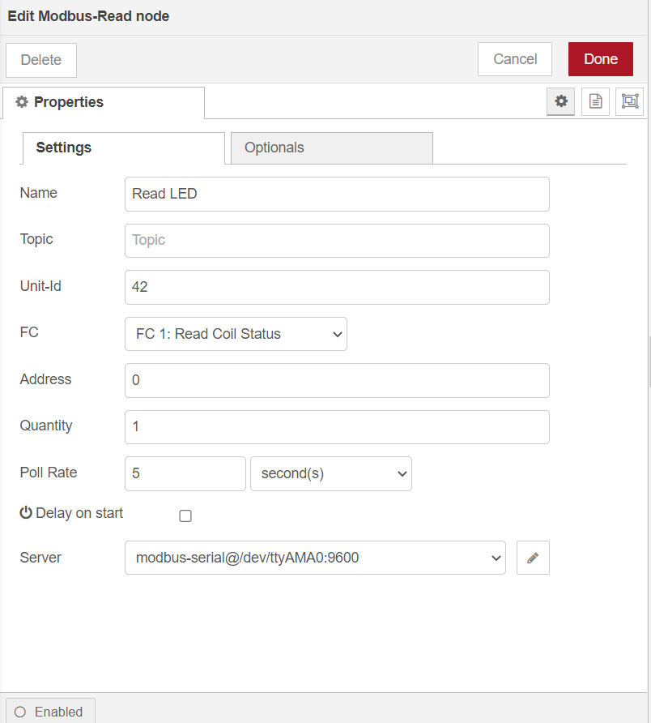
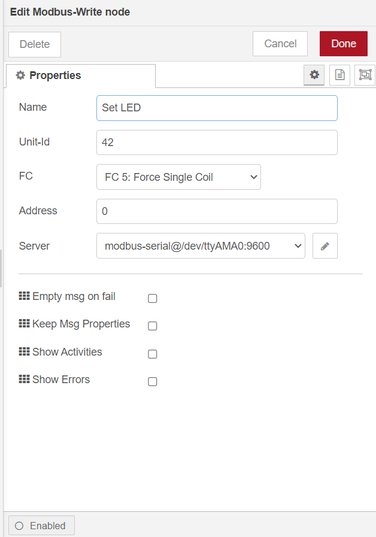
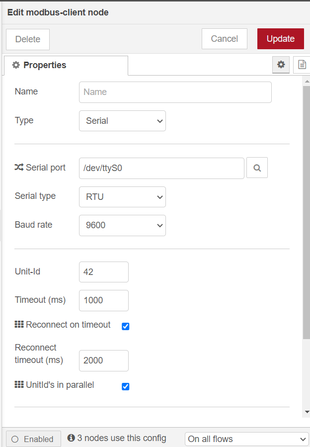

#### Modbus RTU communication using WisBlock IO RAK5802 on RAK7391

[TOC]

## 1.Introduction

This guide explains how to use the [WisBlock IO RAK5802](https://store.rakwireless.com/collections/wisblock-interface/products/rak5802-rs485-interface) in combination with RAK7391 WisGate Developer Connect to interface a Modbus device using node-red.

### 1.1 RS485 standard

**RS-485**, also known as **TIA-485(-A)** or **EIA-485**, is a standard defining the electrical characteristics of drivers and receivers for use in serial communications systems. Electrical signaling is balanced, and multipoint systems are supported. The standard is jointly published by the [Telecommunications Industry Association](https://en.wikipedia.org/wiki/Telecommunications_Industry_Association) and [Electronic Industries Alliance](https://en.wikipedia.org/wiki/Electronic_Industries_Alliance) (TIA/EIA). Digital communications networks implementing the standard can be used effectively over long distances and in electrically noisy environments. Multiple receivers may be connected to such a network in a linear, multidrop bus. These characteristics make RS-485 useful in industrial control systems and similar applications.

### 1.2. Modbus protocol

[Modbus](https://en.wikipedia.org/wiki/Modbus) is an industrial protocol published for the first time in 1979 but still widely used in industrial sensors and appliances. The RAK5802 IO Module allows you to interface sensors using Modbus over RS485 serial lines (a.k.a Modbus RTU).

## 2.Hardware

### 2.1. Sensor hardware

In this example we will first create a Modbus sensor (a.k.a. master or sender) using a WisBlock Starting Kit with a RAK1901 Temperature and Humidity Sensor and a RAK5802 IO Module.

- WisBlock Starter Kit (WisBlock Base RAK5005-O + WisBlock Core RAK4631)


- WisBlock IO RAK5802


- WisBlock Sensor RAK1901


### 2.2. Client hardware

On the client side (a.k.a. receiver) we have two options:

- Raspberry Pi + RAK6421 WisBlock Hat + WisBlock IO RAK5802
- RAK7391 WisGate Developer Connect + WisBlock IO RAK5802

in this example, we use a RAK7391 board to interface RAK5802. there are two WisBlock IO Connecter on the RAK7391 already, you can connect RAK5802 with any one of them.

### 2.3. Other hardware

You will need a couple of cables to connect both RAK5802 modules (on the client and on the sensor) and the required cabling to flash and power the WisBlock and the client board.

### 2.4. Connection diagram


## 3. Software

### 3.1. Sensor software

The sensor code can be found under the [rak5802_modbus_device](rak5802_modbus_device/rak5802_modbus_device.ino) folder. You can open it directly with the Arduino IDE but you will first have to have it installed as well as the RAK6430 BSP. Check the [RAK4631 Quick Start Guide](https://docs.rakwireless.com/Product-Categories/WisBlock/RAK4631/Quickstart) to know more.

- [ArduinoIDE](https://www.arduino.cc/en/Main/Software)
- [RAK4630 BSP](https://github.com/RAKWireless/RAK-nRF52-Arduino)

At the top of the example sketch you have links to install the required libraries using the Arduino IDE Library Manager.

- [Arduino RS485 library](https://www.arduino.cc/en/Reference/ArduinoRS485)
- [ArduinoModbus library](https://www.arduino.cc/en/ArduinoModbus/ArduinoModbus)
- [Sparkfun SHTC3 Humidity and Temperature Sensor Library](https://github.com/sparkfun/SparkFun_SHTC3_Arduino_Library)

The code for the WisBlock sensor is split into methods:

* **setup**: Arduino setup code, initializes all the required hardware (debug serial, modbus, SHTC3 and LED)
* **loop**: Arduino loop, runs forever
* **modbus_setup**: enables RAK5802, starts serial communication and sets up coil (LED) and registries
* **modbus_loop**: checks for incomming packets and updates coil (LED)
* **shtc3_setup**: sensor initialization
* **shtc3_read**: reads the sensor and populates registries
* **led_setup**: LED initialization
* **led_set**: sets the LED on or off

### 3.2. Client software

The client side is a node-red flow with [node-red-contrib-modbus](https://flows.nodered.org/node/node-red-contrib-modbus) module,  the flow file can be found in the [rak5802-example-flow](rak5802-example-flow.json).  before you import this flow and deploy it, you still need some preparation.

#### 3.2.1. Access setup

RAK5802 use Modbus over RS485 serial line, in order to run this flow, the node-red user must have access to the corresponding serial ports. serial ports are `/dev/ttyUSB0` and `/dev/ttyUSB1` on RAK7391, which correspond to two WisBlock IO Connecter(`Wisblcok1` and `Wisblock2`).

No additional settings are required when you run node-red on your host directly. if running node-red using docker,  you need to mount `/dev/ttyUSB0` and `/dev/ttyUSB1` to the node-red container. 

- **Running under Docker Command Line**

To run in Docker in its simplest form just run:

```
docker run -it -p 1880:1880 -v node_red_data:/data --device /dev/ttyUSB0:/dev/ttyUSB0 --device /dev/ttyUSB1:/dev/ttyUSB1 cap-add=SYS_RAWIO nodered/node-red
```

In the command above, the `--device` can mount device to container, the `--cap-add=SYS_RAWIO` give docker the capability to Perform I/O port operations (iopl(2) and ioperm(2)).

- **Running under Docker Portainer**

We strongly recommend you run a Node-Red container with Docker Portainer using the template provided by RAKwireless, you won't need to make any changes to the configurations, just deploy the Node-Red container use the template (shown below),


after the app is deployed, you can browse to http://{host-ip}:1880 to access Node-Red's web interface.

#### 3.2.2. Required modules

You must install `node-red-contrib-modbus` module before import this flow, run the following command in the root directory of your node-red install

```
npm install node-red-contrib-modbus
```

You also can install it directly within the editor by selecting the `Manage Palette` option from the main menu to open the [Palette Manager](https://nodered.org/docs/user-guide/editor/palette/manager). search `node-red-contrib-modbus` modules in the ‘Install’ tab and install it.

#### 3.2.3. Flow configuration

After all the preparation, you can import the flow now, the new flow should look like this:


there are two part in this flow:

- **toggle LED**

​	this part toggle a build-in LED on the WisBlock Base RAK5005-O by writing a single coil to either ON or 	OFF.

​	`Read LED` is a Modbus-read node, you should set `FC` to `Read Coin Status`



​	`Set LED` is a Modbus-wirte node, you should set `FC` to `Force Single Coin`



You also need to configure Modbus server correctly, if you use `Wisblcok1`,  should set `serial port` to

/dev/ttyUSB0, `Wisblcok2` is /dev/ttyUSB1.



- **read RAK1901**

​	this part read temperature and humidity data from RAK1901 by reading holding register. 

​	`READ RAK1901` is a Modbus-read node you should set `FC` to `READING HOLDING REGISTER`.

`	Quantity` specifies the quantity of registers to be read.


#### 3.3.4.Deploy

Hit the `Deploy` button on the top right to deploy this flow, you will see the LED status,  temperature and humidity data on the debug window.


