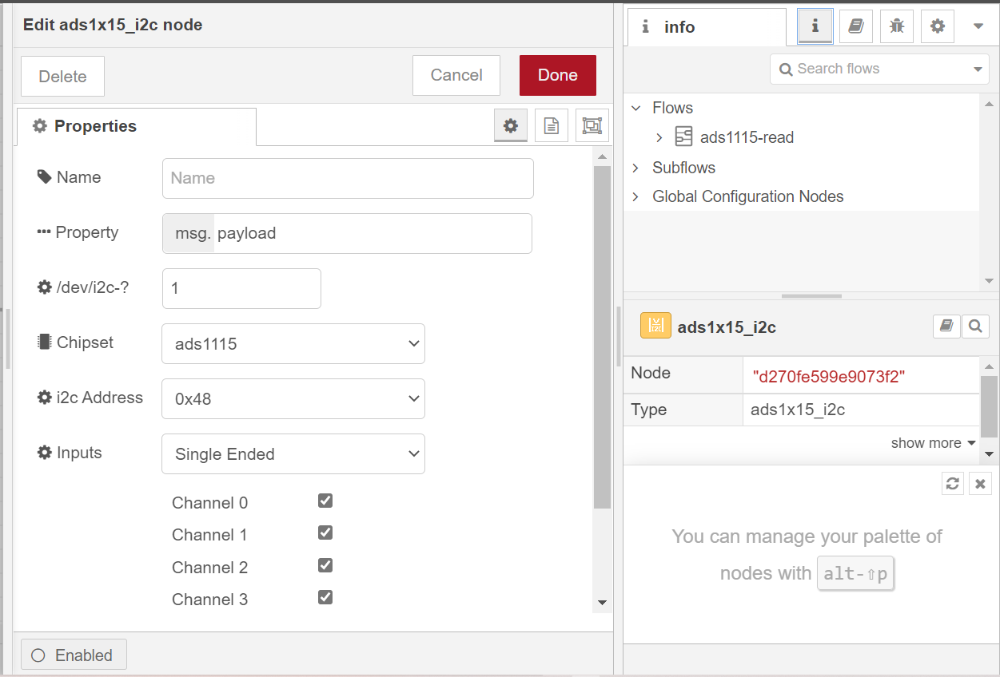
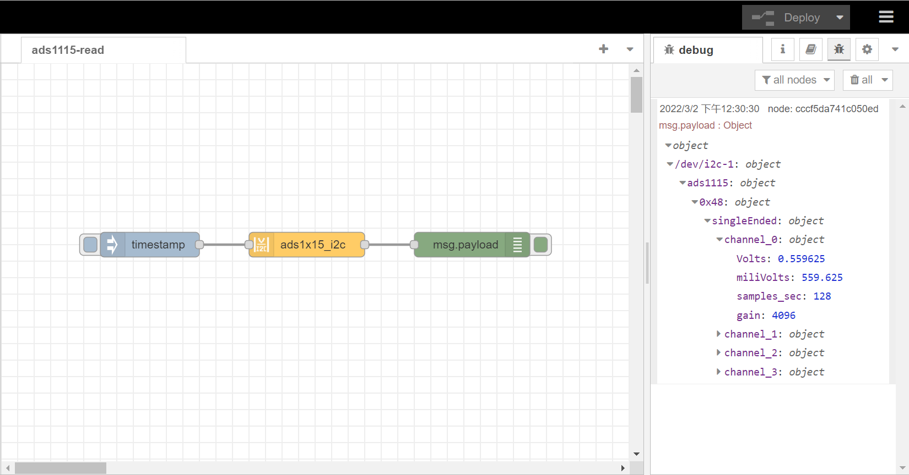

# Read analog voltage input using RAK5811 and NodeRed 

[TOC]

## 1. Introduction

The **ADC**(Analog to Digital Converter)  chip on **RAK7391** board is **ADS1115**. It digitizes the analog input signal routed through RAK5811 module. This flow provides a basic example on how to read analog voltage input in Node-Red with **node-red-contrib-ads1x15_i2c**. 

### 1.1 ADS1115

ADS1115 is a high recision16-bit ADC with 4 channels.  It has a programmable gain from 2/3x to 16x so you can amplify small signals and read them with higher precision. Refer to datasheet for more information : [ADS1115 datasheet](https://cdn-shop.adafruit.com/datasheets/ads1115.pdf).

### 1.2 RAK5811

The RAK5811 WisBlock Interface module is designed to be part of a production-ready IoT solution in a modular way. RAKWireless has standardized the way modules are interconnected to the RAK7391's high density slot 1 & slot 2 with the WisBlock Interface Connectors. 

The RAK5811 is a 0-5 V analog input interface module. The RAK5811 module features two input channels of 0-5 V analog signals. Inside, a high-precision operational amplifier, which supports a wide range of operating temperatures, is used for signal amplification and conversion.

In addition, this module integrates a 12 V power supply. The power supply is connected to an operational amplifier and be used to power the external sensors. The connection of the 0-5 V sensors is done through the fast crimping terminal without the need for special tools, this simplifies the installation process on the field

### 1.3 node-red-contrib-ads1x15_i2c

The node we used in this flow is **node-red-contrib-ads1x15_i2c**, it provides access to a ADS1x15 I2C analog to digital converter, to get a voltage or difference of voltage from a ADS1115 or ADS1015. More information is available at: [node-red-contrib-ads1x15_i2c]([node-red-contrib-ads1x15_i2c (node) - Node-RED (nodered.org)](https://flows.nodered.org/node/node-red-contrib-ads1x15_i2c))


## 2. Preparation


### 2.1 Access setup

ADS1115 use an I2C communication protocol to read analog values, in order to ensure this flow works well in your node-red runtime, the node-red user should have access to i2c bus(`/dev/i2c-1` by default) on your host.

No additional settings are required when you run node-red on your host directly. If running node-red using docker, you need to mount `/dev/i2c-1` device to the node-red container. If you use the portainer template provided by us, you don't need to change anything, as we already mount the device for you.

#### Running under Docker Command Line

To run in Docker in its simplest form just run:

`docker run -it -p 1880:1880 -v node_red_data:/data --device /dev/i2c-1:/dev/i2c-1 --cap-add=SYS_RAWIO nodered/node-red`

In the command above, the `--device` can mount device to container, the `--cap-add=SYS_RAWIO` give docker the capability to Perform I/O port operations (iopl(2) and ioperm(2)).

#### Running under Docker Portainer

If you try to run a Node-Red container with Docker Portainer using the template provided by RAKwireless, you won't need to make any changes to the configurations, just deploy the Node-Red container use the template (shown below), 


after the app is deployed, you can browse to http://{host-ip}:1880 to access Node-Red's web interface.

### 2.2. Hardware preparation 

To use RAK5811 on RAK7391 board, you need to connect RAK5811 to the high-density slots on RAK7391 board. In this example, we use slot 1, and trying to measure the input voltage connected to channel 1. Please check the picture below for more details. Please connect your analog input to the RAK5811. In this example below, the positive pin goes to the red wire, and the ground pin goes to the brown wire.


### 2.3. Flow configuration

After you deploy node-red container,  you can import  [rak5811-example.json](rak5811-example.json) flow. This flow consists of four nodes: `inject` node,  `ads1x15_i2c` node, `function` node , and  `debug` node. After the import is done, the new flow should look like this:


before you deploy this flow, you need to select the correct configuration for `ads1x15_i2c` node



- **Name**: define the msg name if you wish to change the name displayed on the node.

- **Property**: define the msg property name you wish. the name you select (msg.example) will also be the output property.the payload must be a number! anything else will try to be parsed into a number and rejected if that fails.

- **Chipset**: the chipset by default is set to 1115. the chipset is the version of ads supported. If you have an ads1015 select that option.

- **/dev/i2c-?**: the i2c device file you will access, the value by default is set to 1, which means the i2c bus index is 1.

- **i2c_Address**: the address by default is set to 0x48. you can setup the ADS1X15 with one of four addresses, 0x48, 0x49, 0x4a, 0x4b. Please see ads1X15 documentation for more information

- **Inputs**: inputs may be used for Single-ended measurements (A0-GND) or Differential measurements (A0-A1). Single-ended measurements measure voltages relative to a shared reference point which is almost always the main units ground. Differential measurements are “floating”, meaning that it has no reference to ground. the measurement is taken as the voltage difference between the two wires. Example: The voltage of a battery can be taken by connecting A0 to one terminal and A1 to the other.

- **Samples**: select the sample per second you want your ADS to make. higher rate equals more samples taken before being averaged and sent back from the ADS. please see ads1X15 documentation for more information

- **Gain**: select the gain you want. to increase accuracy of smaller voltage signals, the gain can be adjusted to a lower range. Do NOT input voltages higher than the range or device max voltage, pi 3.3v use a voltage devider to lower input voltages as needed.


Hit the `Deploy` button on the top right to deploy the flow, then click inject node to trigger a reading, debug node will print the details about each channels to debug window. However, without a function node to convert the raw readings, the value in the msg.payload object is not right (as shown below). 




Thus we need to add a unction node to the flow to process the output. 

Inside the function node, we have the following code to convert the raw readings to the actual measurements:

```
raw_voltage = msg.payload["/dev/i2c-1"].ads1115["0x48"].singleEnded.channel_1.Volts;
msg.payload = raw_voltage/0.6;
return msg;
```

The code above convert the readings from channel 1 by divided the `raw_voltage` by 0.6 to get the correct measurement value. In order to read from other channels. please change both the channel number in the code and how you connect the anlog input to RAK7391. Slot 1 on RAK7391 handles channel 0 and 1 of RAK5811, while slot 2 on RAK7391 handels channel 2 and 3 of RAK5811.


