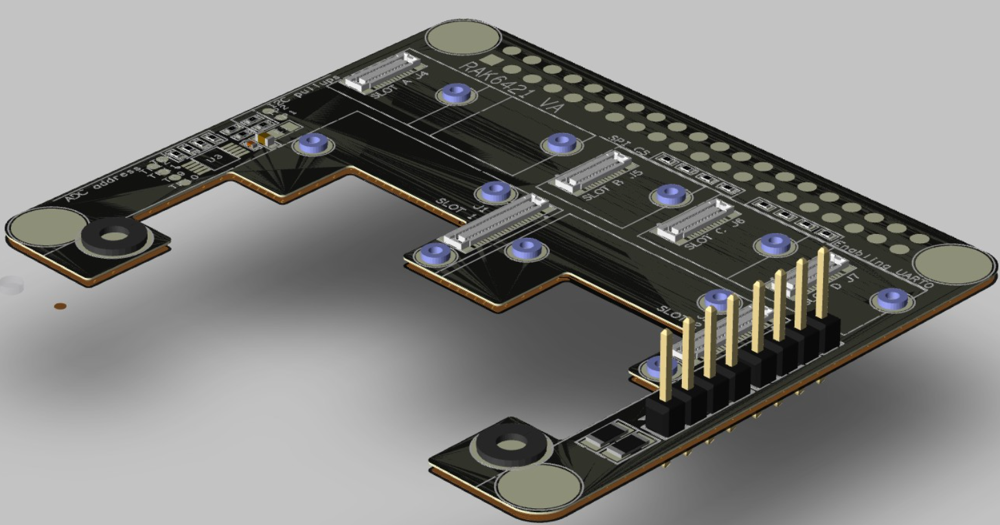
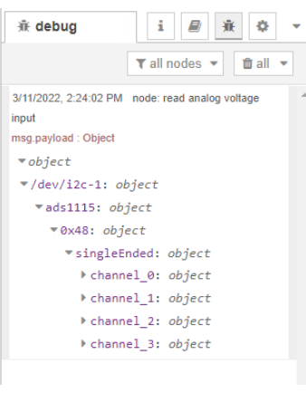

# Read analog voltage input using RAK5811 and NodeRed 

[TOC]

## 1. Introduction

This guide explains how to use `RAK5811` with pi-hat `RAK6421` to measure  `0-5V` analog input through a NodeRed flow.

### 1.1. RAK5811

The [RAK5811](https://docs.rakwireless.com/Product-Categories/WisBlock/RAK5811/Datasheet/#description) is a `0-5V` analog input interface module. 


### 1.2. RAK6421

RAK6421 is a pi-hat for [Wisblock modules](https://docs.rakwireless.com/Product-Categories/WisBlock/). It has **two IO slots** and **four sensor slots**.




### 1.3. ADS1115

ADS1115 is an onboard ADC chip in the RAK6421. it is a high precision 16-bit ADC with 4 channels. it have a programmable gain from 2/3x to 16x so you can amplify small signals and read them with higher precision. Refer to datasheet for more information : [ADS1115 datasheet](https://cdn-shop.adafruit.com/datasheets/ads1115.pdf).


## 2. Preparation

### 2.1. Access Setup

In this example, we are going to deploy a flow in Node-RED to measure temperature and humidity. To make the measurements, ensure you have access to I2C devices. 

If you are using Node-RED locally (in the host machine without using docker containers), you need to make sure the Node-RED user has access to the i2c bus (/dev/i2c-1 by default) on your host machine. You can enable I2C either by using **raspi-config** or just change `/boot/config.txt`.

If your Node-RED is deployed inside a container, you need to mount `/dev/i2c-1` to the Node-RED container, and also make sure the user inside the container is assigned to the right group so that it has access to I2C devices.

For detailed "docker run" command, docker-compose file, and information about how to use a pre-configured Portainer template, please check this [instruction](https://git.rak-internal.net/product-rd/gateway/wis-developer/rak7391/wisblock-node-red/-/blob/dev/README-Docker/README.md), we provide all the information you need to know about using containerized Node-RED.

### 2.2. Hardware

There are two WisBlock IO connectors (`wisblock#1` and `wisblock#2`)on the RAK6421. User can connect RAK5811 module with any one of them. 

In my example, I use an external power supply to simulate changes in the sensor's input current.

- **Raspberry Pi model 4B + RAK6421 WisBlock Hat +  RAK5811**


- **RAK7391 + Raspberry Pi CM4 +  RAK5811**


### 2.3. Software

This flow use `node-red-contrib-ads1x15_i2c`  module, so you must install the module to your node-red first. run the following command in the root directory of your node-red install

```
npm install node-red-contrib-ads1x15_i2c
```

Another way to install required module is from editor window, open the main menu on the right, select  the `Manage Palette` option,  search node-red-contrib-ads1x15_i2c modules in the `Install` tab and install it.


## 3. Run example

You can import  [rak5811-example.json](rak5811-example.json) flow.   This flow consists of four nodes: `inject` node,  `ads1x15_i2c` node, `function` node , and  `debug` node. After the import is done, the new flow should look like this:


If you use rak7391 without pi-hat rak6421, you should import [another](./rak5811-rak7391-example-flow.json) flow. 

Hit the `Deploy` button on the top right to deploy the flow, then click inject node to trigger a reading, debug node will print the details about each channels to debug window. However, without a function node to convert the raw readings, the value in the msg.payload object is not right (as shown below). 



## 4. License

This project is licensed under MIT license.

