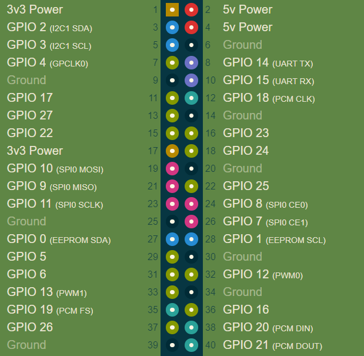
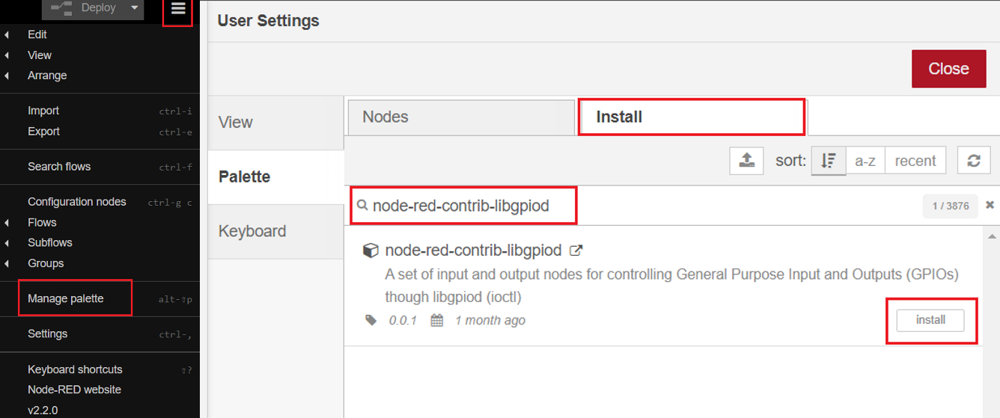
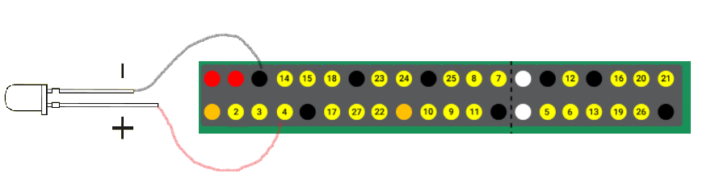
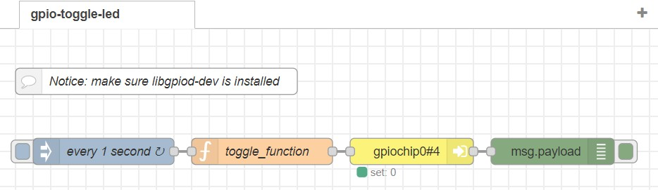
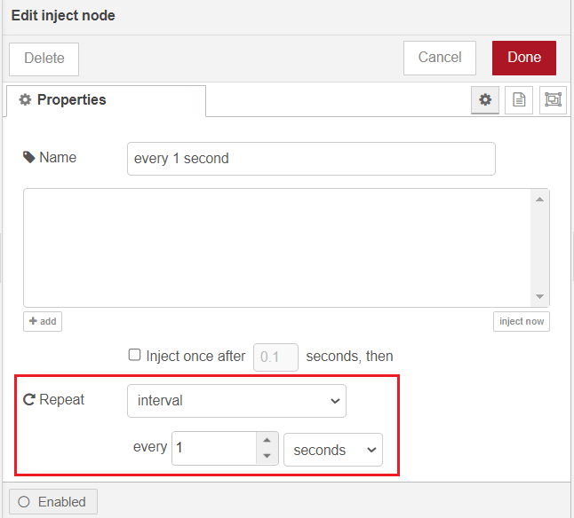
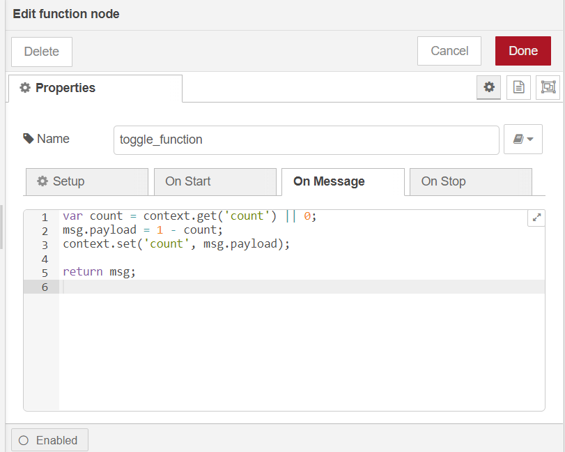
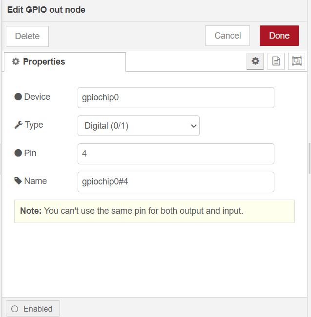
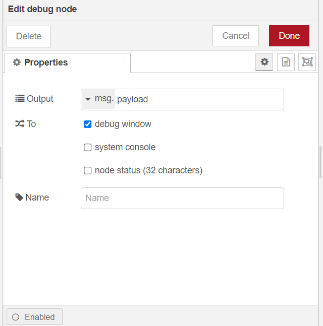
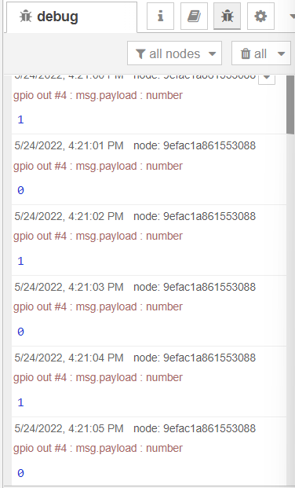

# Control the native GPIOs on Raspberry Pi or RAK7391 board from NodeRED.

[TOC]

## 1. Introduction

This guide explains how to create a flow and then use the node **node-red-contrib-libgpiod** to toggles an LED connected to a GPIO pin in the 40-pin header on a Raspberry Pi or a RAK7391 board.

### 1.1  The 40-pin header and GPIO

There is a 40-pin header on RAK7391 board, it follows the same pinout Raspberry Pi uses. The 40-pin header is a row of GPIO ( general-purpose input/output) pins offers the ability for Raspberry Pi or RAK7391 to interface with the real world. The 40-pin header provides the following power and interface options: 

* 3V3 (power)
* 5V (power)
* Ground 
* GPIO (general-purpose input/output)
* I2C (Inter-integrated circuit)
* UART (Universal asynchronous receiver-transmitter)
* PCM (Pulse-code modulation)

Check the following figure for the pinout, make sure don't get confused by BCM numbering (aka “Broadcom” or ”GPIO“ ）and Board pin numbering (aka "physical pin)". They are two different numbering systems. BCM numbering refers to the pins defined by the "Broadcom SOC channel", while the Board pin refers to the pin's physical location on the header. For example, Board pin 7 and GPIO 4 refer to the same pin.  



<span style="color:blue">here is the [reference](https://pinout.xyz/), need the documentation team to cite it or create a new one?</span>

By configuring the status of each pin in software, users can define each pin as an input or output pin, and use them for different applications.

### 1.2 node-red-contrib-libgpiod

The node we used in this flow is **[node-red-contrib-libgpiod](https://flows.nodered.org/node/node-red-contrib-libgpiod)**. It contains a set of input and output nodes for controlling General Purpose Input and Outputs (GPIOs) though libgpiod (ioctl). One of the most important things to notice when using **node-red-contrib-libgpiod** in a container is to make sure you have access to the GPIO chip inside the container. We will cover more details about it in section 2.1. If you are interested in using this node locally (outside container), please also check the [node's introduction in Node-RED's library](https://flows.nodered.org/node/node-red-contrib-libgpiod) and also their [repo](https://github.com/s5z6/node-red-contrib-libgpiod). 

## 2. Preparation

### 2.1 Get gpiochip number and pin number 

Whether you are going to use Node-RED locally or inside container, we highly recommend you to install a package called **gpiod** on your host machine to help you identify the gpiochip number and interact with Linux GPIO character device if necessary. In your terminal, run the following command to install **gpiod**:

```
sudo apt install gpiod
```

Then reboot your Raspberry Pi or the RAK7391 board. After reboot, we can execute `gpiodetect` to detect existing or new gpio chips.

```plaintext
sudo gpiodetect
```

You should be able to see a list of detected gpio chips:

```
rak@rakpios:~ $ gpiodetect
gpiochip0 [pinctrl-bcm2835] (54 lines)
gpiochip1 [raspberrypi-exp-gpio] (8 lines)
```

Notice that `gpiochip0` is for the native 40-pin header. 

In this example, we are going to deploy a flow in Node-RED to toggle a LED connected to GPIO4 (board pin 7), you can run `gpioinfo` to see the current status of this pin, you will find that it's defined as line 4, currently, it's set as Input:

```
rak@rakpios:~ $ gpioinfo
gpiochip0 - 54 lines:
	line   0:     "ID_SDA"       unused   input  active-high 
	line   1:     "ID_SCL"       unused   input  active-high 
	line   2:       "SDA1"       unused   input  active-high 
	line   3:       "SCL1"       unused   input  active-high 
	line   4:  "GPIO_GCLK"       unused   input  active-high 
	line   5:      "GPIO5"       unused   input  active-high 
	...
```

Now you know the gpiochip number and also the pin number, we are going to need both of them for the node configuration section when we deploy the node in Node-RED.

### 2.2 Running Node-RED locally

Make sure you can detect the GPIO chip first. If you are only trying to control the native 40-pin header on Raspberry or RAK7391, you won't need to modify the `config.txt` file, however, if you need to control other gpiochips connected to the Raspberry Pi/RAK7391, for example, a built-in GPIO expander on RAK7391, please check [this example](https://git.rak-internal.net/product-rd/gateway/wis-developer/rak7391/wisblock-node-red/-/tree/dev/other/libgpiod/libgpiod-blink) for instructions on how to modify the `config.txt` file and enable device tree overlay(s). 

Users need to install `libgpiod-dev`  first if they are running Node-RED locally:

```plaintext
sudo apt install libgpiod-dev
```

After that you need to install the **node-red-contrib-libgpiod** node and import the example flow we provided. We will cover this in section 2.4.

### 2.3 Running Node-RED in Docker 

#### 2.3.1 Using Docker Command Line

You can always running Node-RED inside a container. To run Node-RED in Docker and use the latest Node-RED official image, the easiest way is run the following command:

```plaintext
docker run -it -p 1880:1880 -v node_red_data:/data --device /dev/gpiochip0:/dev/gpiochip0 --restart=unless-stopped --user node-red:997 --name NodeRed nodered/node-red
```

The `--device` can mount device to container, and `--name` can add an user with specified group. Before add node-red user to the local gpio group, you need to verify the group number via running command below on your host:

```
cat /etc/group | grep gpio | awk -F: '{print $3}'
```

On a Raspbian-based-image, the group id is usually defined as 997.

Once the container is up, there is one more thing you need to do, and this step is critical. Since the offical Node-RED image doesn't have **libgpiod-dev** pre-installed, users have to install it manually inside the container, otherwise, users won'e be able to install the **node-red-contrib-libgpiod** node  :

```
apk add libgpiod-dev
```

Or, you can use the Node-RED image provided by RAKwireless, it comes with the **libgpiod-dev** package installed:

```
docker run -it -p 1880:1880 -v node_red_data:/data --device /dev/gpiochip0:/dev/gpiochip0 --restart=unless-stopped --user node-red:997 --name NodeRed sheng2216/nodered-docker:1.1
```

#### 2.3.2 Using Docker Compose

If you are going to use the Node-RED docker container, you can bring up the service by using the docker-compose.yml file provided below:

```
version: '3.7'

services:

  nodered:
    image: sheng2216/nodered-docker:1.1
    container_name: NodeRed
    user: node-red
    group_add:
        - 997
    restart: unless-stopped
    devices:
        - "/dev/gpiochip0:/dev/gpiochip0"
    volumes:
        - 'node-red-data:/data'
    ports:
        - "1880:1880/tcp"
        
volumes:
  node-red-data:
```

If you want to use the latest official image from Node-RED, feel free to change the image defined in the docker-compose file. But don't forget to install **libgpiod-dev** once the container is up. Then you need to install the node **node-red-contrib-libgpiod**（check section 2.4）

#### 2.3.3 Using Portainer

If you have Portainer installed on your Raspberry Pi or RAK7391,  you can use the Portainer template provided by RAKwireless. In this case, you won't need to make any changes to the configurations, just deploy a Node-Red container using the template (shown below), 


then you need to install the node **node-red-contrib-libgpiod**(check section 2.4).

### 2.4 Install the Node in Node-RED

After the previous software setup is completed, you can browse to http://{host-ip}:1880 to access Node-Red's web interface. Then you need to install the node **node-red-contrib-libgpiod**.

To install a new  node, go to the top right **Menu**, and then select **Manage palette**. In the **User Settings** page, you need to select **Install**, and search the key word **node-red-contrib-libgpiod**. Now you should be able to install this node.



### 2.5 Hardware

For the hardware side, you need a Raspberry Pi (or RAK7391), LED, and some jumper wires. In this example, we will first connect a LED to Board pin 7 (GPIO 4), and then create a flow in node-red to toggle the led.  Please check the figure below for how to connect the LED:



<span style="color:blue">need the documentation team to create a new one?</span>

Notice that you can connect the Ground to any of the ground pin( Board pin 6、9、14、20、25、30、34、39).

## 3. Flow configuration

 After the installation of **node-red-contrib-libgpiod** is completed, you can clone/copy the flow example. The example is under `other/gpio/gpio-toggle-led` folder in the [`wisblock-node-red`](https://git.rak-internal.net/product-rd/gateway/wis-developer/rak7391/wisblock-node-red/-/tree/dev/) repository. Then you can import the  **gpio-toggle-led.json** file or just copy and paste the .json file contents into your new flow.

After the import is done, the new flow should look like this:



Hit the **Deploy** button on the top right to deploy the flow.

This is a simple flow with one inject node to trigger the function node once a second, the GPIO out node set/unset the pin defined, and the debug node display the result. 

* inject node

  

* function node

  

* GPIO out node

  In section 2.1, we learned that the device name of the native 40-pin headers is **gpiochip0**, and since we want to control GPIO 4, we need to enter 4 for the **Pin**. For the **Name** option, you can change it to anything based on your preference.

  

* Debug node

  


Once the flow is correctly configured and deployed, you should see the LED connected to GPIO 4 is blinking at a frequency of 1 Hz, and also the output payloads in the debug window.


