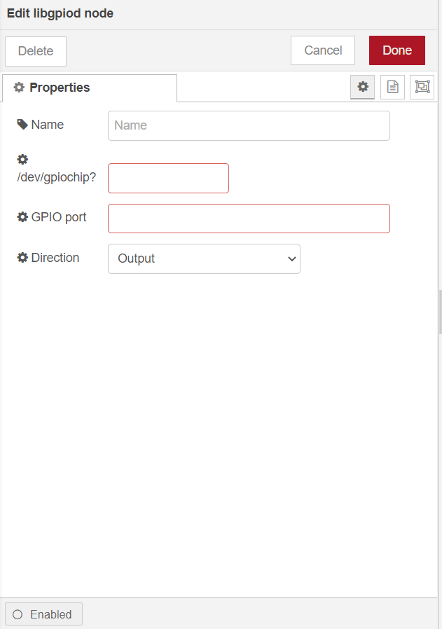
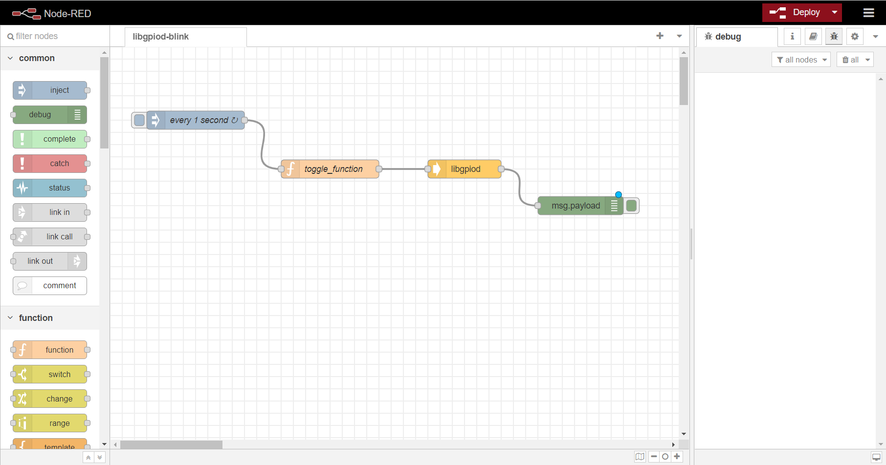

# Control the PI4IOE5V96224 GPIO Expander in RAK7391 board from NodeRED.

[TOC]

## 1. Introduction

This guide explains how to create a flow and then use the node **node-red-contrib-libgpiod** to toggles an LED connected to `IO0_7` pin of GPIO Expander in RAK7391 board. 

### 1.1 Requirements

Gpio device needs [special udev rules](https://blog.oless.xyz/post/fedorarpigpio/#udev) in order to belong to a special group so non-root users could access it freely.

Please create `/etc/udev/rules.d/85-gpiochip.rules` file, and copy the line below to `85-gpiochip.rules` file.

```
KERNEL=="gpiochip*", SUBSYSTEM=="gpio", MODE="0660", GROUP="wheel"
```


## 2. Preparation

### 2.1. Hardware

Since the LED and GPIO Expander used are all in RAK7391 board, we needn't to prepare other hardware except RAK7391.

Schematic diagram of LED and IO0_7 of GPIO Expander in RAK7391 is showed as follows.


### 2.2. Software

Install `libgpiod` library with the following commands. 

```
sudo apt install libgpiod
```

Install `node-red-contrib-libgpiod` node with the following commands. If you use docker of Node-RED, you may need to replace `~/.node-red` with `/usr/src/node-red`.

```
git clone -b dev https://git.rak-internal.net/product-rd/gateway/wis-developer/rak7391/node-red-nodes.git
```

```
cp -rf node-red-nodes/node-red-contrib-libgpiod ~/.node-red/node_modules
```

```
cd ~/.node-red/node_modules/node-red-contrib-libgpiod && npm install
```

**Tips:**  After `node-red-contrib-libgpiod` being installed,  **node-red should be restarted**, otherwise, the node cannot be found on the page.


## 3. Configure

Provides one nodes - `libgpiod` to get  and set GPIO state.

To set  GPIO port of `/dev/gpiochip?` you just need to select the correct settings for your device and trigger the node. 

	

- **Name**

  Define the msg name if you wish to change the name displayed on the node.

- **/dev/gpiochip?**

  The gpiochip Device # - You can execute 'sudo gpiodetect' to see gpiochip num.

- **GPIO port**

  The port of selected gpiochip must be number.

- **Direction**

  The direction of port can be set as `input` or `output` mode.


## 4. Run example

The example is under `other/libgpiod/libgpiod-blink` folder in the [`wisblock-node-red`](https://git.rak-internal.net/product-rd/gateway/wis-developer/rak7391/wisblock-node-red/-/tree/dev/) repository. Then you can import the  **libgpiod-blink.json** file or just copy and paste the .json file contents into your new flow.

After the import is done, the new flow should look like this:



Hit the **Deploy** button on the top right to deploy the flow.

This is a simple flow with four node, where `inject` node supply a trigger event every 1 second,  `toggle_function`  function toggle the state's value, `libgpiod`node set state of LED state, and `debug` node print the state of gpio. 

After hitting **Deploy** button, the LED on board starts to blink.


