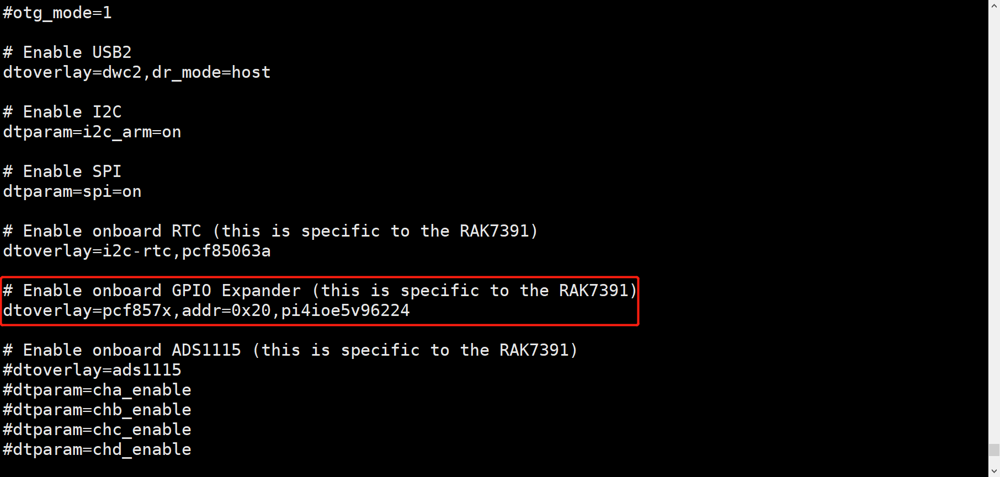
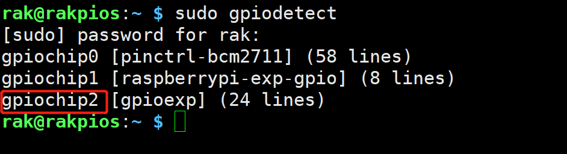
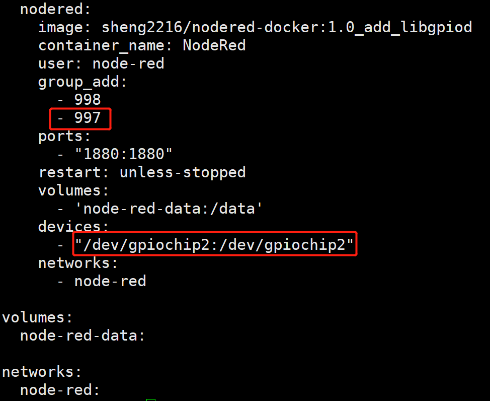
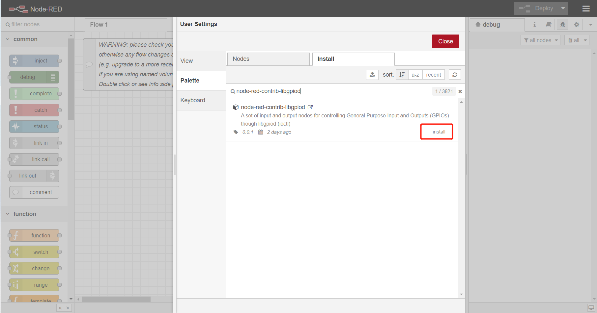
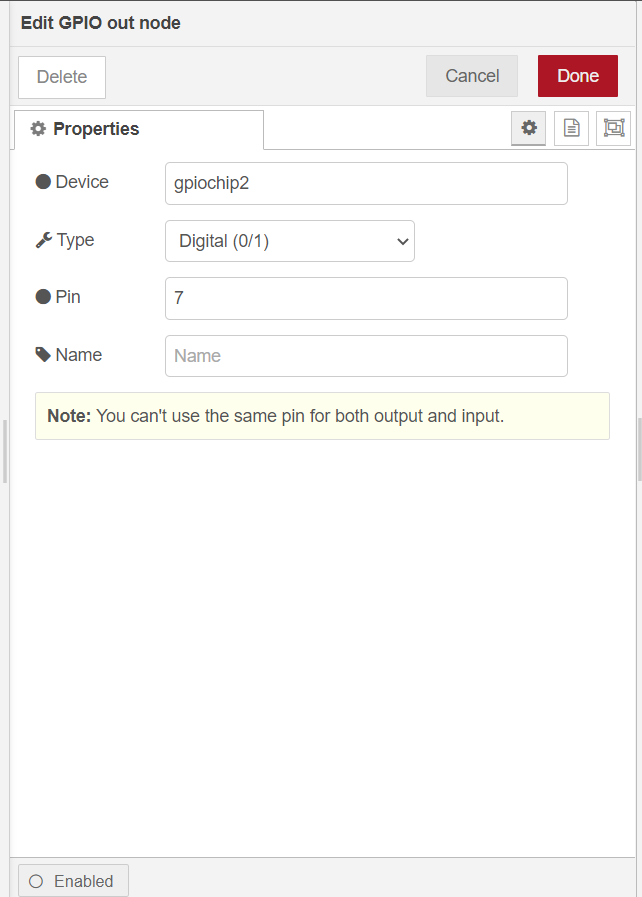
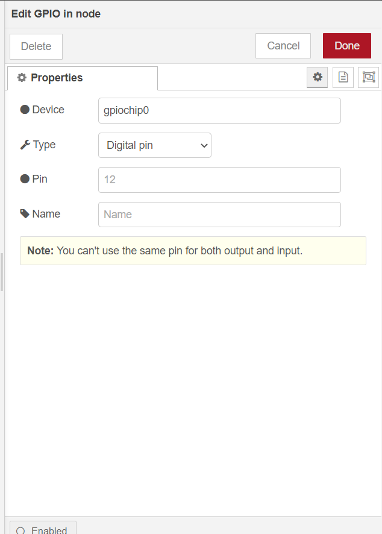
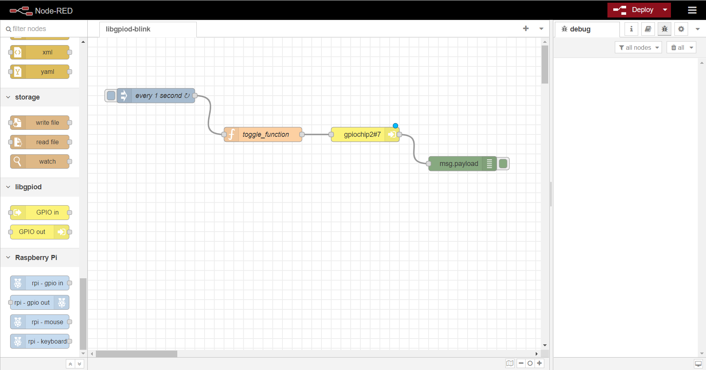

# Control the GPIO Expander in RAK7391 board from NodeRED.

[TOC]

## 1. Introduction

This guide explains how to create a flow and then use the node **libgpiod** to toggles an LED connected to `IO0_7` pin of GPIO Expander in RAK7391 board. 

### 1.1 Requirements

Adding the following line into the `/boot/config.txt`.

```
dtoverlay=pcf857x,addr=0x20,pi4ioe5v96224
```

The result will be like this.



Install `libgpiod-dev`  library  and tools firstly. 

```
sudo apt install libgpiod-dev
```

If you use `NodeRED docker`, you can execute the next command. 

```
apk add libgpiod-dev
```

Then reboot the `RAK7391`. After reboot, we can execute `gpiodetect` to find whether the new gpio expander has existed.

```
sudo gpiodetect
```

We can find gpiochip2 has already exited as follows.



If we use NodeRED docker, we should all add sometings as bellow.




## Install

## 2. Preparation

### 2.1. Hardware

Since the LED and GPIO Expander used are all in RAK7391 board, we needn't to prepare other hardware except RAK7391.

Schematic diagram of LED and IO0_7 of GPIO Expander in RAK7391 is showed as follows.


### 2.2. Software

Install `node-red-contrib-libgpiod` node from the `manage palette` menu.



## 3. Configure

Provides two nodes - `gpio out` to set GPIO state and `gpio om` to get   GPIO state.

### 3.1 gpio out

To set  GPIO port of `/dev/gpiochip?` you just need to select the correct settings for your device and trigger the node. 

	

- **Device**

  The gpiochip Device # - You can execute `sudo gpiodetect` to see gpiochip num.

- **Pin**

  The port of selected gpiochip must be number.

- **Name**

  Define the node name if you wish to change the name displayed on the node.


### 3.1 gpio in

To get  GPIO port of `/dev/gpiochip?` you just need to select the correct settings for your device and trigger the node. 

	

- **Device**

  The gpiochip Device # - You can execute `sudo gpiodetect` to see gpiochip num.

- **Pin**

  The port of selected gpiochip must be number.

- **Name**

  Define the node name if you wish to change the name displayed on the node.

## 4. Run example

The example is under `other/libgpiod/libgpiod-blink` folder in the [`wisblock-node-red`](https://git.rak-internal.net/product-rd/gateway/wis-developer/rak7391/wisblock-node-red/-/tree/dev/) repository. Then you can import the  **libgpiod-blink.json** file or just copy and paste the .json file contents into your new flow.

After the import is done, the new flow should look like this:



Hit the **Deploy** button on the top right to deploy the flow.

This is a simple flow with four node, where `inject` node supply a trigger event every 1 second,  `toggle_function`  function toggle the state's value, `gpio out`node set state of LED state, and `debug` node print the state of gpio. 

After hitting **Deploy** button, the LED on board starts to blink.


