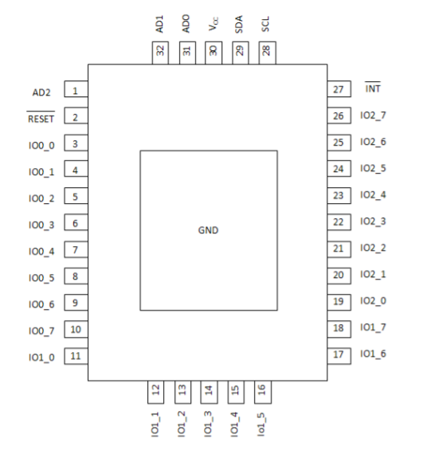
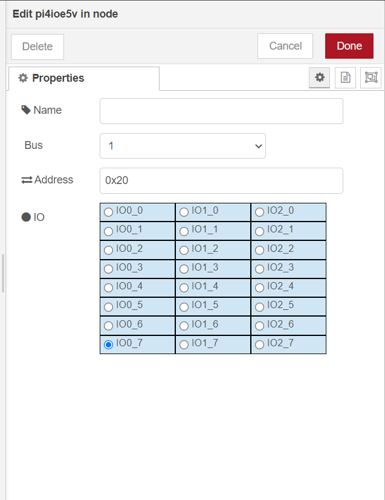
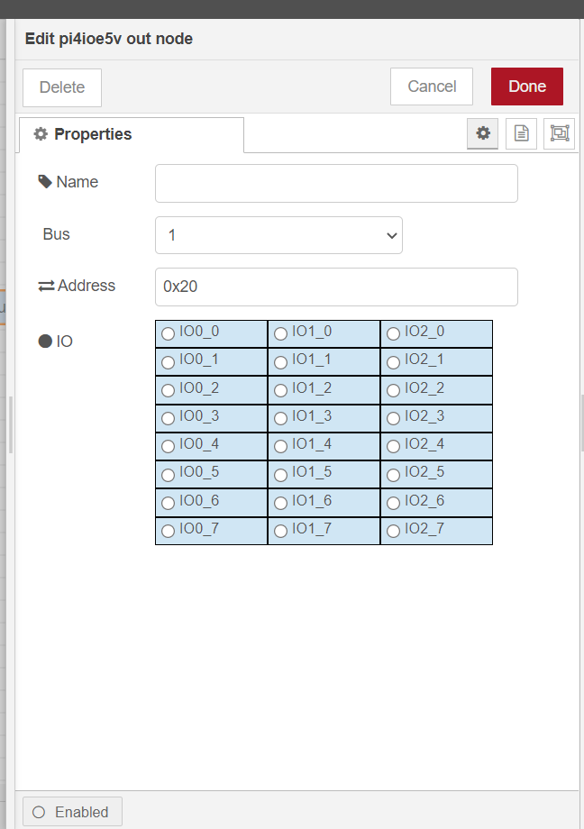
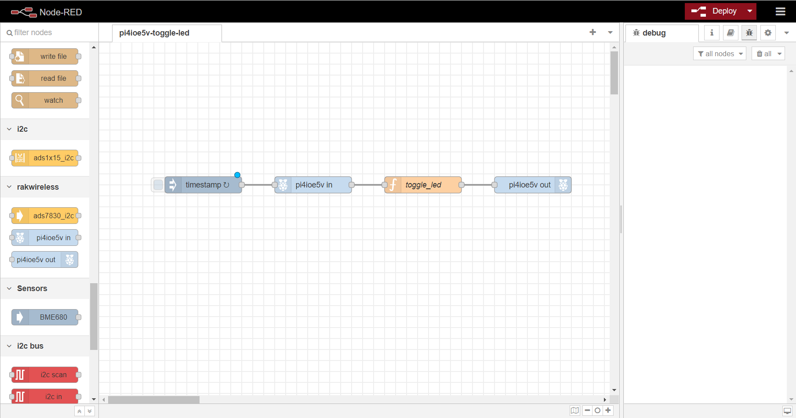
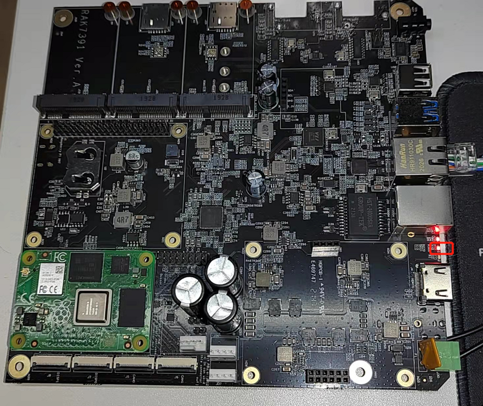

# Control the PI4IOE5V96224 GPIO Expander in RAK7391 board from NodeRED.

[TOC]

## 1. Introduction

This guide explains how to create a flow and then use the node **node-red-contrib-pi4ioe5v** to toggles an LED connected to `IO0_7` pin of PI4IOE5V96224 GPIO Expander in RAK7391 board.  PI4IOE5V96224 GPIO Expander use `i2c-1` of RAK7391 board to expand 24 IO pins.  Its pin-map is showed as follows.




### 1.1 Requirements

If you use docker to run Node-RED,  you need to ensure that the user has I2C operation permission.


## 2. Preparation

### 2.1. Hardware

Since the LED and PI4IOE5V96224  GPIO Expander used are all in RAK7391 board, we needn't to prepare other hardware except RAK7391.

Schematic diagram of LED and IO0_7 of PI4IOE5V96224  in RAK7391 is showed as follows.


### 2.2. Software

Please install `node-red-contrib-pi4ioe5v` node with the following commands. If you use docker of Node-RED, you may need to replace `~/.node-red` with `/usr/src/node-red`.

```
git clone -b dev https://git.rak-internal.net/product-rd/gateway/wis-developer/rak7391/node-red-nodes.git
```

```
cp -rf node-red-nodes/node-red-contrib-pi4ioe5v ~/.node-red/node_modules
```

```
cd ~/.node-red/node_modules/node-red-contrib-pi4ioe5v && npm install
```


## 3. Configure

Provides two nodes - `pi4ioe5v in` to get IO state, and  `pi4ioe5v out` to set IO state.

### pi4ioe5v in

PI4IOE5VXXX IO expander input node. Generates a `msg.payload` with either a 0 or 1 depending on the state of the input pin.



- **Name**

  Define the msg name if you wish to change the name displayed on the node.

- **Bus**

  Default I2C Bus is 1.  `1` is for `'/dev/i2c-1'`.

- **Address**

  The Address by default is set to 0x20. You can setup the PI4IOE5V96224 address according to your hardware. Please see  PI4IOE5V96224 documentation for more information.

- **IO**

  Select one pin whose state you what get.


### pi4ioe5v out

PI4IOE5VXXX IO expander output node. Set specific IO pin as  0 or 1. 



- **Name**

  Define the msg name if you wish to change the name displayed on the node.

- **Bus**

  Default I2C Bus is 1.  `1` is for `'/dev/i2c-1'`.

- **Address**

  The Address by default is set to 0x20. You can setup the PI4IOE5V96224 address according to your hardware. Please see  PI4IOE5V96224 documentation for more information.

- **IO**

  Select one pin whose state you what set.


## 4. Run example

After you deployed the Node-Red container using the [portainer app template](link to our portainer template) by Rakwireless, you can clone /copy the flow example. The example is under `other/pi4ioe5v` folder in the [`wisblock-node-red`](https://git.rak-internal.net/product-rd/gateway/wis-developer/rak7391/wisblock-node-red/-/tree/dev/) repository. Then you can import the  **pi4ioe5v-toggle-led.json** file or just copy and paste the .json file contents into your new flow.

After the import is done, the new flow should look like this:



Hit the **Deploy** button on the top right to deploy the flow.

This is a simple flow with four node and a `toggle_led`  function, where `inject` node supply a trigger event every 5 seconds, `pi4ioe5v in`node read state of LED state,  `toggle_led`  function toggle the state's value, and `pi4ioe5v out` node set the toggled state's value to LED. 

For example, when state of LED which `pi4ioe5v in`node read is **ON**, the `toggle_led`  function will change to **OFF** and `pi4ioe5v out` node will set **OFF** to LED and  vice versa.




