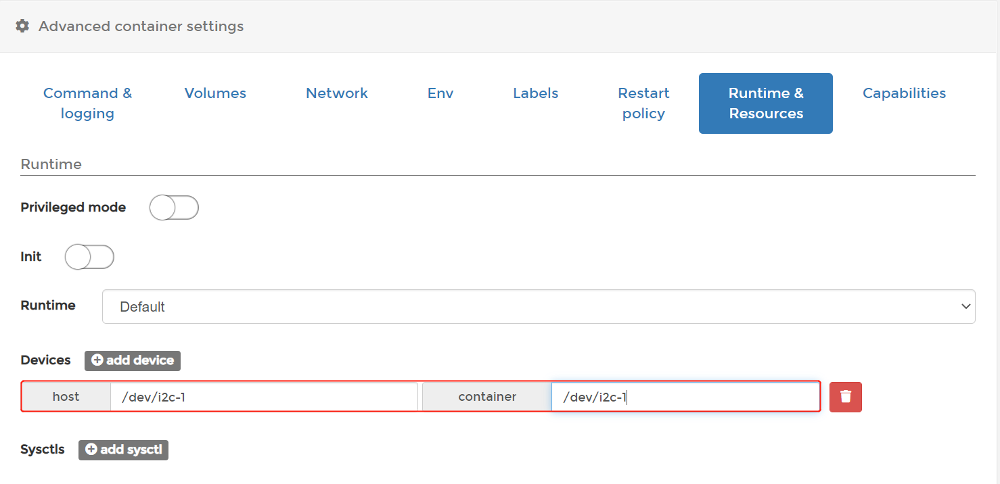
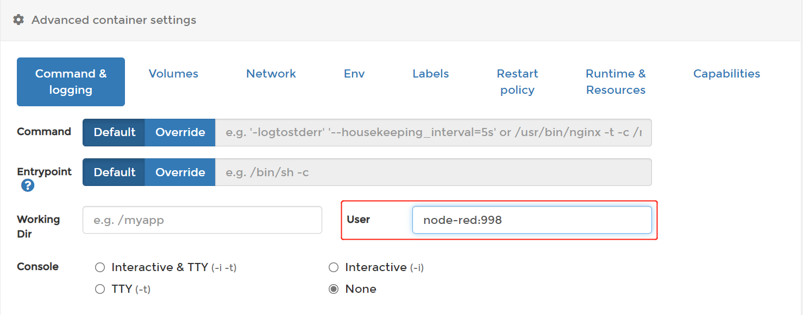
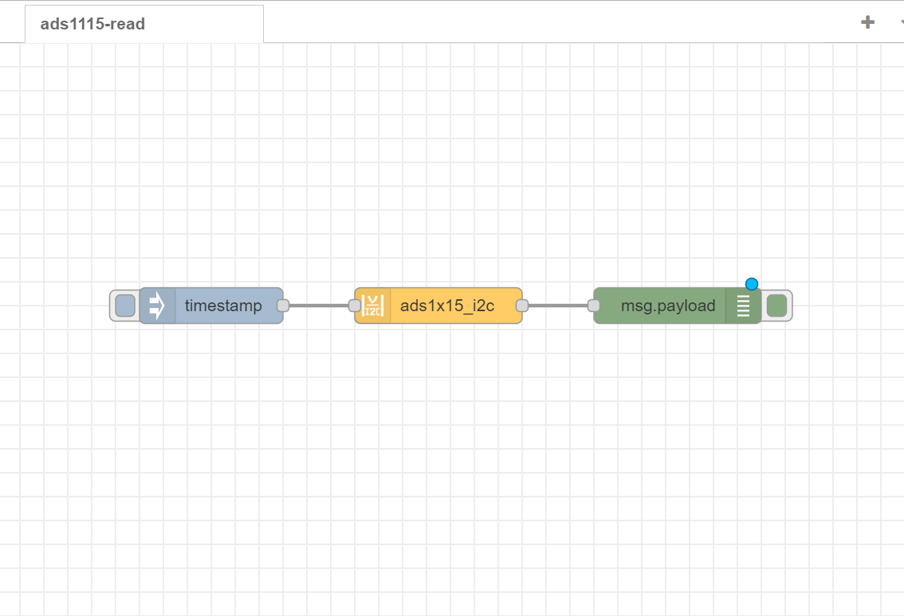
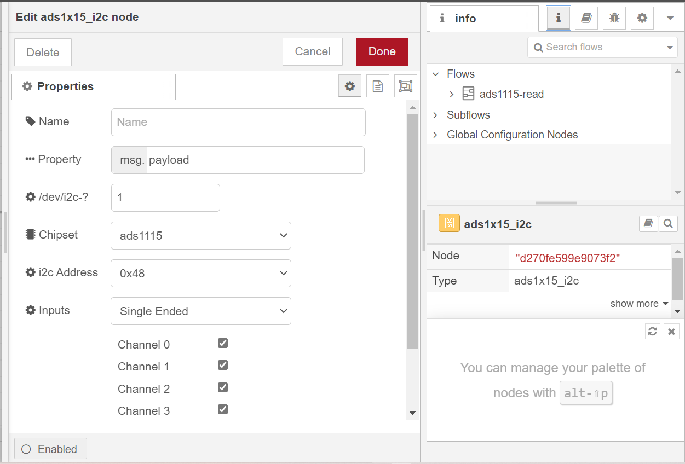
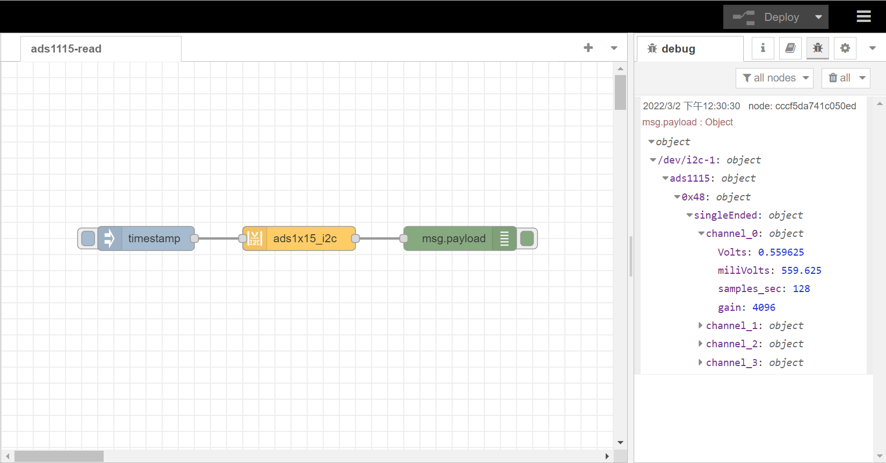

# Read 4 ADC channels on RAK7391 board from NodeRed

[TOC]

## 1.Introduction

the **ADC**(Analog to Digital Converter)  chip on **RAK7391** board is **ADS1115**. this flow explains how to read 4 input channels of ads1115 with **node-red-contrib-ads1x15_i2c** when using a RAK7391 board.

### 1.1.ADS1115

ADS1115 is  a high recision16-bit ADC with 4 channels.  it have a programmable gain from 2/3x to 16x so you can amplify small signals and read them with higher precision. Refer to datasheet for more information : [ADS1115 datasheet](https://cdn-shop.adafruit.com/datasheets/ads1115.pdf).

### 1.2.node-red-contrib-ads1x15_i2c

node-red-contrib-ads1x15_i2c is a node-red module provide access to a ADS1x15 I2C analog to digital converter, to get a voltage or difference of voltage from a ADS1115 or ADS1015. More information is available at: [node-red-contrib-ads1x15_i2c]([node-red-contrib-ads1x15_i2c (node) - Node-RED (nodered.org)](https://flows.nodered.org/node/node-red-contrib-ads1x15_i2c))

## 2 Preparation

### 2.1. access setup

ADS1115 use an I2C communication protocol to read analog values, in order to ensure this flow works well in your node-red runtime, the node-red user should have access to i2c bus(`/dev/i2c-1` by default) on your host.

no additional settings are required when you run node-red on your host directly. if running node-red using docker, you need to mount `/dev/i2c-1` device to the node-red container and add node-red user to the i2c group on your host.

#### Running under Docker Command Line

to run in Docker in its simplest form just run:

`docker run -it -p 1880:1880 -v node_red_data:/data --device /dev/i2c-1:/dev/i2c-1 --name 		node-red:998 nodered/node-red`

the `--device` can mount device to container, and `--name` can add an user with specified group.

before add node-red user to the local i2c group, you need to get the group number via running command below on your host:

cat /etc/group | grep i2c | awk -F: '{print $3}'

#### Running under Docker Portainer

if you try to run a node-red container with Docker Portainer, you also need to do some configuration similar in the `Advanced container settings`.

### 2.2. flow configuration

after you deploy node-red container,  you can import  [ads1115_read.json](ads1115_read.json) flow. this flow consists of three nodes: `inject` node,  `ads1x15_i2c` node, `debug` node. after the import is done, the new flow should look like this:

before you deploy this flow, you need to select the correct setting for `ads1x15_i2c` node

- **Name**: define the msg name if you wish to change the name displayed on the node.

- **Property**: define the msg property name you wish. the name you select (msg.example) will also be the output property.the payload must be a number! anything else will try to be parsed into a number and rejected if that fails.

- **Chipset**: the chipset by default is set to 1115. the chipset is the version of ads supported. If you have an ads1015 select that option.

- **/dev/i2c-?**: the i2c device file you will access, the value by default is set to 1, which means the i2c bus index is 1.

- **i2c_Address**: the address by default is set to 0x48. you can setup the ADS1X15 with one of four addresses, 0x48, 0x49, 0x4a, 0x4b. Please see ads1X15 documentation for more information

- **Inputs**: inputs may be used for Single-ended measurements (A0-GND) or Differential measurements (A0-A1). Single-ended measurements measure voltages relative to a shared reference point which is almost always the main units ground. Differential measurements are “floating”, meaning that it has no reference to ground. the measurement is taken as the voltage difference between the two wires. Example: The voltage of a battery can be taken by connecting A0 to one terminal and A1 to the other.

- **Samples**: select the sample per second you want your ADS to make. higher rate equals more samples taken before being averaged and sent back from the ADS. please see ads1X15 documentation for more information

- **Gain**: select the gain you want. to increase accuracy of smaller voltage signals, the gain can be adjusted to a lower range. Do NOT input voltages higher than the range or device max voltage, pi 3.3v use a voltage devider to lower input voltages as needed.

Hit the `Deploy` button on the top right to deploy the flow, then click inject node to trigger a reading, debug node will print the details about each channels to debug window.

