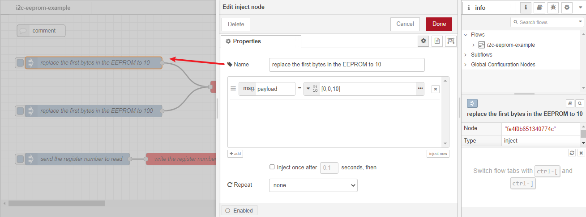
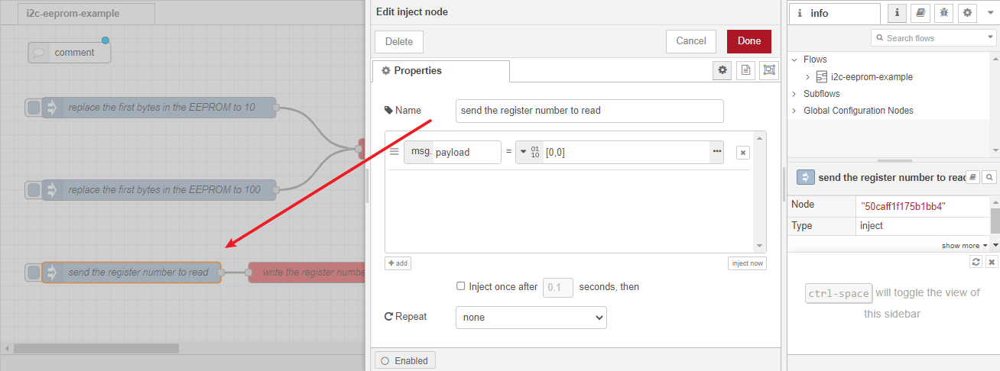
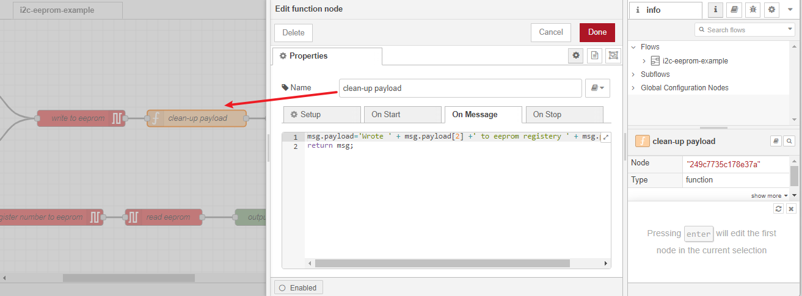
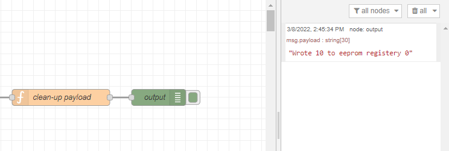
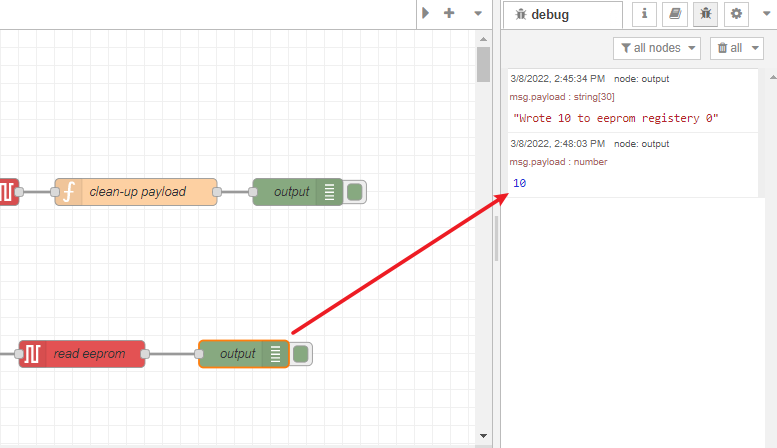

# Manage EEPROM chip in the Raspberry Pi or RAK7391 board from Node-RED 

[TOC]

## 1 Introduction

The example demonstrate how to replace the first bytes in the EEPROM chip in the RAK7391 with a certain value. The goal of this example to give a basic idea on how to manage i2c devices using Node-RED, especially how the raw I2C access in the Node-RED container is granted. 

### 1.1 I2C protocol

[**I2C**](https://en.wikipedia.org/wiki/I%C2%B2C) (Inter-Integrated Circuit), alternatively known as I2C or IIC, is a synchronous, multi-controller/multi-target (controller/target), packet switched, single-ended, serial communication bus invented in 1982 by Philips Semiconductors. It is widely used for attaching lower-speed peripheral ICs to processors and microcontrollers in short-distance, intra-board communication. To manage a I2C device, you need to know the device's I2C bus number and device address first. 

### 1.2 EEPROM

[**EEPROM**](https://en.wikipedia.org/wiki/EEPROM) stands for electrically erasable programmable read-only memory and is a type of non-volatile memory used in computers, integrated in microcontrollers for smart cards and remote keyless systems, and other electronic devices to store relatively small amounts of data by allowing individual bytes to be erased and reprogrammed.

The EEPROM chip used on RAK7391 is **[CAT24C32](https://www.onsemi.com/pdf/datasheet/cat24c32-d.pdf)**. It is a EEPROM Serial 32-Kb i2c device, internally organized as 4096 words of 8 bits each. Pin A0, A1, and A2 are used to define device address, these three pins are hard-wired HIGH or LOW allowing for up to eight devices to be used(cascaded) on the same bus. The device address of CAT24C32 is configured to **0x50** on RAK7391, and it is connected to i2c bus 1.

### 1.3 node-red-contrib-i2c

The node we used in this flow is **[node-red-contrib-i2c](https://flows.nodered.org/node/node-red-contrib-i2c)**, it provides three node: i2c scan, i2c in, and i2c out, and allows users to communicate with the Raspberry Pi I2C driver. The node "i2c scan" can scan the i2c bus for connected devices. If you are not familiar with I2C protocol, playing with this node is a good starting point. In the example .json file we provided, only node "i2c in" and "i2c out" are used. We use the "i2c out" node to write to the EEPROM chip, and then use the "i2c in" node to read from the EEPROM chip. If you are not using the Node-RED docker image provided by RAKwireless, you can run the following command in your Node-RED user directory (typically `~/.node-red`)

```
npm install --unsafe-perm node-red-contrib-i2c
```


## 2 Preparation


### 2.1 Access setup

CAT24C32 is a I2C device, it you are using Node-RED in the host machine directly( without using docker container), you won't need to change anything, just make sure the Node-RED user have access to i2c bus(`/dev/i2c-1` by default) on your host machine, and then you can skip to the hardware preparation section. For user who are using Node-RED inside a docker container, please make sure the Node-RED container you are running include support for raw I2C access. 

If running Node-RED using docker, you need to mount `/dev/i2c-1` device to the Node-RED container. If you use the portainer template provided by us, you don't need to change anything, as we already mount the device for you.

#### 2.1.1 Running under Docker Command Line

To run in Docker in its simplest form just run:

```
docker run -it -p 1880:1880 -v node_red_data:/data --device /dev/i2c-1:/dev/i2c-1 --cap-add=SYS_RAWIO nodered/node-red
```

In the command above, the `--device` can mount device to container, the `--cap-add=SYS_RAWIO` give docker the capability to Perform I/O port operations (iopl(2) and ioperm(2)).

#### 2.1.2 Running under Docker Portainer

If you try to run a Node-RED container with Docker Portainer using the template provided by RAKwireless, you won't need to make any changes to the configurations, just deploy the Node-RED container use the template (shown below), 


after the app is deployed, you can browse to http://{host-ip}:1880 to access Node-RED's web interface.

### 2.2 Hardware preparation 

On RAK7391, the device address of CAT24C32 is configured to 0x50, and connected to i2c bus 1. If you are using another board or EEPROM chip, the device address and i2c bus might change, please check  CAT24C32's [data-sheet](https://www.onsemi.com/pdf/datasheet/cat24c32-d.pdf) for more information about how the device address is configured by hard-wiring the Address inputs pins. 


## 3 Flow configuration

After you deploy Node-RED container,  you can import  [**i2c-EEPROM-example.json**](**i2c-EEPROM-example.json**.json) flow. This flow consists of four sets of nodes: `inject` node,   `node-red-contrib-i2c` nodes (`i2c in` node and `i2c out` node), `function` node , and  `debug` node. After the import is done, the new flow should look like this:


One of the most important thing to know before you deploy this flow is that you need to select the correct configuration for `node-red-contrib-i2c` nodes (`i2c in` node and `i2c out` node).

### 3.1 node-red-contrib-i2c configuration 

The first node we we want to introduce is the "write to EEPROM" node, it is a `i2c out` node. The node is responsible for writing/updating a specific byte in the EEPROM. One thing to notice is that the bus address is set to 80, as it's **0x50** in decimal; this node send 3 bytes of data to the EEPROM chip to change the first bytes stored in the EEPROM, which consists of the address of the register, and also the new value we want to write to the chip. The actual bytes are defined in the `inject` nodes, which will be explained later.


Next is the "write the register number to EEPROM" node, it is a `i2c out` node. This node write the number of the register we want to read to the EEPROM chip. This time we only send two bytes of data to the EEPROM chip.


The last `node-red-contrib-i2c` node we include in this example is the `i2c in` node. We use this node to read only one byte of data from the EEPROM chip.


### 3.2 Inject node configuration

The `inject` nodes used in this flow are used to send the right payload to `node-red-contrib-i2c` nodes. For example, if we want the change/replace the first byte in the EEPROM to 10, we need to send an array of  [0,0,10] as **buffer**. If we need to replace the first byte to 100, we need to send [0,0,100]. In this array, the second element defines the which register you want to change/update, the third element defines the value you want to change/update it to. For example, if you want to change/update the second byte in EEPROM to 50, just change the buffer payload to [0,1,50], then you are good to go.



It works the same when you trying to read from the EEPROM. For example, if you wan to read the first byte, just send [0,0] to the "i2c out" node as the inject payload, if you want to read the second byte, just send [0,1]. The only difference is that when reading, you need to write first, and then use an `i2c in` node to read.




### 3.3 Function node configuration

The function node is only used to process the output data to a more organized format. The script is provided below:

```
msg.payload='Wrote ' + msg.payload[2] +' to eeprom registery ' + msg.payload[1];
return msg;
```

and also a screenshot:




### 3.4 Debug node

The two debug node used in this flow are only for output the result. The first will output what value was written to which regiser:



and the second debug node will display the value read from a specific register of the EEPROM:



The last step is to hit the deploy button on top right to test this flow. 


