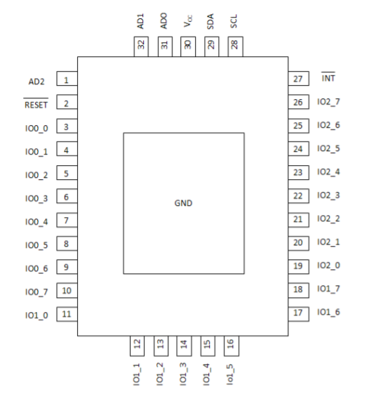
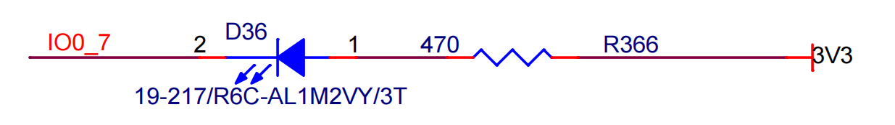
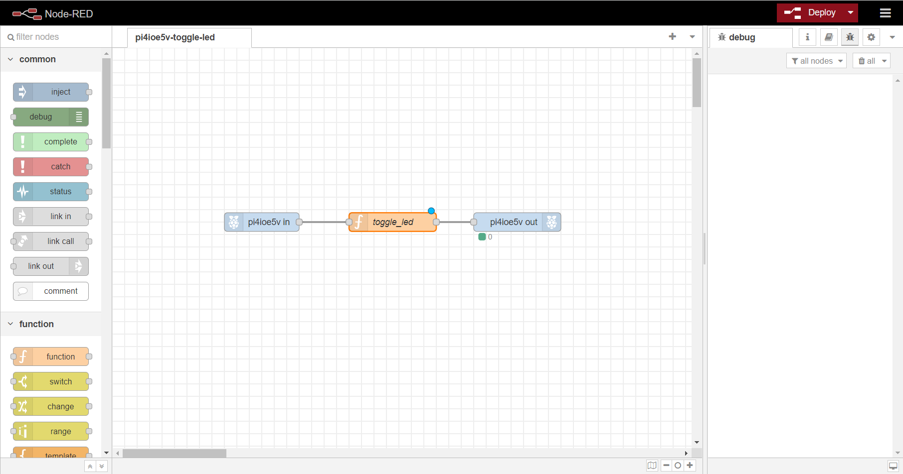
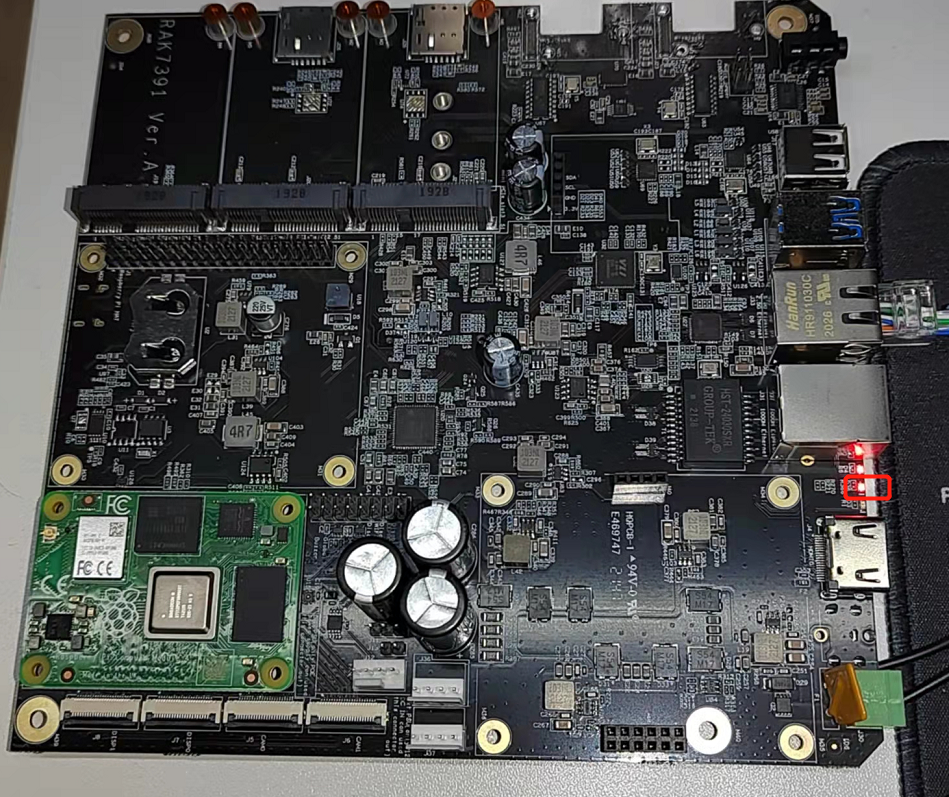

# Control the PI4IOE5V96224 GPIO Expander in RAK7391 board from NodeRED.

[TOC]

## 1. Introduction

This guide explains how to create a flow and then use the node **node-red-contrib-pi4ioe5v** to toggles an LED connected to `IO0_7` pin of PI4IOE5V96224 GPIO Expander in RAK7391 board.  PI4IOE5V96224 GPIO Expander use `i2c-1` of RAK7391 board to expand 24 IO pins.  Its pin-map is showed as follows.

### 1.1 Requirements

If you use docker to run Node-RED,  you need to ensure that the user has I2C operation permission.

## 2. Preparation

### 2.1. Hardware

Since the LED and PI4IOE5V96224  GPIO Expander used are all in RAK7391 board, we needn't to prepare other hardware except RAK7391.

Schematic diagram of LED and IO0_7 of PI4IOE5V96224  in RAK7391 is showed as follows.

### 2.2. Software

Install node-red-contrib-pi4ioe5v node according to [README]( https://git.rak-internal.net/product-rd/gateway/wis-developer/rak7391/node-red-nodes/-/tree/dev/node-red-contrib-pi4ioe5v).

## 2.2. Run

After you deployed the Node-Red container using the [portainer app template](link to our portainer template) by Rakwireless, you can clone /copy the flow example. The example is under `other/PI4IOE5V96224-GPIO-Expander` folder in the [`wisblock-node-red`](https://git.rak-internal.net/product-rd/gateway/wis-developer/rak7391/wisblock-node-red/-/tree/dev/) repository. Then you can import the  **pi4ioe5v-toggle-led.json** file or just copy and paste the .json file contents into your new flow.

After the import is done, the new flow should look like this:

Hit the **Deploy** button on the top right to deploy the flow.

This is a simple flow with a `pi4ioe5v in`node, a `pi4ioe5v out` node and a `toggle_led`  function, where `pi4ioe5v in`node read state of LED state,  `toggle_led`  function toggle the state's value, and `pi4ioe5v out` node set the toggled state's value to LED. 

For example, when state of LED which `pi4ioe5v in`node read is **ON**, the `toggle_led`  function will change to **OFF** and `pi4ioe5v out` node will set **OFF** to LED and  vice versa.

