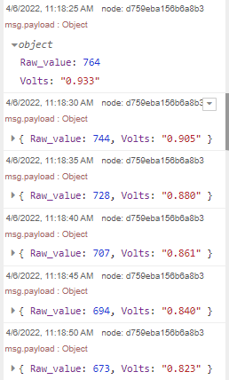

# node-red-contrib-adc121c021

The node-red-contrib-adc121c021 node allows users to read analog inputs of adc121c021 and then convert them to digital readings. 

**Tips**: Please make sure that user has the permissions to access GPIO and i2c devices, otherwise user can neither enable the adc121c021 chip nor read from the chip. 

---

## Install

Please install `node-red-contrib-ads7830` node with the following commands. If you use docker of Node-RED, you may need to replace `~/.node-red` with `/usr/src/node-red`,

```
git clone -b dev https://git.rak-internal.net/product-rd/gateway/wis-developer/rak7391/node-red-nodes.git
```

then copy `node-red-contrib-adc121c021` directory  to  the `node_modules` directory,

```
cp -rf node-red-nodes/node-red-contrib-adc121c021 ~/.node-red/node_modules
```

lastly, change to the `node-red-contrib-adc121c021` directory and install the node, 

```
cd ~/.node-red/node_modules/node-red-contrib-adc121c021 && npm install
```

**Tips:**  After the installation of  `node-red-contrib-adc121c021`  is finished, please restart your node-red service.  Otherwise, the node cannot be found/added to the new flow.

## Usage

To get the voltage reading from the adc121c021, user only need to define the i2c bus of the chip. In this case, the adc121c021 is on bus 1, and the I2C address is configured to 0x51. 


The output of the node is a payload contains the raw ADC readings and the calculated voltage measurements,



**Name**

Define the msg name if you wish to change the name displayed on the node.

**/dev/i2c-?**

Default I2C Bus is 1.  `1` is for `'/dev/i2c-1'`.

**i2c_Address**

The Address by default is set to `0x51`. Please check adc121c021's datasheet for more information.


## Example

The adc chip has an EN pin that must be pulled high before the reading, thus you need to enable the pin by using another node-red node called `node-red-node-pi-gpiod`.  It requires the [pi-gpiod](http://abyz.me.uk/rpi/pigpio/index.html) daemon to be running in order to work.

The advantage is that it also talk to GPIO on a Pi that is remote as long as it is running the daemon, and also sharing pins works more cleanly as contention is handled by the multiple connections. This is also a good way to access GPIO when running Docker on a Pi as you can use the network connection to link out of the container to the PiGPIO daemon running on the host. There are detailed instructions on how to make it works in container, please check this [guide](https://git.rak-internal.net/product-rd/gateway/wis-developer/rak7391/wisblock-node-red/-/tree/dev/other/gpio/gpio-toggle-led) on `node-red-node-pi-gpiod` created by RAKwireless and also the node's [offical webpage](https://flows.nodered.org/node/node-red-node-pi-gpiod).

Once your installed the node in Node-RED, copy the content of the following .json file and paste it to the Clipboard in Node-RED, or you can download the .json file and import it. 

```
[
    {
        "id": "4b119ae7baa52fd4",
        "type": "tab",
        "label": "Flow 1",
        "disabled": false,
        "info": "",
        "env": []
    },
    {
        "id": "c7838226084400e1",
        "type": "adc121c021_i2c",
        "z": "4b119ae7baa52fd4",
        "name": "",
        "i2c_device_number": 1,
        "i2c_address": "0x51",
        "x": 360,
        "y": 320,
        "wires": [
            [
                "7296b36a4fcdb8fa"
            ]
        ]
    },
    {
        "id": "46c2be62d207cec8",
        "type": "inject",
        "z": "4b119ae7baa52fd4",
        "name": "",
        "props": [
            {
                "p": "payload"
            },
            {
                "p": "topic",
                "vt": "str"
            }
        ],
        "repeat": "5",
        "crontab": "",
        "once": false,
        "onceDelay": 0.1,
        "topic": "",
        "payload": "",
        "payloadType": "date",
        "x": 180,
        "y": 320,
        "wires": [
            [
                "c7838226084400e1"
            ]
        ]
    },
    {
        "id": "f2c9b02fea070e04",
        "type": "inject",
        "z": "4b119ae7baa52fd4",
        "name": "ON",
        "props": [
            {
                "p": "payload"
            },
            {
                "p": "topic",
                "vt": "str"
            }
        ],
        "repeat": "",
        "crontab": "",
        "once": false,
        "onceDelay": 0.1,
        "topic": "",
        "payload": "1",
        "payloadType": "num",
        "x": 170,
        "y": 160,
        "wires": [
            [
                "cb4b6bde46fe7a23"
            ]
        ]
    },
    {
        "id": "cb4b6bde46fe7a23",
        "type": "pi-gpiod out",
        "z": "4b119ae7baa52fd4",
        "name": "",
        "host": "172.17.0.1",
        "port": 8888,
        "pin": "12",
        "set": "",
        "level": "0",
        "out": "out",
        "sermin": "1000",
        "sermax": "2000",
        "freq": "800",
        "x": 400,
        "y": 200,
        "wires": []
    },
    {
        "id": "1f183709fbcf35a7",
        "type": "inject",
        "z": "4b119ae7baa52fd4",
        "name": "OFF",
        "props": [
            {
                "p": "payload"
            },
            {
                "p": "topic",
                "vt": "str"
            }
        ],
        "repeat": "",
        "crontab": "",
        "once": false,
        "onceDelay": 0.1,
        "topic": "",
        "payload": "0",
        "payloadType": "num",
        "x": 170,
        "y": 240,
        "wires": [
            [
                "cb4b6bde46fe7a23"
            ]
        ]
    },
    {
        "id": "7296b36a4fcdb8fa",
        "type": "debug",
        "z": "4b119ae7baa52fd4",
        "name": "",
        "active": false,
        "tosidebar": true,
        "console": false,
        "tostatus": false,
        "complete": "payload",
        "targetType": "msg",
        "statusVal": "",
        "statusType": "auto",
        "x": 550,
        "y": 320,
        "wires": []
    },
    {
        "id": "45450eb87ffd5b37",
        "type": "comment",
        "z": "4b119ae7baa52fd4",
        "name": "Notes",
        "info": "The ADC121c021 module has an EN pin (IO_6 in the WisBlock connector) that must be pulled high before the reading. In the example flow, the EN pin is connected to pin 32 (GPIO 12) of the 40-pin header.\n\nTo enable/disable the EN pin, you need to use a pi-gpiod node to control it.  \n\nOnce the EN pin is set to ON, you should be able to read the PPM value and percentage readings from the MQ2 gas sensor.\n\nTo get a more accurate readins, you need to calibrate the MQ2 sensor based on your set-up. For more information about the gas sensor, please check the [datasheet](https://www.mouser.com/datasheet/2/321/605-00008-MQ-2-Datasheet-370464.pdf) and the [tutorial ](https://jayconsystems.com/blog/understanding-a-gas-sensor) ",
        "x": 150,
        "y": 80,
        "wires": []
    }
]
```


## License

This project is licensed under MIT license.
