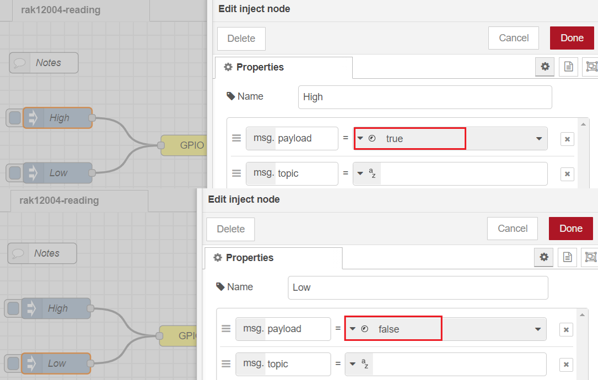
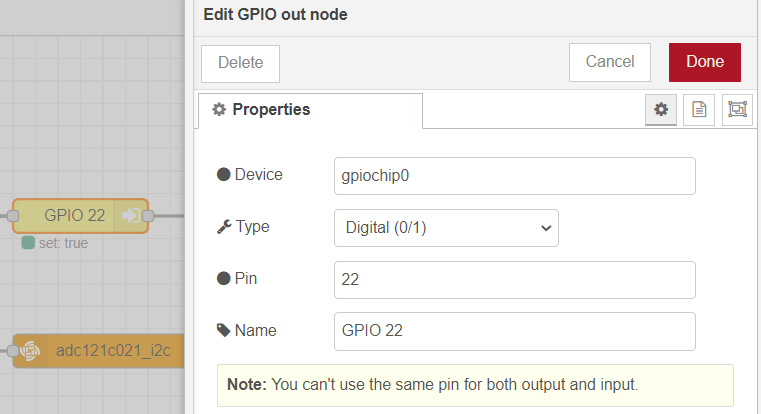
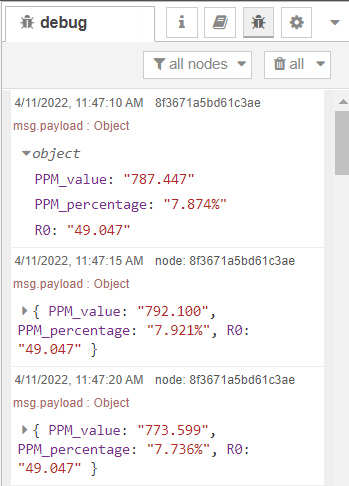

# Read smoke PPM using WisBlock sensor RAK12004 from Node-RED 

[TOC]

## 1 Introduction

This guide explains how to use the [WisBlock Sensor RAK12004](https://docs.rakwireless.com/Product-Categories/WisBlock/RAK12004/Overview/) in combination with RAK6421 Wisblock Hat or RAK7391 WisGate Developer Connect to measure smoke's PPM through the I2C interface using Node-RED.  

### 1.1 RAK12004

The **RAK12004** is a gas sensor module, part of the RAKWireless WisBlock Sensor series. The RAK12004 has an electronic sensor used for sensing the concentration of gases in the air. The sensor used is the [MQ2](https://www.pololu.com/file/0J309/MQ2.pdf) from Zhengzhou Winsen Electronics, it contains a sensing material whose resistance changes when it comes in contact with the gas. MQ-2 gas sensor has a high sensitivity to LPG, Propane, and Hydrogen, also could be used for Methane and other combustible steam. For more information about RAK12004, refer to the [Datasheet](https://docs.rakwireless.com/Product-Categories/WisBlock/RAK12004/Datasheet/).

In RAK12004, the concentrations of gas is measured using a voltage divider network present in the sensor. The output of the sensing element is connected to a 12-bit ADC (ADC121C021) which communicates through I2C to the application. The ADC121C021 supports the I2C serial bus and data transmission protocol, and it operates as a slave device on the I2C bus. For more information about ADC121C021, refer to the [datasheet](https://www.ti.com/lit/ds/symlink/adc121c021.pdf?ts=1649226964688&ref_url=https%253A%252F%252Fwww.google.com.hk%252F). 

### 1.2 node-red-contrib-adc121c021 & node-red-contrib-libgpiod

The node we used in this flow is **[node-red-contrib-adc121c021](https://git.rak-internal.net/product-rd/gateway/wis-developer/rak7391/node-red-nodes/-/tree/dev/node-red-contrib-adc121c021)**, as well as [node-red-contrib-libgpiod](https://flows.nodered.org/node/node-red-contrib-libgpiod). 

The `node-red-contrib-adc121c021` provides the very basic configuration for users to configure, the user only needs to define the i2c bus of the chip. The chip is set to the automatic conversion mode by default, and the cycle time is set to 32. The I2C address of adc121c021 is configured to 0x51 on RAK12004. 

The `node-red-contrib-libgpiod` node contains a set of input and output nodes for controlling General Purpose Input and Outputs (GPIOs) though libgpiod (ioctl). It is used to pull the EN pin that must be pulled high before ASC121C021 can read analog inputs.

One of the most important things to notice when using `node-red-contrib-libgpiod` inside a container is to make sure you have access to the GPIO chip inside the container. We will cover more details about it in this [documentation](https://git.rak-internal.net/product-rd/gateway/wis-developer/rak7391/wisblock-node-red/-/blob/dev/README-Docker/README.md). If you are interested in using this node locally (outside container), please also check the [node's introduction in Node-RED's library](https://flows.nodered.org/node/node-red-contrib-libgpiod) and also their [repo](https://github.com/s5z6/node-red-contrib-libgpiod). 


## 2 Preparation

### 2.1 Access Setup

Ensure you have access to both I2C devices and GPIO when using RAK12004. In this example, we are going to deploy a flow in Node-RED to to measure alcohol gas PPM through the I2C interface. To make the measurement, we need to enable the ADC121C021 chip first. The Enable pin varies based on your hardware setup, when you connect the RAK12004 to the IO slot1 on RAK6421, the ENABLE pin is GPIO 12 (board pin 32). When using IO slot 2 on RAK6421 (check the hardware preparation section for pictures), the ENABLE pin is GPIO 22 (board pin 15). 

If you are using Node-RED locally (in the host machine without using docker containers), you need to make sure the Node-RED user has access to the i2c bus (/dev/i2c-1 by default) and gpio(/dev/gpiochip0 by default) on your host machine.

If your Node-RED is deployed inside a container, you need to mount `/dev/i2c-1` and `/dev/gpiochip0` to the Node-RED container, and also make sure the user inside the container is assigned to the right group so that it has access to I2C and GPIO devices.

For detailed "docker run" command, docker-compose file, and information about how to use a pre-configured Portainer template, please check this [instruction](https://git.rak-internal.net/product-rd/gateway/wis-developer/rak7391/wisblock-node-red/-/blob/dev/README-Docker/README.md), we provide all the information you need to know about using containerized Node-RED.

### 2.2 Install dependency & nodes in Node-RED

Before we install the nodes, please make sure `libgpiod-dev` has been installed, if not, please install it.

```plaintext
sudo apt update
sudo apt install libgpiod-dev
```

If your Node-RED is deployed inside a container, you need to install `libgpiod-dev` inside container, please also check the [instruction](https://git.rak-internal.net/product-rd/gateway/wis-developer/rak7391/wisblock-node-red/-/blob/dev/README-Docker/README.md) on install dependency inside container.

Now we need to install some nodes for the example flow. Browse to http://{host-ip}:1880 to access Node-Red's web interface. In this example, you need to install two nodes: [node-red-contrib-libgpiod](https://flows.nodered.org/node/node-red-contrib-libgpiod) and [node-red-contrib-pca9685](https://flows.nodered.org/node/node-red-contrib-pca9685).

Take `node-red-contrib-libgpiod` as an example. To install this node , go to the top right **Menu**, and then select **Manage palette**. In the **User Settings** page, you need to select **Install**, and search the key word **node-red-contrib-libgpiod**. Now you should be able to install this node.


### 2.3 Hardware  

The device address of RAK12009 is configured to 0x55, and connected to i2c bus 1. 

The easiest way to set up the hardware is to use the RAK6421 WisBlock Hat that exposes all the Wisbock high-density connector pins.  The RAK12009 can be mounted to the HAT, and the HAT goes to the 40-pin headers located on Raspberry Pi 4B/IO board/RAK7391. Based on your hardware selections, there are three ways to mount RAK12009, please check the following figured(use slot 2 on RAK6421, you can switch to use slot 1, make sure to change the Enable pin defined in the flow, and also section 2.1):

1. Raspberry Pi model B + RAK6421 WisBlock Hat +  RAK12004

   

2. Raspberry Pi CM4 + Compute Module 4 IO Board + RAK6421 WisBlock Hat + RAK12004

   

3. Raspberry Pi CM4  + RAK7391 WisGate Developer Connect + RAK6421 WisBlock Hat + RAK12004

   


## 3 Flow Configuration

After the installation of `node-red-contrib-adc121c021` is completed, you can clone/copy the flow example. The example is under `sensor/rak12004/rak12004-reading` folder in the [`wisblock-node-red`](https://git.rak-internal.net/product-rd/gateway/wis-developer/rak7391/wisblock-node-red/-/tree/dev/) repository. Then you can import the  **rak12004-reading.json** file or just copy and paste the .json file contents into your new flow.

After the import is done, the new flow should look like this:

As we mentioned in section 2.5,  `node-red-contrib-libgpiod` node is used to pull the Enable pin that must be pulled high before ADC121C021 can read analog input.

* Inject nodes

  The two inject nodes connected to the **GPIO out node node** are responsible for sending digital 0 and 1 (or true or false) to **GPIO out node** node, the **GPIO out node** will set the selected Board pin to high or low based on the value passed in by the inject nodes. 

  

* GPIO out node

  In section 2.1, we learned that the device name of the native 40-pin headers is **gpiochip0**, and since we want mount the RAK12004 on slot 2 of RAK6421 Pi-HAT, the Enable pi is GPIO 22. For the **Name** option, you can change it to anything based on your preference.

  

* Debug node (Pin status)

  The output of this debug node is the status of the Enable pin.

  

* inject node (5s trigger)

  The inject node connected to the adc121c021_i2c node will trigger the adc121c021_i2c node every five seconds.

  

  

* adc121c021_i2c node

  

  To get the voltage reading from the adc121c021, users only need to define the i2c bus of the chip. In this case (using RAK12004), the adc121c021 is on bus 1, and the I2C address of the chip ADC121c021 is configured to 0x51 on RAK12004. 

- function node configuration

  In order to make the sensor with better performance, calibration of R0 is needed. Users can also define the regression method in the function node. The value of `RatioMQ2CleanAir` depends on the gas users want to monitor, and constantA and constanB are calculated based on the Sensitive Characteristics provided in MQ2's [datasheet](https://www.pololu.com/file/0J309/MQ2.pdf).

  

  The script is provided below:

  ```
  // Retrieve voltage readings from the adc node
  var sensorVoltage = msg.payload.Volts;
  const MQ2_RL = 10;
  // RS over R0 = 9.8 ppm
  const RatioMQ2CleanAir = 9.6;
  const VOLTAGE_REF = 5;
  const constantA = -0.399;
  const constantB = 1.45;
  
  
  function readSensor(regressionMethod) {
      // set the regression method if=1 use Exponential else Linear
      //     Exponential:  PPM =  A*(RS/R0)^B
      //     Linear:       PPM =  pow(10, (log10(RS/R0)-B)/A) 
  
      var RS_air = (VOLTAGE_REF * MQ2_RL / sensorVoltage) - MQ2_RL;
      // console.log("DEBUG RS_air VALUE", RS_air);
      var ppm;
      if (RS_air < 0) {
          //No negative values accepted.
          RS_air = 0;
      }
      // Get ratio RS_gas/RS_air
      var ratio = RS_air / R0;
      if (ratio <= 0) {
          //No negative values accepted or upper datasheet recomendation. 
          ratio = 0;
      }
  
      if (regressionMethod == 1) {
          ppm = constantA * Math.pow(ratio, constantB);
      } else if (regressionMethod == 0){
          //Get ppm value in linear scale according to the the ratio value 
          let ppm_log = (Math.log10(ratio) - constantB) / constantA;
          //Convert ppm value to log scale 
          ppm = Math.pow(10, ppm_log);
      } else{throw "Wrong regression method, only support 1 and 0 ";}
  
      if (ppm < 0) {
          ppm = 0;
      }
      return ppm;
  }
  
  function calibrateR0(ratioInCleanAir) {
      //Calculate RS in fresh air
      var RS_air = (VOLTAGE_REF * MQ2_RL / sensorVoltage) - MQ2_RL;
      //No negative values accepted
      if (RS_air < 0) {
          RS_air = 0;
      }
      //Calculate R0 
      R0 = RS_air / ratioInCleanAir;
      //No negative values accepted
      if (R0 < 0) {
          R0 = 0;
      }0
      return R0;
  }
  
  
  
  // Retrieve calibated R0 value
  var R0 = flow.get('R0');
  if (!R0)
  {
      var clacR0 = 0;
      for (let i = 0; i <= 100; i++) {
          clacR0 =clacR0+calibrateR0(RatioMQ2CleanAir);
      }
      R0=clacR0/100;
  
      if (R0 === Infinity) {
          throw "Warning: Conection issue founded, R0 is infite (Open circuit detected) please check your wiring and supply";
      }
      if (R0 == 0){
          throw "Warning: Conection issue founded, R0 is zero (Analog pin with short circuit to ground) please check your wiring and supply";
      }
  
      //set the value of R0 for the flow
      flow.set("R0",R0);
  }
  
  // get sensor PPM value
  var sensorPPM = readSensor(0);
  var payload = {};
  
  payload.PPM_value = sensorPPM.toFixed (3);
  payload.PPM_percentage = ((sensorPPM / 10000) * 100).toFixed(3) +'%';
  payload.R0=R0.toFixed(3);
  
  return {
      payload: payload
  };
  ```

  

## 4 Flow output

The output of the node is a payload that contains the PPM value, percentage readings, and the value of R0,




## License

This project is licensed under MIT license.
