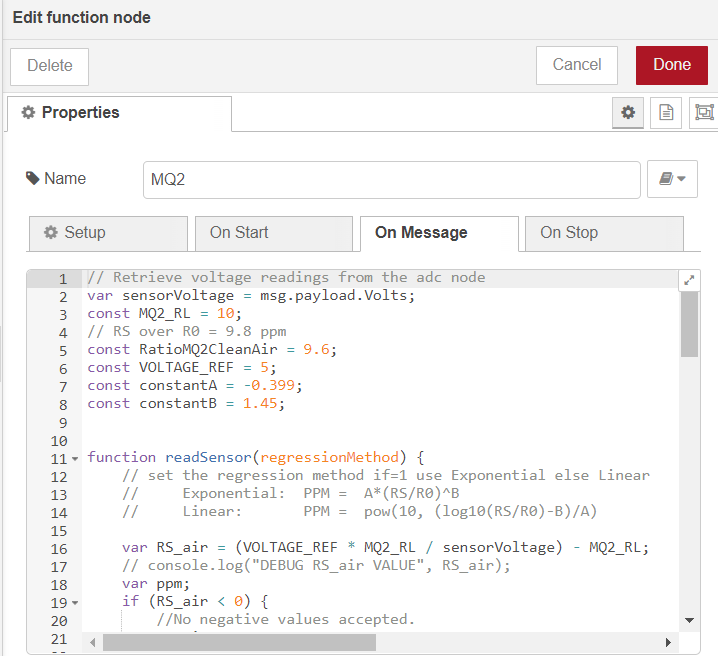

# Read smoke PPM using WisBlock sensor RAK12004 from Node-RED 

[TOC]

## 1 Introduction

This guide explains how to use the [WisBlock Sensor RAK12004](https://docs.rakwireless.com/Product-Categories/WisBlock/RAK12004/Overview/) in combination with RAK6421 Wisblock Hat or RAK7391 WisGate Developer Connect to measure smoke's PPM through the I2C interface using Node-RED.  

### 1.1 RAK12004

The **RAK12004** is a gas sensor module, part of the RAKWireless WisBlock Sensor series. The RAK12004 has an electronic sensor used for sensing the concentration of gases in the air. The sensor used is the [MQ2](https://www.pololu.com/file/0J309/MQ2.pdf) from Zhengzhou Winsen Electronics, it contains a sensing material whose resistance changes when it comes in contact with the gas. MQ-2 gas sensor has a high sensitivity to LPG, Propane, and Hydrogen, also could be used for Methane and other combustible steam. For more information about RAK12004, refer to the [Datasheet](https://docs.rakwireless.com/Product-Categories/WisBlock/RAK12004/Datasheet/).

### 1.2 I2C protocol

**I2C** (**Inter-Integrated Circuit**) is a synchronous, multi-controller/multi-target (controller/target), packet switched, single-ended, serial communication bus invented in 1982 by Philips Semiconductors. It is widely used for attaching lower-speed peripheral ICs to processors and microcontrollers in short-distance, intra-board communication. 

In RAK12004, the concentrations of gas is measured using a voltage divider network present in the sensor. The output of the sensing element is connected to a 12-bit ADC (ADC121C021) which communicates through I2C to the application. For more information about ADC121C021, refer to the [Datasheet](https://www.ti.com/lit/ds/symlink/adc121c021.pdf?ts=1649226964688&ref_url=https%253A%252F%252Fwww.google.com.hk%252F). The ADC121C021 supports the I2C serial bus and data transmission protocol, and it operates as a slave device on the I2C bus.

### 1.3 node-red-contrib-adc121c021 & node-red-node-pi-gpiod

The node we used in this flow is **[node-red-contrib-adc121c021](https://git.rak-internal.net/product-rd/gateway/wis-developer/rak7391/node-red-nodes/-/tree/dev/node-red-contrib-adc121c021)**, as well as the **[node-red-node-pi-gpiod](https://flows.nodered.org/node/node-red-node-pi-gpiod)** node. The node-red-node-pi-gpiod node is used to pull the EN pin that must be pulled high before ASC121C021 can read analog inputs, and it requires the [pi-gpiod](http://abyz.me.uk/rpi/pigpio/index.html) daemon to be running in order to work. There are detailed instructions on how to install the node-red-node-pi-gpiod and how to use it inside and outside container, please check this [guide](https://git.rak-internal.net/product-rd/gateway/wis-developer/rak7391/wisblock-node-red/-/tree/dev/other/gpio/gpio-toggle-led) on `node-red-node-pi-gpiod` created by RAKwireless and also the node's [official webpage](https://flows.nodered.org/node/node-red-node-pi-gpiod). 

The node-red-contrib-adc121c021 provides the very basic configuration for users to configure, the user only needs to define the i2c bus of the chip. The chip is set to the automatic conversion mode by default, and the cycle time is set to 32. The I2C address is configured to 0x51. 


## 2 Preparation


### 2.1 Access setup

Ensure you have access to both I2C devices and GPIO when using the sensor. The adc121c021 chip on RAK12004 supports I2C protocol, if you are using Node-RED in the host machine directly (without using the docker container), you won't need to change anything, just make sure the Node-RED user has access to the i2c bus (/dev/i2c-1 by default) on your host machine. Then you have to make sure the [pi-gpiod](http://abyz.me.uk/rpi/pigpio/pigpiod.html) daemon to be running to work. Check the pi-gpiod node's [official webpage](https://flows.nodered.org/node/node-red-node-pi-gpiod) for how to install pi-gpiod on your machine and enable the daemon. Again, you will always find some useful tips on using this node in docker specifically from the [documentation provided by RAKwireless](https://git.rak-internal.net/product-rd/gateway/wis-developer/rak7391/wisblock-node-red/-/tree/dev/other/gpio/gpio-toggle-led).

If running Node-RED using docker, you need to mount `/dev/i2c-1` device to the Node-RED container using the docker command we provided below;  you also need to make sure you have access to the GPIO devices  inside the container. If you use the Portainer template provided by us, you don't need to change anything, as we have already mounted the device for you.

#### 2.1.1 Docker compose

Since PiGPIO daemon requires users to have root access, we recommend the user to use the network connection to link out of the Node-RED container to the PiGPIO daemon running on another container to get rid of the permission issues. So that your Node-RED container's default user is set to "node-red", and the container has PiGPIO daemon running on is running in the privileged mode. The example docker-compose is provided below:

```
version: '3.9'

services:

  pigpiod:
    image: zinen2/alpine-pigpiod
    container_name: pigpiod
    restart: unless-stopped
    privileged: true
    ports:
        - "8888:8888/tcp"
    networks:
      - node-red

  nodered:
    image: sheng2216/nodered-docker:1.0
    container_name: NodeRed
    user: node-red
    group_add:
      - 998
    ports:
      - "1880:1880"
    restart: unless-stopped
    volumes:
      - 'node-red-data:/data'
    devices:
      - "/dev/i2c-1:/dev/i2c-1"
    networks:
      - node-red

volumes:
  node-red-data:

networks:
  node-red:
```

To bring up the service, save the above file into a file called **docker-compose.yml**, and in the same directory, run `docker-compose up`. To stop the service, just press **ctrl+c** to exit and then run `docker-compose down` to stop the services defined in the Compose file, and also remove the networks defined.

In the docker-compose file provided above, the --device can mount the device to the container, --group-add 998 adds the I2C group (group id 998 in Rakpios) to run as. Notice that **998** in the compose file needs to be changed if you are not using Rakpios, it needs to match your system group setup. Before adding the node-red user to the i2c group, you need to get the group number via running the command below on your host:

```
cat /etc/group | grep i2c | awk -F: '{print $3}'
```

#### 2.1.2 Running under Docker Portainer

If you try to run a Node-RED container with Docker Portainer using the template provided by RAKwireless, you won't need to make any changes to the configurations, just deploy the Node-RED container using the template (shown below), 


in the template, we defined a customized Node-RED docker image for you to use, so you don't need to worry about the configuration or permission anymore. After the app is deployed, you can browse to http://{host-ip}:1880 to access Node-Red's web interface.

### 2.2 Hardware preparation 

The device address of RAK12004 is configured to 0x51, and connected to i2c bus 1. Please check ADC121C021's [datasheet](https://www.ti.com/lit/ds/symlink/adc121c021.pdf?ts=1649226964688&ref_url=https%253A%252F%252Fwww.google.com.hk%252F) for more information about how the device address is configured. 

The easiest way to set up the hardware is to use the RAK6421 WisBlock Hat that exposes all the Wisbock high-density connector pins.  The RAK12004 can be mounted to the HAT, and the HAT goes to the 40-pin headers located on Raspberry Pi 4B/IO board/RAK7391. Based on your hardware selections, there are three ways to mount RAK12004:

1. Raspberry Pi model B + RAK6421 WisBlock Hat +  RAK12004

   

2. Raspberry Pi CM4 + Compute Module 4 IO Board + RAK6421 WisBlock Hat + RAK12004

   

3. Raspberry Pi CM4  + RAK7391 WisGate Developer Connect + RAK6421 WisBlock Hat + RAK12004

   


## 3 Flow configuration

Whether you are using the Node-Red docker image provided by RAKwireless or the official latest image, or you host your Node-RED service on your host machine, you need to install the node `node-red-node-pi-gpiod`  and `node-red-contrib-ads7830` before you deploy the flow. 

### 3.1 Install nodes  

To install the **node-red-node-pi-gpiod**, go to the top-right **Menu**, and then select **Manage palette**. On the **User Settings** page, you need to select **Install**, and search the keyword **node-red-node-pi-gpiod**. Now you should be able to install this node.


While the `node-red-contrib-adc121c021` hasn't been published, so you need to install it in anther way. Please install `node-red-contrib-adc121c021` node with the following commands. If you are using docker for Node-RED, you may need to replace `~/.node-red` with `/usr/src/node-red`,

```
git clone -b dev https://git.rak-internal.net/product-rd/gateway/wis-developer/rak7391/node-red-nodes.git
```

then copy `node-red-contrib-adc121c021` directory  to  the `node_modules` directory,

```
cp -rf node-red-nodes/node-red-contrib-adc121c021 ~/.node-red/node_modules
```

lastly, change to the `node-red-contrib-adc121c021` directory and install the node, 

```
cd ~/.node-red/node_modules/node-red-contrib-adc121c021 && npm install
```

**Tips:**  After the installation of  `node-red-contrib-adc121c021`  is finished, please restart your node-red service/container(s).  Otherwise, the node cannot be found/added to the new flow.

### 3.2 Deploy the Example Flow 

After you deploy the NodeRED container,  you can import  [**rak12004-reading.json**](rak2004-reading.json) flow. This is a very basic flow and it uses five sets of nodes: `inject` node, `adc121c021_i2c` node,  `node-red-node-pi-gpiod` node, `function` node, and  `debug` node. After the import is done, the new flow should look like this:


As we mentioned in the node introduction section, the `node-red-node-pi-gpiod` node is used to pull the EN pin that must be pulled high before ASC121C021 can read analog input.

### 3.3 Nodes Configurations 

- node-red-node-pi-gpiod configuration

  The flow above is a simple flow with two inject nodes for ON and OFF that toggles the EN pin. Based on your hardware setup, when you connect the RAK12004 to the IO slot1 on RAK6421, you should modify the EN pin to GPIO 12 (board pin 32). When using IO slot 2 on RAK6421, please change the EN pin to GPIO 22 (board pin 15). Now you should be able to toggle the EN pin by hitting the On and OFF button.

  One more thing to notice is that the **Host** defined in the  **pi-gpiod out** node is set to **pigpiod**, because the PiGPIO daemon is running in another container called **pigpiod** (as defined in the docker-compose file/Portainer stackfile). To control the GPIOs on another device/outside the container, please change this Host variable based on your setup. For example. if you are using Node-RED on your host machine directly, you can change the Host to 172.17.0.1


- node-red-contrib-adc121c021 configuration

  To get the voltage reading from the adc121c021, users only need to define the i2c bus of the chip. In this case, the adc121c021 is on bus 1, and the I2C address of RAK12004 is configured to 0x51. 


- function node configuration

  The function node is used to retrieve the voltage readings from the ADC chip, calibrate the sensor based on the users' setup and environment, and then calculate the PPM values. 



In order to make the sensor with better performance, calibration of R0 is needed. Users can also define the regression method in the function node. The value of `RatioMQ2CleanAir` depends on the gas users want to monitor, and constantA and constanB are calculated based on the Sensitive Characteristics provided in MQ2's [datasheet](https://www.pololu.com/file/0J309/MQ2.pdf).

The script is provided below:

```plaintext
// Retrieve voltage readings from the adc node
var sensorVoltage = msg.payload.Volts;
const MQ2_RL = 10;
// RS over R0 = 9.8 ppm
const RatioMQ2CleanAir = 9.6;
const VOLTAGE_REF = 5;
const constantA = -0.399;
const constantB = 1.45;


function readSensor(regressionMethod) {
    // set the regression method if=1 use Exponential else Linear
    //     Exponential:  PPM =  A*(RS/R0)^B
    //     Linear:       PPM =  pow(10, (log10(RS/R0)-B)/A) 

    var RS_air = (VOLTAGE_REF * MQ2_RL / sensorVoltage) - MQ2_RL;
    // console.log("DEBUG RS_air VALUE", RS_air);
    var ppm;
    if (RS_air < 0) {
        //No negative values accepted.
        RS_air = 0;
    }
    // Get ratio RS_gas/RS_air
    var ratio = RS_air / R0;
    if (ratio <= 0) {
        //No negative values accepted or upper datasheet recomendation. 
        ratio = 0;
    }

    if (regressionMethod == 1) {
        ppm = constantA * Math.pow(ratio, constantB);
    } else if (regressionMethod == 0){
        //Get ppm value in linear scale according to the the ratio value 
        let ppm_log = (Math.log10(ratio) - constantB) / constantA;
        //Convert ppm value to log scale 
        ppm = Math.pow(10, ppm_log);
    } else{throw "Wrong regression method, only support 1 and 0 ";}

    if (ppm < 0) {
        ppm = 0;
    }
    return ppm;
}

function calibrateR0(ratioInCleanAir) {
    //Calculate RS in fresh air
    var RS_air = (VOLTAGE_REF * MQ2_RL / sensorVoltage) - MQ2_RL;
    //No negative values accepted
    if (RS_air < 0) {
        RS_air = 0;
    }
    //Calculate R0 
    R0 = RS_air / ratioInCleanAir;
    //No negative values accepted
    if (R0 < 0) {
        R0 = 0;
    }0
    return R0;
}


// Retrieve calibated R0 value
var R0 = flow.get('R0');
if (!R0)
{
    var clacR0 = 0;
    for (let i = 0; i <= 100; i++) {
        clacR0 =clacR0+calibrateR0(RatioMQ2CleanAir);
    }
    R0=clacR0/100;

    if (R0 === Infinity) {
        throw "Warning: Conection issue founded, R0 is infite (Open circuit detected) please check your wiring and supply";
    }
    if (R0 == 0){
        throw "Warning: Conection issue founded, R0 is zero (Analog pin with short circuit to ground) please check your wiring and supply";
    }

    //set the value of R0 for the flow
    flow.set("R0",R0);
}

// get sensor PPM value
var sensorPPM = readSensor(0);
var payload = {};

payload.PPM_value = sensorPPM.toFixed (3);
payload.PPM_percentage = ((sensorPPM / 10000) * 100).toFixed(3) +'%';
payload.R0=R0.toFixed(3);

return {
    payload: payload
};
```

- inject node

  There are three inject nodes deployed in the example flow. The two inject nodes connected to the `node-red-node-pi-gpiod` are responsible for sending digital 0 and 1 (or true or false) to **pi-gpiod out** node, the **pi-gpiod out** node will set the selected Board pin to high or low depending on the value passed in by the inject nodes. The inject node connected to the adc121c021_i2c node will trigger the adc121c021_i2c node every five seconds:

  


### 3.4 Flow output

The output of the node is a payload that contains the PPM value, percentage readings, and the value of R0,


## License

This project is licensed under MIT license.
