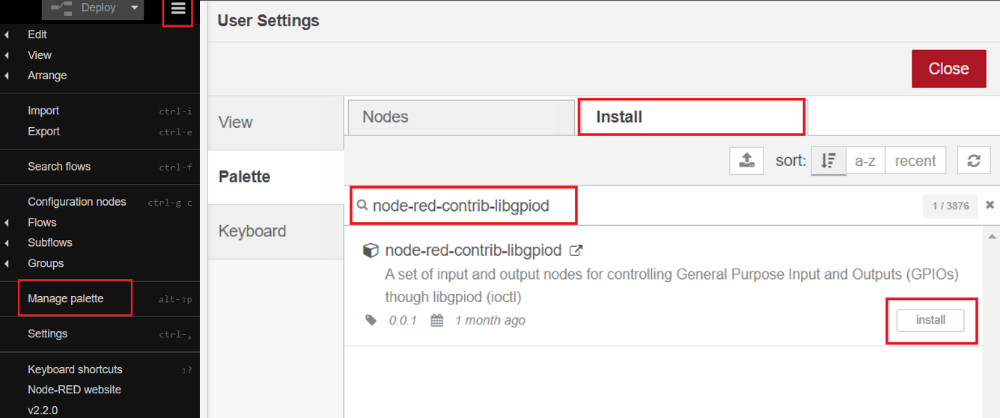
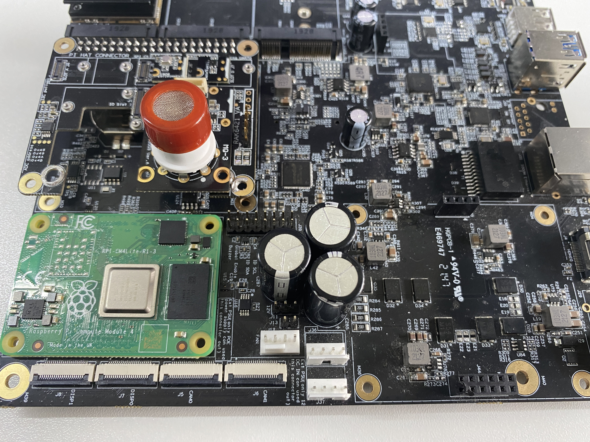

# Read Alcohol Gas PPM Using WisBlock Sensor RAK12009 from Node-RED 

[TOC]

## 1 Introduction

This guide explains how to use the [WisBlock Sensor RAK12009](https://docs.rakwireless.com/Product-Categories/WisBlock/RAK12009/Overview/) in combination with RAK6421 Wisblock Hat or RAK7391 WisGate Developer Connect to measure alcohol gas PPM through the I2C interface using Node-RED.  

### 1.1 RAK12009

The RAK12009 is an Alcohol Gas Sensor module, part of the RAKWireless WisBlock Sensor Series. The sensor used in this module is the MQ-3B from Zhengzhou Winsen Electronics. There is also a ADC chip (ADC121C021) on RAK12009. This sensor is capable of detecting alcohol gas in the air with an alcohol concentration detection range of 25 to 500 ppm.For more information about RAK12009, refer to the [Datasheet](https://docs.rakwireless.com/Product-Categories/WisBlock/RAK12009/Datasheet/).

### 1.2 I2C protocol

**I2C** (**Inter-Integrated Circuit**) is a synchronous, multi-controller/multi-target (controller/target), packet switched, single-ended, serial communication bus invented in 1982 by Philips Semiconductors. It is widely used for attaching lower-speed peripheral ICs to processors and microcontrollers in short-distance, intra-board communication. 

In RAK12009, the concentrations of gas is measured using a voltage divider network present in the sensor. The output of the sensing element is connected to a 12-bit ADC (ADC121C021) which communicates through I2C to the application. The ADC121C021 supports the I2C serial bus and data transmission protocol, and it operates as a slave device on the I2C bus. For more information about ADC121C021, refer to the [datasheet](https://www.ti.com/lit/ds/symlink/adc121c021.pdf?ts=1649226964688&ref_url=https%253A%252F%252Fwww.google.com.hk%252F). 

### 1.3 node-red-contrib-adc121c021 & node-red-node-pi-gpiod

The node we used in this flow is **[node-red-contrib-adc121c021](https://git.rak-internal.net/product-rd/gateway/wis-developer/rak7391/node-red-nodes/-/tree/dev/node-red-contrib-adc121c021)**, as well as [node-red-contrib-libgpiod](https://flows.nodered.org/node/node-red-contrib-libgpiod). 

The `node-red-contrib-adc121c021` provides the very basic configuration for users to configure, the user only needs to define the i2c bus of the chip. The chip is set to the automatic conversion mode by default, and the cycle time is set to 32. The I2C address of adc121c021 is configured to 0x55 on RAK12009. 

The `node-red-node-pi-gpiod` node contains a set of input and output nodes for controlling General Purpose Input and Outputs (GPIOs) though libgpiod (ioctl). It is used to pull the EN pin that must be pulled high before ASC121C021 can read analog inputs.

One of the most important things to notice when using `node-red-contrib-libgpiod` inside a container is to make sure you have access to the GPIO chip inside the container. We will cover more details about it in section 2.1. If you are interested in using this node locally (outside container), please also check the [node's introduction in Node-RED's library](https://flows.nodered.org/node/node-red-contrib-libgpiod) and also their [repo](https://github.com/s5z6/node-red-contrib-libgpiod). 

## 2 Preparation

### 2.1 Get gpiochip number and pin number 

Whether you are going to use Node-RED locally or inside container, we highly recommend you to install a package called **gpiod** on your host machine to help you identify the gpiochip number and interact with Linux GPIO character device if necessary. In your terminal, run the following command to install **gpiod**:

```
sudo apt install gpiod
```

Then reboot your Raspberry Pi or the RAK7391 board. After reboot, we can execute `gpiodetect` to detect existing or new gpio chips.

```plaintext
sudo gpiodetect
```

You should be able to see a list of detected gpio chips:

```
rak@rakpios:~ $ gpiodetect
gpiochip0 [pinctrl-bcm2835] (54 lines)
gpiochip1 [raspberrypi-exp-gpio] (8 lines)
```

Notice that `gpiochip0` is for the native 40-pin header. 

In this example, we are going to deploy a flow in Node-RED to to measure alcohol gas PPM through the I2C interface. To make the measurement, we need to enable the ADC121C021 chip first. The Enable pin varies based on your hardware setup, when you connect the RAK12009 to the IO slot1 on RAK6421, the ENABLE pin is GPIO 12 (board pin 32). When using IO slot 2 on RAK6421 (check the hardware preparation section for pictures), the ENABLE pin is GPIO 22 (board pin 15). 

You can run `gpioinfo` to check the status of GPIO 12 and GPIO 22 to see whether they are used or not.

```
rak@rakpios:~ $ gpioinfo
gpiochip0 - 54 lines:
	line   0:     "ID_SDA"       unused   input  active-high 
	line   1:     "ID_SCL"       unused   input  active-high 
	line   2:       "SDA1"       unused   input  active-high 
	line   3:       "SCL1"       unused   input  active-high 
	...
	line  12:     "GPIO12"       unused   input  active-high
	...
	line  22:     "GPIO22"       unused   input  active-high 
	...
```

Now you know the gpiochip number and also the pin number, we are going to need both of them for the node configuration section when we deploy the node in Node-RED.

### 2.2 I2C Access setup

Ensure you have access to both I2C devices and GPIO when using the sensor. The ADC121C021 chip on RAK12009 supports I2C protocol, if you are using Node-RED in the host machine directly (without using the docker container), you need to make sure the Node-RED user has access to the i2c bus (/dev/i2c-1 by default) on your host machine. 

If running Node-RED using docker, you need to mount `/dev/i2c-1` device to the Node-RED container using the docker command we provided below;  you also need to make sure you have access to the GPIO devices  inside the container. If you use the Portainer template provided by us, you don't need to change anything, as we have already mounted the device for you.

### 2.3 Running Node-RED locally

Make sure you can detect the GPIO chip first. Then, users need to install `libgpiod-dev`  if they are running Node-RED locally:

```plaintext
sudo apt install libgpiod-dev
```

After that you need to install the **node-red-contrib-libgpiod** node and import the example flow we provided. We will cover this in section 2.5.

### 2.4 Running Node-RED in Docker 

#### 2.4.1 Using Docker Command Line

You can always running Node-RED inside a container. To run Node-RED in Docker and use the latest Node-RED official image, the easiest way is run the following command:

```plaintext
docker run -it -p 1880:1880 -v node_red_data:/data --device /dev/gpiochip0:/dev/gpiochip0 --device /dev/i2c-1:/dev/i2c-1 --restart=unless-stopped --user node-red:997 --group-add 998 --name NodeRed nodered/node-red
```

The `--device` can mount device to container, and `--name` can add an user with specified group. Before add node-red user to the local gpio group, you need to verify the group number via running command below on your host:

```
cat /etc/group | grep gpio | awk -F: '{print $3}'
cat /etc/group | grep i2c | awk -F: '{print $3}'
```

On a Raspbian-based-image, the group id of GPIO is usually defined as 997, and 998 for I2C.

Once the container is up, there is one more thing you need to do, and this step is critical. Since the offical Node-RED image doesn't have **libgpiod-dev** pre-installed, users have to install it manually inside the container, otherwise, users won'e be able to install the **node-red-contrib-libgpiod** node  :

```
apk add libgpiod-dev
```

Or, you can use the Node-RED image provided by RAKwireless, it comes with the **libgpiod-dev** package installed:

```
docker run -it -p 1880:1880 -v node_red_data:/data --device /dev/gpiochip0:/dev/gpiochip0 --device /dev/i2c-1:/dev/i2c-1 --restart=unless-stopped --user node-red:997 --group-add 998 --name NodeRed sheng2216/nodered-docker:1.1
```

#### 2.4.2 Using Docker Compose

If you are going to use the Node-RED docker container, you can bring up the service by using the docker-compose.yml file provided below:

```
version: '3.7'

services:

  nodered:
    image: sheng2216/nodered-docker:1.1
    container_name: NodeRed
    user: node-red
    group_add:
      - 997
      - 998
    restart: unless-stopped
    devices:
      - "/dev/gpiochip0:/dev/gpiochip0"
      - "/dev/i2c-1:/dev/i2c-1"
    volumes:
      - 'node-red-data:/data'
    ports:
      - "1880:1880"

volumes:
  node-red-data:
```

To bring up the service, save the above file into a file called **docker-compose.yml**, and in the same directory, run `docker-compose up`. To stop the service, just press **ctrl+c** to exit and then run `docker-compose down` to stop the services defined in the Compose file, and also remove the networks defined.

If you want to use the latest official image from Node-RED, feel free to change the image defined in the docker-compose file. But don't forget to install **libgpiod-dev** once the container is up. Then you need to install the node **node-red-contrib-libgpiod**（check section 2.4）

#### 2.4.3 Using Portainer

If you have Portainer installed on your Raspberry Pi or RAK7391,  you can use the Portainer template provided by RAKwireless. In this case, you won't need to make any changes to the configurations, just deploy a Node-Red container using the template (shown below), 


then you need to install the node **node-red-contrib-libgpiod**(check section 2.4).

### 2.5 Install Node in Node-RED

After the previous software setup is completed, you can browse to http://{host-ip}:1880 to access Node-Red's web interface. Then you need to install the node **node-red-contrib-libgpiod**.

To install a new  node, go to the top right **Menu**, and then select **Manage palette**. In the **User Settings** page, you need to select **Install**, and search the key word **node-red-contrib-libgpiod**. Now you should be able to install this node.



### 2.6 Hardware  

The device address of RAK12009 is configured to 0x55, and connected to i2c bus 1. 

The easiest way to set up the hardware is to use the RAK6421 WisBlock Hat that exposes all the Wisbock high-density connector pins.  The RAK12009 can be mounted to the HAT, and the HAT goes to the 40-pin headers located on Raspberry Pi 4B/IO board/RAK7391. Based on your hardware selections, there are three ways to mount RAK12009, please check the following figured(use slot 2 on RAK6421, you can switch to use slot 1, make sure to change the Enable pin defined in the flow):

1. Raspberry Pi model B + RAK6421 WisBlock Hat +  RAK12009

   

2. Raspberry Pi CM4 + Compute Module 4 IO Board + RAK6421 WisBlock Hat + RAK12009

   

3. Raspberry Pi CM4  + RAK7391 WisGate Developer Connect + RAK6421 WisBlock Hat + RAK12009

   


## 3 Flow configuration

Whether you are using the Node-Red docker image provided by RAKwireless or the official latest image, or you host your Node-RED service locally, you need to install `node-red-contrib-adc121c021` before you deploy the flow. 

### 3.1 Install node-red-contrib-adc121c021

While the `node-red-contrib-adc121c021` hasn't been published, so you need to install it in another way. Please install `node-red-contrib-adc121c021` node with the following commands. If you are using docker for Node-RED, you may need to replace `~/.node-red` with `/usr/src/node-red`,

```
git clone -b dev https://git.rak-internal.net/product-rd/gateway/wis-developer/rak7391/node-red-nodes.git
```

then copy `node-red-contrib-adc121c021` directory  to  the `node_modules` directory,

```
cp -rf node-red-nodes/node-red-contrib-adc121c021 ~/.node-red/node_modules
```

lastly, change to the `node-red-contrib-adc121c021` directory and install the node, 

```
cd ~/.node-red/node_modules/node-red-contrib-adc121c021 && npm install
```

**Tips:**  After the installation of  `node-red-contrib-adc121c021`  is finished, please restart your node-red service/container(s).  Otherwise, the node cannot be found/added to the new flow.

### 3.2 Deploy the Example Flow 

After the installation of `node-red-contrib-adc121c021` is completed, you can clone/copy the flow example. The example is under `sensor/rak12009/rak12009-reading` folder in the [`wisblock-node-red`](https://git.rak-internal.net/product-rd/gateway/wis-developer/rak7391/wisblock-node-red/-/tree/dev/) repository. Then you can import the  **rak12009-reading.json** file or just copy and paste the .json file contents into your new flow.

After the import is done, the new flow should look like this:


As we mentioned in section 2.5,  `node-red-contrib-libgpiod` node is used to pull the Enable pin that must be pulled high before ASC121C021 can read analog input.

### 3.3 Nodes Configurations 

* Inject nodes

  The two inject nodes connected to the **GPIO out node node** are responsible for sending digital 0 and 1 (or true or false) to **GPIO out node** node, the **GPIO out node** will set the selected Board pin to high or low based on the value passed in by the inject nodes. 

  

* GPIO out node

  In section 2.1, we learned that the device name of the native 40-pin headers is **gpiochip0**, and since we want mount the RAK12009 on slot 2 of RAK6421 Pi-HAT, the Enable pi is GPIO 22. For the **Name** option, you can change it to anything based on your preference.

  

  

- Debug node (Pin status)

  The output of this debug node is the status of the Enable pin.

  
  
- inject node (5s trigger)

  The inject node connected to the adc121c021_i2c node will trigger the adc121c021_i2c node every five seconds.

  
  
- adc121c021_i2c node

  

  To get the voltage reading from the adc121c021, users only need to define the i2c bus of the chip. In this case (using RAK12009), the adc121c021 is on bus 1, and the I2C address of the chip ADC121c021 is configured to 0x55 on RAK12009. 

- function node 

  The function node is used to retrieve the voltage readings from the ADC chip, calibrate the sensor based on the users' setup and environment, and then calculate the PPM values. 
  
  
  
  In order to make the sensor with better performance, calibration of R0 is needed. Users can also define the regression method in the function node. The value of `Ratiomq3CleanAir` depends on the gas users want to monitor, and constantA and constanB are calculated based on the Sensitive Characteristics provided in MQ3's [datasheet](https://www.sparkfun.com/datasheets/Sensors/MQ-3.pdf).
  
  The script is provided below:
  
  ```
  // Retrieve voltage readings from the adc node
  var sensorVoltage = msg.payload.Volts;
  const MQ2_RL = 10;
  
  const RatioMQ2CleanAir = 1;
  const VOLTAGE_REF = 5;
  const constantA = -0.888;
  const constantB = 0.738;
  
  
  function readSensor(regressionMethod) {
      // set the regression method if=1 use Exponential else Linear
      //     Exponential:  PPM =  A*(RS/R0)^B
      //     Linear:       PPM =  pow(10, (log10(RS/R0)-B)/A) 
  
      var RS_air = (VOLTAGE_REF * MQ2_RL / sensorVoltage) - MQ2_RL;
      // console.log("DEBUG RS_air VALUE", RS_air);
      var ppm;
      if (RS_air < 0) {
          //No negative values accepted.
          RS_air = 0;
      }
      // Get ratio RS_gas/RS_air
      var ratio = RS_air / R0;
      if (ratio <= 0) {
          //No negative values accepted or upper datasheet recomendation. 
          ratio = 0;
      }
  
      if (regressionMethod == 1) {
          ppm = constantA * Math.pow(ratio, constantB);
      } else if (regressionMethod == 0){
          //Get ppm value in linear scale according to the the ratio value 
          let ppm_log = (Math.log10(ratio) - constantB) / constantA;
          //Convert ppm value to log scale 
          ppm = Math.pow(10, ppm_log);
      } else{throw "Wrong regression method, only support 1 and 0 ";}
  
      if (ppm < 0) {
          ppm = 0;
      }
      return ppm;
  }
  
  function calibrateR0(ratioInCleanAir) {
      //Calculate RS in fresh air
      var RS_air = (VOLTAGE_REF * MQ2_RL / sensorVoltage) - MQ2_RL;
      //No negative values accepted
      if (RS_air < 0) {
          RS_air = 0;
      }
      //Calculate R0 
      R0 = RS_air / ratioInCleanAir;
      //No negative values accepted
      if (R0 < 0) {
          R0 = 0;
      }0
      return R0;
  }
  
  
  
  // Retrieve calibated R0 value
  var R0 = flow.get('R0');
  // calibrate R0 if it hasn't been calibrated before
  if (!R0)
  {
      var clacR0 = 0;
      for (let i = 0; i <= 100; i++) {
          clacR0 =clacR0+calibrateR0(RatioMQ2CleanAir);
      }
      R0=clacR0/100;
  
      if (R0 === Infinity) {
          throw "Warning: Conection issue founded, R0 is infite (Open circuit detected) please check your wiring and supply";
      }
      if (R0 == 0){
          throw "Warning: Conection issue founded, R0 is zero (Analog pin with short circuit to ground) please check your wiring and supply";
      }
  
      //set the value of R0 for the flow
      flow.set("R0",R0);
  }
  
  // get sensor PPM value
  var sensorPPM = readSensor(0);
  var payload = {};
  
  payload.PPM_value = sensorPPM.toFixed (3);
  payload.PPM_percentage = ((sensorPPM / 10000) * 100).toFixed(3) +'%';
  payload.R0=R0.toFixed(3);
  
  return {
      payload: payload
  };
  ```

### 3.4 Flow output

The output of the node is a payload that contains the PPM value, the percentage readings, and also the value of R0,


## License

This project is licensed under MIT license.
