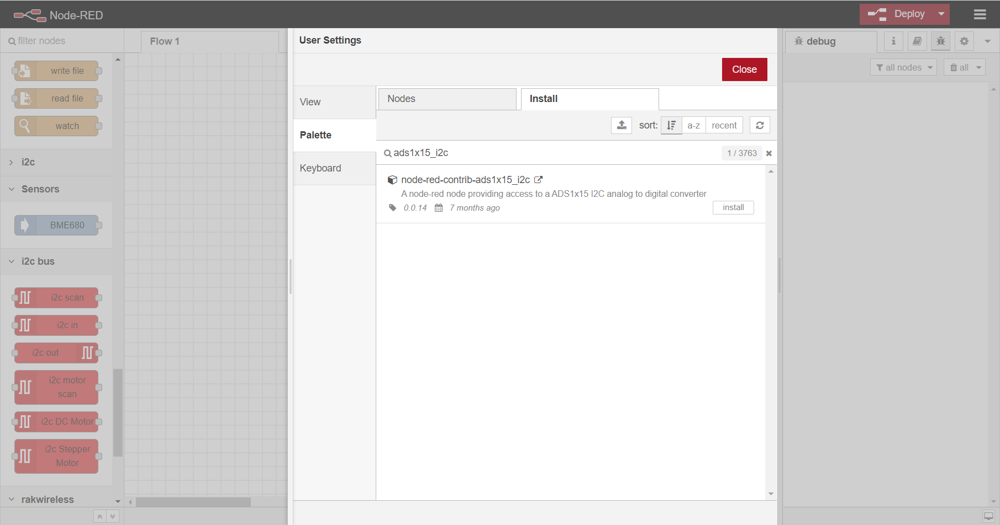
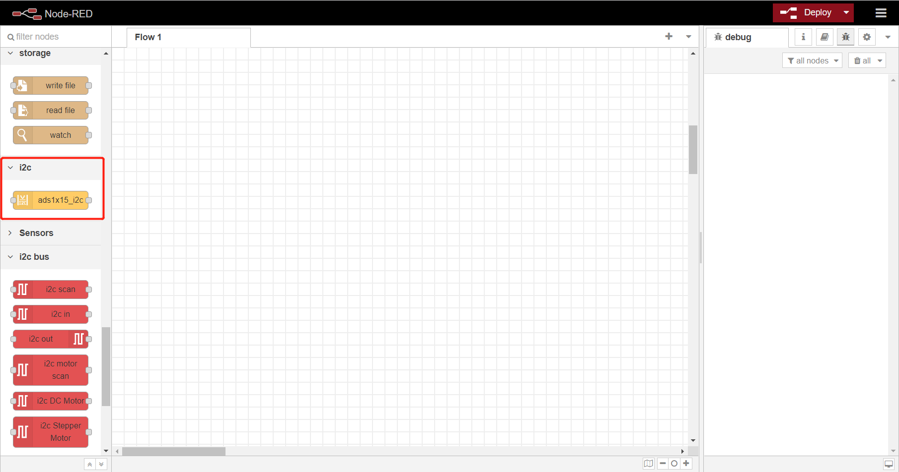
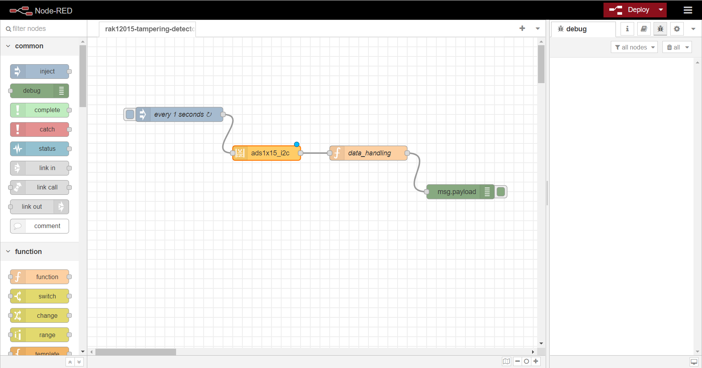
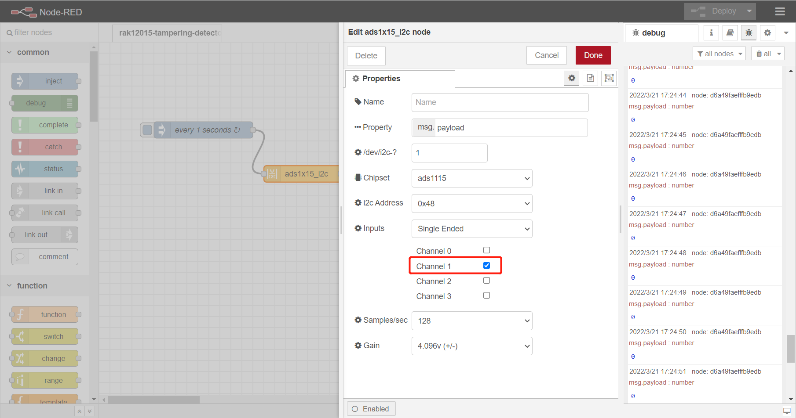

# Detect vibration using WisBlock sensor RAK12015 from Node-RED 

[TOC]

## 1. Introduction

The RAK12015 is a high precision vibration sensor module that can detect micro shocks or vibration without direction limits.

In this example, we use it to connect  with RAK7391, and convert the analog to digital value with ads1115 on RAK7391.

## 2. Preparation

### 2.1. Hardware

RAK12015 is needed which should be fixed to `Wisblock1` slot or `Wisblock2` slot of RAK7391. 

When RAK12015 being fixed to slot of RAK7391, hardware is ready. 

### 2.2. Software

Because we need ads1115 to convert value from RAK12015, so we should install ads1x15_i2c NodeRED node before.

We can install `ads1x15_i2c` node from `Manage palette` menu of NodeRED as follows.



After  `ads1x15_i2c`  installed, we can find the node at left side.



## 3. Configure

At first , we should learn how to configure ads1115.  


- **Name**: define the msg name if you wish to change the name displayed on the node.

- **Property**: define the msg property name you wish. the name you select (msg.example) will also be the output property.the payload must be a number! anything else will try to be parsed into a number and rejected if that fails.

- **Chipset**: the chipset by default is set to ads1115. the chipset is the version of ads supported. If you have an ads1015 select that option.

- **/dev/i2c-?**: the i2c device file you will access, the value by default is set to 1, which means the i2c bus index is 1.

- **i2c_Address**: the address by default is set to 0x48. you can setup the ADS1X15 with one of four addresses, 0x48, 0x49, 0x4a, 0x4b. Please see ads1X15 documentation for more information

- **Inputs**: inputs may be used for Single-ended measurements (A0-GND) or Differential measurements (A0-A1). Single-ended measurements measure voltages relative to a shared reference point which is almost always the main units ground. Differential measurements are “floating”, meaning that it has no reference to ground. the measurement is taken as the voltage difference between the two wires. Example: The voltage of a battery can be taken by connecting A0 to one terminal and A1 to the other.

- **Samples**: select the sample per second you want your ADS to make. higher rate equals more samples taken before being averaged and sent back from the ADS. please see ads1X15 documentation for more information

- **Gain**: select the gain you want. to increase accuracy of smaller voltage signals, the gain can be adjusted to a lower range. Do NOT input voltages higher than the range or device max voltage, pi 3.3v use a voltage devider to lower input voltages as needed.


## 4. Run example

You can clone /copy the flow example. The example is . Then you can import the  **rak12015-tampering-detector.json** file or just copy and paste the .json file contents into your new flow.

After the import is done, the new flow should look like this:



This is a simple flow with four node, where `inject` node supply a trigger event every 1 seconds, `ads1x15_i2c`node convert data from rak12015,  `data_handling` handles the data converted by ads1115,  and `debug` node print the converted data.

The example use `Wisblock2` slot of RAK7391. If you fixed RAK12015 to  `Wisblock2` slot, just skip modificaiton steps bellow and hit the **Deploy** button to run example.  

If you fixed RAK12015 to `Wisblock1` of RAK7391,  you must modify configure of `ads1x15_i2c`  and `data_handling` function as follows.

Modify configure of `ads1x15_i2c`:



Modify `data_handling` function to change channel to `channel_1`:

```
let data = {};

data.payload = msg.payload["/dev/i2c-1"]
.ads1115["0x48"]
.singleEnded.channel_1.Volts;

data.payload = Math.round(data.payload * 100) / 100;
if(data.payload > 0) {
    node.warn('Vibration detected !');
    node.status({
        fill: 'red',
        shape: 'dot',
        text: "Vibration detected"
    });
} else {
    node.status({});
}

return data;
```

As all configure has been done, then hit the **Deploy** button on the top right to deploy the flow. When Shaking RAK7391 , `debug` node will print a warn message and `data_handling` node will also change status.

The test result is as follows:


