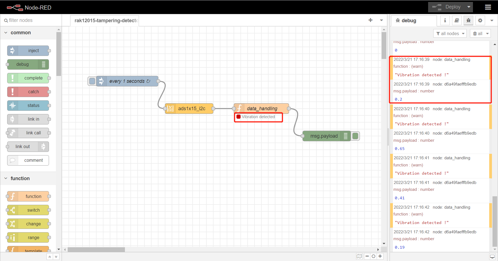

# Detect vibration using WisBlock sensor RAK12015 from Node-RED 

[TOC]

## 1. Introduction

This guide explains how to use the WisBlock sensor [RAK12015](https://docs.rakwireless.com/Product-Categories/WisBlock/RAK12015/Overview/#product-description) to detect vibrations using Node-RED.

### 1.1 RAK12015

The RAK12015, a part of WisBlock Sensor, is a Vibration Detection Module that uses a high-precision sensor, the ANT-801S. This sensor is capable of detecting micro shocks or vibration without direction limits.

### 1.2 node-red-contrib-ads1x15_i2c

The [node-red-contrib-ads1x15_i2c](https://flows.nodered.org/node/node-red-contrib-ads1x15_i2c) node providing access to a ADS1x15 I2C analog to digital converter. Please check the node's documentation for more details.

## 2. Preparation

### 2.1 Access Setup

Ensure you have access to I2C devices when using the sensor. RAK12015 relays on the the ADS1115 comes with RAK6421 and RAK7391 to work, and ADS1115 supports I2C protocol. The I2C address of ADS1115 is configured to 0x48.

You need to enable I2C first, either by using **raspi-config** or just change `/boot/config.txt`.

If you are using Node-RED locally (in the host machine without using docker containers), you only need to  make sure the Node-RED user has access to the i2c bus (/dev/i2c-1 by default) on your host machine.

If your Node-RED is deployed inside a container, you need to mount `/dev/i2c-1` to the Node-RED container, and also make sure the user inside the container is assigned to the right group so that it has access to I2C devices.

For detailed "docker run" command, docker-compose file, and information about how to use a pre-configured Portainer template, please check this [instruction](https://git.rak-internal.net/product-rd/gateway/wis-developer/rak7391/wisblock-node-red/-/blob/dev/README-Docker/README.md), we provide all the information you need to know about using containerized Node-RED.

### 2.2 Install nodes in Node-RED

Now we need to install the required nodes for the example flow. Browse to http://{host-ip}:1880 to access Node-Red's web interface. In this example, you need to install only one node: [node-red-contrib-ads1x15_i2c](https://flows.nodered.org/node/node-red-contrib-ads1x15_i2c).

To install this node , go to the top right **Menu**, and then select **Manage palette**. In the **User Settings** page, you need to select **Install**, and search the keyword **node-red-contrib-ads1x15_i2c **. Now you should be able to install this node. 


### 2.2 Hardware

The easiest way to set up the hardware is to use the RAK6421 WisBlock Hat that exposes all the Wisblock high-density connector pins.  The RAK12015 can be mounted to the HAT, and the HAT goes to the 40-pin headers located on Raspberry Pi 4B/IO board/RAK7391. Based on your hardware selections, there are several ways to mount RAK12015:

1. RAK12015 + RAK6421 + Raspberry Pi


2. RAK12015 + RAK6421 + RAK7391 + CM4

   

   

## 3. Flow Configuration

After the installation of `node-red-contrib-ads1x15_i2c ` is completed, you can clone/copy the flow example. The example is under `sensor/rak12015/rak12015-tampering-detector` folder in the [`wisblock-node-red`](https://git.rak-internal.net/product-rd/gateway/wis-developer/rak7391/wisblock-node-red/-/tree/dev/) repository. Then you can import the  **rak12015-tampering-detector.json** file or just copy and paste the `.json` file contents into your new flow.

After the import is done, the new flow should look like this:


### 3.1 Node Configuration

* node-red-contrib-ads1x15_i2c

  **Name**: define the msg name if you wish to change the name displayed on the node.

  **Property**: define the msg property name you wish. the name you select (msg.example) will also be the output property.the payload must be a number! anything else will try to be parsed into a number and rejected if that fails.

  **Chipset**: the chipset by default is set to ads1115. the chipset is the version of ads supported. If you have an ads1015 select that option.

  **/dev/i2c-?**: the i2c device file you will access, the value by default is set to 1, which means the i2c bus index is 1.

  **i2c_Address**: the address by default is set to 0x48. you can setup the ADS1X15 with one of four addresses, 0x48, 0x49, 0x4a, 0x4b. Please see ads1X15 documentation for more information

  **Inputs**: inputs may be used for Single-ended measurements (A0-GND) or Differential measurements (A0-A1). Single-ended measurements measure voltages relative to a shared reference point which is almost always the main units ground. Differential measurements are “floating”, meaning that it has no reference to ground. the measurement is taken as the voltage difference between the two wires. Example: The voltage of a battery can be taken by connecting A0 to one terminal and A1 to the other. When the RAK12015 is mounted on slot 1 (RAK6421 or RAK7391), use channel 1; when RAK12015 is mounted to slot 2 (RAK6421 or RAK7391), please change it to use channel 3.

  **Samples**: select the sample per second you want your ADS to make. higher rate equals more samples taken before being averaged and sent back from the ADS. please see ads1X15 documentation for more information

  **Gain**: select the gain you want. To increase accuracy of smaller voltage signals, the gain can be adjusted to a lower range. Do NOT input voltages higher than the range or device max voltage, pi 3.3v use a voltage devider to lower input voltages as needed.


* function node

  The function node in the flow is marked as `data_handling`, you need to change the code in the function node when you mount RAK12015 to different slot.

  In the example flow, since we use slot 1 (check section 2.2), the channel we defined in the flow is channel 1. If you mount RAK12015 to slot 2, you need to change not only the channel configured in the node-red-contrib-ads1x15_i2c, but also change the code inside the function node:

  Modify `data_handling` function to use `channel_3`:

  ```
  let data = {};
  
  data.payload = msg.payload["/dev/i2c-1"]
  .ads1115["0x48"]
  .singleEnded.channel_3.Volts;
  
  data.payload = Math.round(data.payload * 100) / 100;
  if(data.payload > 0) {
      node.warn('Vibration detected !');
      node.status({
          fill: 'red',
          shape: 'dot',
          text: "Vibration detected"
      });
  } else {
      node.status({});
  }
  
  return data;
  ```

  

## 4. Flow output

This is a simple flow with four node, where `inject` node supply a trigger event every 1 seconds, `ads1x15_i2c`node convert data from rak12015,  `data_handling` handles the data converted by ads1115,  and `debug` node print the converted data. Make sure to change the channel if you use different slots.

The test result is as follows:



## License

This project is licensed under MIT license.
