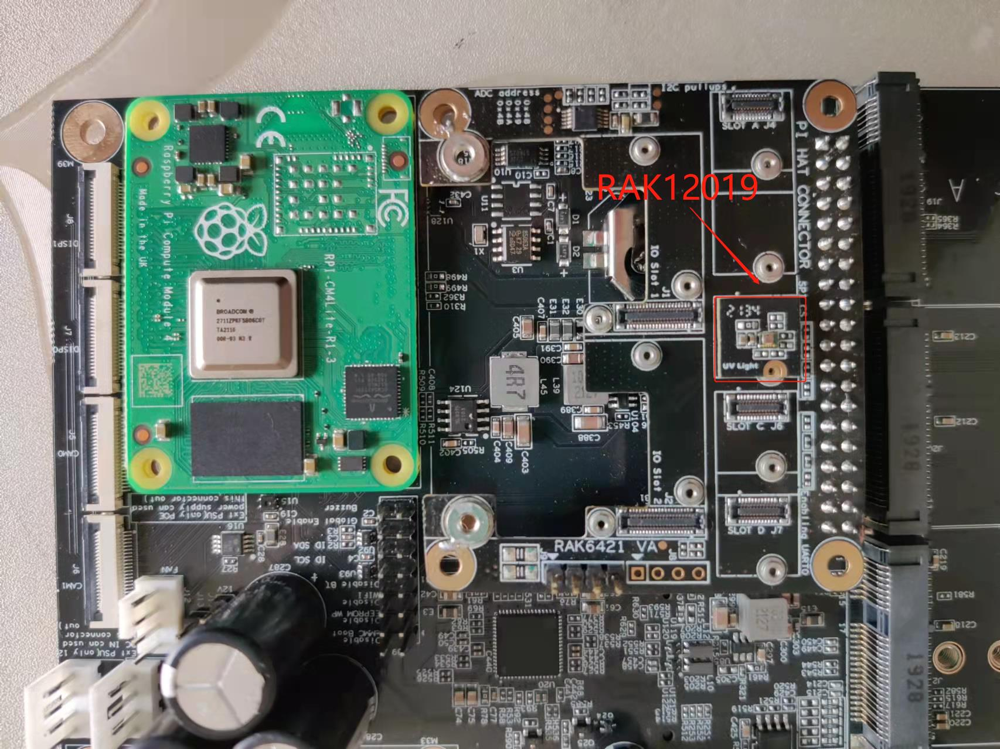

# Measure LUX and UVI using WisBlock UV sensor RAK12019 from Node-RED 

[TOC]

## 1 Introduction

This guide explains how to use the [WisBlock UV Sensor RAK12019](https://docs.rakwireless.com/Product-Categories/WisBlock/RAK12019/Overview/) in combination with RAK6421 Wisblock Hat or RAK7391 WisGate Developer Connect to measure lux and uvi(ultraviolet index) through the I2C interface using Node-RED.  

### 1.1 RAK12019

The RAK12019 is an Ambient Light sensor (ALS) or Ultraviolet Light Sensor (UVS), which is part of the RAKwireless WisBlock sensor series. The measured ambient light intensity and ultraviolet index are interfaced via the I2C bus making it immune to electrical noises, unlike its analog output counterpart. This module utilizes the LTR-390UV-01 sensor from Lite-On. For more information about RAK12019, refer to the [Datasheet](https://docs.rakwireless.com/Product-Categories/WisBlock/RAK12004/Datasheet/).

### 1.2 LTR-390UV-01

The LTR-390UV-01 is an integrated low voltage I2C  ambient aight sensor(ALS) and ultraviolet light sensor(UVS) in a single miniature 2x2mm ChipLED lead-free surface mount package. This sensor converts light intensity to a digital output signal capable of direct I2C interface. For more information about LTR-390UV-01, refer to the [Datasheet](https://optoelectronics.liteon.com/upload/download/DS86-2015-0004/LTR-390UV_Final_%20DS_V1%201.pdf). 

## 2 Preparation

### 2.1 Access setup

Ensure you have access to I2C devices when using the sensor. The ltr-uv390 chip on RAK12019 supports I2C protocol.

If you are using Node-RED locally (in the host machine without using docker containers), you only need to  make sure the Node-RED user has access to the i2c bus (/dev/i2c-1 by default) on your host machine. 

If your Node-RED is deployed inside a container, you need to mount `/dev/i2c-1` to the Node-RED container, and also make sure the user inside the container is assigned to the right group so that it has access to I2C devices.

For detailed "docker run" command, docker-compose file, and information about how to use a pre-configured Portainer template, please check this [instruction](../../../README-Docker/README.md), we provide all the information you need to know about using containerized Node-RED.

### 2.2 Install dependency & nodes in Node-RED

Now we need to install the required nodes for the example flow. Browse to http://{host-ip}:1880 to access Node-Red's web interface. In this example, you need to install only one node: [@rakwireless/ltr-390uv](https://www.npmjs.com/package/@rakwireless/ltr-390uv).

To install this node , go to the top right **Menu**, and then select **Manage palette**. In the **User Settings** page, you need to select **Install**, and search the keyword **node-red-contrib-ltr-390uv**. Now you should be able to install this node. 

### 2.3 Hardware  

The easiest way to set up the hardware is to use the RAK6421 WisBlock Hat that exposes all the Wisblock high-density connector pins.  The RAK12019 can be mounted to the HAT, and the HAT goes to the 40-pin headers located on Raspberry Pi 4B/IO board/RAK7391. Based on your hardware selections, there are three ways to mount RAK12019:

1. Raspberry Pi model B + RAK6421 WisBlock Hat +  RAK12019

   

2. Raspberry Pi CM4 + Compute Module 4 IO Board + RAK6421 WisBlock Hat + RAK12019

   

3. Raspberry Pi CM4  + RAK7391 WisGate Developer Connect + RAK6421 WisBlock Hat + RAK12019

   

## 3 Flow configuration

After the installation of `@rakwireless/ltr-390uv` is completed,  you can import the  [rak12019-reading.json](rak12019-reading.json) file or just copy and paste the .json file contents into your new flow.

After the import is done, the new flow should look like this:

### 3.1 Nodes Configurations 

To get the lux and uvi reading from the RAK12019,  you need to configure the following settings

**Name**

Define the msg name if you wish to change the name displayed on the node.

**/dev/i2c-?**

The i2c bus number, the default value is `1` , it means `'/dev/i2c-1'`.

**i2c_Address**

The i2c slave address for the RAK12019, by default is set to `0x53`.

**gain**

Define the als/uvs measuring gain range. the default value is `1x`

**resolution**

Define the als/uvs measuring resolution, the default value is `16 Bit`

## 4 Flow output

This flow outputs the measuring result with `debug` node every 2 seconds, the output of the node is a payload contains the raw als data, raw uvs data,  the calculated lux and the calculated uvi.

## License

This project is licensed under MIT license.
