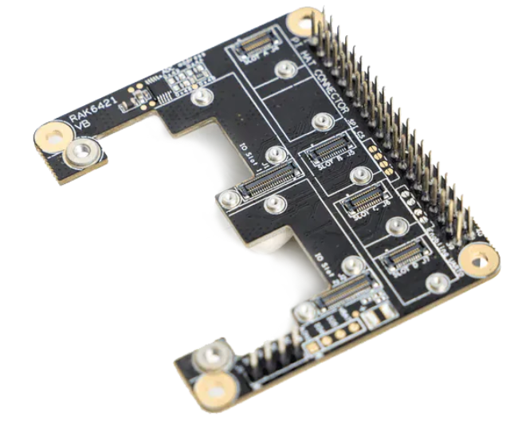
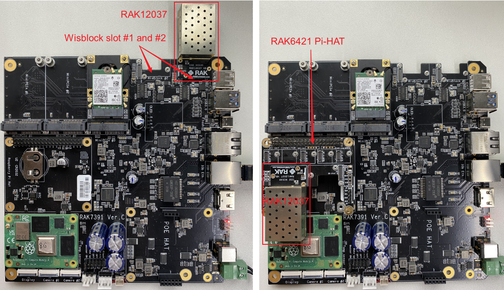
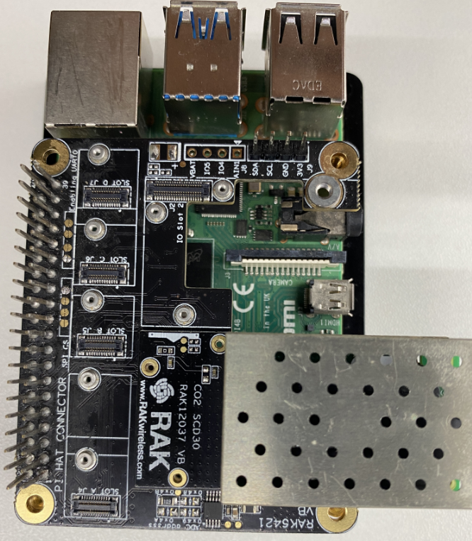
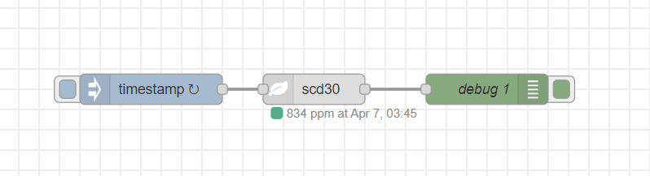
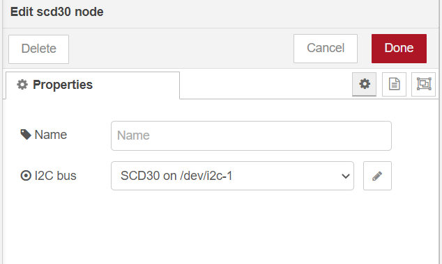
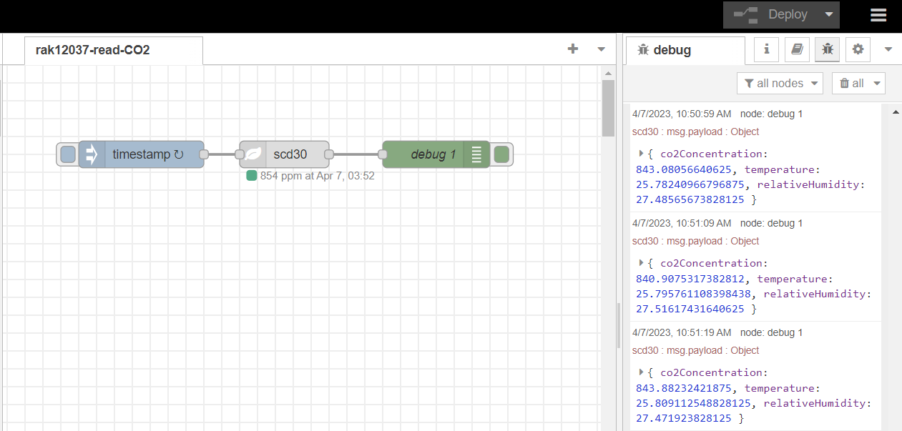

# Measure the concentration of CO2 with WisBlock sensor RAK12037 and Pi-Hat RAK6421 from Node-RED.

[TOC]

## 1. Introduction

This guide explains how to use the [WisBlock sensor RAK12037](https://store.rakwireless.com/products/co2-sensor-sensirion-scd30-rak12037) in combination with RAK6421 Pi-Hat to measure the concentration of CO2 in the air using Node-RED.

### 1.1 RAK12037

RAK12037 is a WisBlock Sensor that extends the WisBlock system based on the SCD30 module. This module uses NDIR CO2 sensor technology to sense CO2 and has an integrated temperature and humidity sensor. Ambient humidity and temperature can be measured by monitoring and compensating for external heat sources without the need for additional components. Its i2c address is `0x61`.


### 1.2 RAK6421 Pi-Hat

RAK6421 is a pi-hat for Raspberry pi 3B/4B or RAK7391 which has 4 sensor slots and 2 IO slots of Wisblock.



## 2. Preparation

### 2.1 Access Setup

In this example, we are going to deploy a flow in Node-RED to measure concentration of CO2. To make the measurements, ensure you have access to I2C devices. 

If you are using Node-RED locally (in the host machine without using docker containers), you need to make sure the Node-RED user has access to the i2c bus (/dev/i2c-1 by default) on your host machine. You can enable I2C either by using **raspi-config** or just change `/boot/config.txt`.

If your Node-RED is deployed inside a container, you need to mount `/dev/i2c-1` to the Node-RED container, and also make sure the user inside the container is assigned to the right group so that it has access to I2C devices.

For detailed "docker run" command, docker-compose file, and information about how to use a pre-configured Portainer template, please check this [instruction](../../../README-Docker/README.md), we provide all the information you need to know about using containerized Node-RED.

### 2.2 Install node in Node-RED

Now we need to install the required nodes for the example flow. Browse to [http://{host-ip}:1880](http://{host-ip}:1880) to access Node-Red's web interface. In this example, you need to install only one node: [node-red-contrib-scd30](https://flows.nodered.org/node/node-red-contrib-scd30).

To install this node , go to the top right **Menu**, and then select **Manage palette**. In the **User Settings** page, you need to select **Install**, and search the keyword **node-red-contrib-scd30**.  

If you encounter permission issues when trying to install a node in Node-RED, you can execute into the Node-RED container as root and then install the node manually using the following command.

```bash
docker exec -u 0 -it <Node-Red container_name> /bin/bash
npm install node-red-contrib-scd30
exit
```

This will allow you to install the node even if you don't have sufficient permissions. Simply replace `<Node-Red container_name>` with the actual name of your Node-RED container. Once inside the container as root, you can use npm to install the node.

### 2.3 Connection diagram

There are two methods to establish a connection between the RAK12037 and the RAK7391. The first approach involves utilizing the on-board Wisblock slots on RAK7391, and both slots are fully functional for this purpose. The second option involves utilizing the RAK6421 Pi-HAT. It is important to note that, due to the over-sized enclosure, the RAK12037 can only be mounted on IO slot 1 on the RAK6421 Pi-HAT.

To ensure optimal functionality, it is recommended to carefully consider the available options and select the appropriate method that meets the requirements of the specific project.

We can also connect RAK6421 to Raspberry pi 4B+.



## 3. Flow configuration

Import the  [rak12037-read-CO2.json](./rak12037-read-CO2.json) file or just copy and paste the .json file contents into your new flow.

After the import is done, the new flow should look like this:



### 3.1 Node Configurations

To get value of  CO2 concentration you need to select the correct I2C bus number for the scd30 chip.



## 4. Flow output

This is a simple flow with three node, where `inject` node supplys a trigger event every 10 seconds, `scd30`node reads data of the CO2 sensor, and `debug` node prints the CO2 concentration,temperature and humidity.

The result is as follows:


