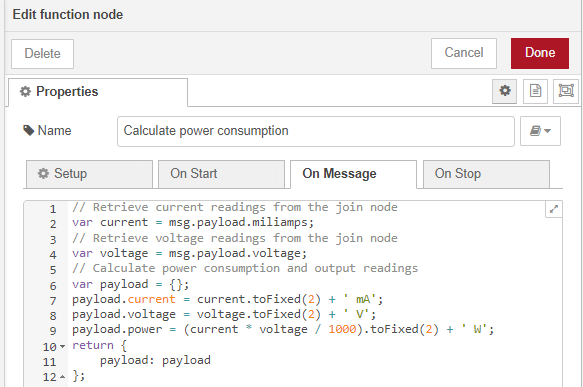

# Measuring DC current using WisBlock sensor RAK16000 from Node-RED 

[TOC]

## 1 Introduction

This guide explains how to use the [WisBlock IO RAK16000](https://docs.rakwireless.com/Product-Categories/WisBlock/RAK16000/Overview/) in combination with RAK6421 Wisblock Hat or RAK7391 WisGate Developer Connect to measure DC current through the I2C interface using Node-RED.  

### 1.1 RAK16000

**RAK16000** is a part of the WisBlock Sensor Series that is capable of measuring DC current in the range of 0 to 3 A in a voltage range of 0 to 26 V. With the two measured DC values, you get the power consumption by multiplying the current and voltage. Additionally, this module uses the [INA219BID](https://www.ti.com/store/ti/en/p/product/?p=INA219BID) from Texas Instruments which offers high accuracy maximum rate of 0.5% over temperature.

The INA219 is a current shunt and power monitor with an I2C- or SMBUS-compatible interface. The device monitors both shunt voltage drop and bus supply voltage, with programmable conversion times and filtering. A programmable calibration value, combined with an internal multiplier, enables direct readouts of current in amperes. An additional multiplying register calculates power in watts. The I2C- or SMbus-compatible interface features 16 programmable addresses. For more information about **INA219BID**, refer to the [Datasheet](https://www.ti.com/lit/ds/symlink/ina219.pdf?ts=1647401885343&ref_url=https%3A%2F%2Fwww.ti.com%2Fproduct%2FINA219).

### 1.2 I2C protocol

**I2C** (**Inter-Integrated Circuit**) is a synchronous, multi-controller/multi-target (controller/target), packet switched, single-ended, serial communication bus invented in 1982 by Philips Semiconductors. It is widely used for attaching lower-speed peripheral ICs to processors and microcontrollers in short-distance, intra-board communication. The **INA219BID** supports the I2C serial bus and data transmission protocol, and it operates as a slave device on the I2C bus.

### 1.3 node-red-contrib-easybotics-ina219-sensor

The node we used in this flow is **[node-red-contrib-easybotics-ina219-sensor](https://flows.nodered.org/node/node-red-contrib-easybotics-ina219-sensor)**, we need to deploy an **ina-sensor** node to measure DC current. It has two outputs, one is for the voltage and the other one is for the current readings. The **ina-sensor** node itself provides a dropdown menu to chose from the four possible addresses. Users can also make adjustments to the shunt resistance and poll frequency.  If you are not using the Node-RED docker image provided by RAKwireless, you can run the following command in your Node-RED user directory (typically `~/.node-red`):

```
npm install node-red-contrib-easybotics-ina219-sensor
```

or you can install this node in the WebUI, which will be explained in the node-configuration section.

## 2 Preparation


### 2.1 Access setup

The INA219 sensor on RAK16000 support I2C protocol, if you are using Node-RED in the host machine directly (without using docker container), you won't need to change anything, just make sure the Node-RED user have access to i2c bus (`/dev/i2c-1` by default) on your host machine, and then you can skip to the hardware preparation section. For users who are using Node-RED inside a docker container, please make sure the Node-RED containers you are running include support for raw I2C access. 

If running Node-RED using docker, you need to mount `/dev/i2c-1` device to the Node-RED container using the docker command we provided below. If you use the Portainer template provided by us, you don't need to change anything, as we have already mounted the device for you.

#### 2.1.1 Running under Docker Command Line

To run in Docker, just run:

```
docker run -it -p 1880:1880 -v node_red_data:/data --device /dev/i2c-1:/dev/i2c-1 --group-add 998 nodered/node-red
```

In the command above, the `--device` can mount device to container, `--group-add 998` adds the I2C group (group id 998 in Rakpios) to run as.

Notice that **998** in the command needs to be changed if you are not using Rakpios, it needs to match your system group setup. Before adding the node-red user to the i2c group, you need to get the group number via running the command below on your host:

```
cat /etc/group | grep i2c | awk -F: '{print $3}'
```

#### 2.1.2 Docker compose

Another way to bring up Node-RED container is to use docker-compose file:

```
version: "3.9"

services:

  node-red:
    image: sheng2216/nodered-docker:alpine-latest
    container_name: NodeRed
    user: node-red
    group_add:
      - 998
    ports:
      - "1880:1880"
    restart: unless-stopped
    volumes:
      - 'node-red-data:/data'
    devices:
      - "/dev/i2c-1:/dev/i2c-1"

volumes:
  node-red-data:
```

To bring up the service, save the above file into a file called **docker-compose.yml**, and in the same directory, run `docker-compose up`. To stop the service, just press **ctrl+c** to exit and then run `docker-compose down` to stop the services defined in the Compose file, and also remove the networks defined.

Notice that 998 is the group id of the I2C group in the Rakpios, you can use the command we mentioned in section 2.1.1 to double check the group id. If you are working on another OS in which your i2c group id is not 998,  please change this number 998 in docker-compose.yml file to match your set-up.

After the NodeRed container is up, you also need to install the node `node-red-contrib-easybotics-ina219-sensor`.

#### 2.1.3 Running under Docker Portainer

If you try to run a Node-RED container with Docker Portainer using the template provided by RAKwireless, you won't need to make any changes to the configurations, just deploy the Node-RED container use the template (shown below), 


in the template, we defined a customized Node-RED docker image for you to use, so you don't need to worry about the configuration or permission anymore. After the app is deployed, you can browse to http://{host-ip}:1880 to access Node-Red's web interface.

### 2.2 Hardware preparation 

The device address of RAK16000 is configured to 0x41, and connected to i2c bus 1. If you are not using RAK16000, you need to check the hardware specification of the sensor to get the correct I2C device address.  Please check  INA219's [data sheet](https://www.ti.com/lit/ds/symlink/ina219.pdf?ts=1647401885343&ref_url=https%3A%2F%2Fwww.ti.com%2Fproduct%2FINA219) for more information about how the device address is configured. 


## 3 Flow configuration

Whether you are using the Node-Red docker image provided by RAKwireless or the official latest image, or you host your Node-RED service on your host machine, you need to install the node `node-red-contrib-easybotics-ina219-sensor` before you deploy the flow. 

To install a new node, go to the top-right **Menu**, and then select **Manage palette**. On the **User Settings** page, you need to select **Install**, and search the keyword **node-red-contrib-easybotics-ina219-sensor**. Now you should be able to install this node.


After you deploy the NodeRED container,  you can import  [**rak16000-power-monitoring.json**](rak16000-power-monitoring.json) flow. This is a very basic flow and it uses four kinds of nodes: `ina-sensor` node, `function` node, and  `debug` node. After the import is done, the new flow should look like this:


One of the most important things to know before you deploy this flow is that you need to select the correct configuration for `ina-sensor` nodes.

### 3.1 ina-sensor node configuration 

The `ina-sensor` node provides a drop-down menu for users to add or configure the ina sensor that is used. To make changes to the used ina sensor, just select the edit button (pencil icon), and then you will be navigated to a new page where you can change the device address, sampling frequency, whether a custom resistor is used or not, and the resistance of the shunt resistor. 


The I2C address of INA219 is configured to **0x41**, and the shunt resistance is 0.1 ohms. We set the "Delay between samples in ms" to 5000 ms so that this flow outputs to the debug console the power consumption in Watts every 5 seconds.

### 3.2 Join node configuration

`Join` node can join sequences of messages in a variety of ways. In this flow, `Join node` joins every two messages sent by the `ina-219` node, and combine their payloads to create a key/value object. The payloads generated by `ina-291` node have two kinds of topics, one is **milliamps**, and the other one is **voltage**.


### 3.3 Function node configuration

The function node is only used to calculate the power consumption simply by times current readings by voltages readings. It reads the current and voltage data processed by the `join` node.  The script is provided below:

```plaintext
// Retrieve current readings from the join node
var current = msg.payload.miliamps;
// Retrieve voltage readings from the join node
var voltage = msg.payload.voltage;
// Calculate power consumption and output readings
var payload = {};
payload.current = current.toFixed(2) + ' mA';
payload.voltage = voltage.toFixed(2) + ' V';
payload.power = (current * voltage / 1000).toFixed(2) + ' W';
return {
    payload: payload
};
```

and also a screenshot:



### 3.4 Debug node

The three debug nodes are only for outputting the result. The one on the very top is used to output voltage readings in Watts, the one in the middle is used to output current readings in milliamps, and the last one will output power consumption in Watts. 
In the example flow, the voltage and current reading outputs are disabled by default, so you won't see them in the debug window. If you want to check voltage and current readings specifically, you can enable them manually by clicking the square on the right of the debug node to activate them.


