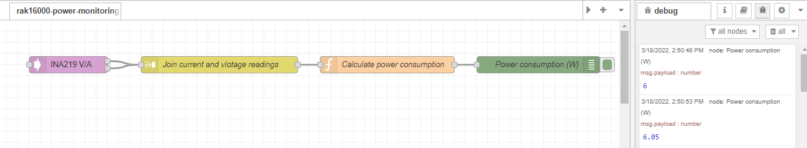

# Measuring DC current using WisBlock sensor RAK16000 from Node-RED 

[TOC]

## 1 Introduction

This guide explains how to use the [WisBlock IO RAK16000](https://docs.rakwireless.com/Product-Categories/WisBlock/RAK16000/Overview/) in combination with RAK6421 Wisblock Hat or RAK7391 WisGate Developer Connect to measure DC current through the I2C interface using Node-RED.  

### 1.1 RAK16000

**RAK16000** is a part of the WisBlock Sensor Series that is capable of measuring DC current in the range of 0 to `3 A` in a voltage range of `0 to 26 V`. With the two measured DC values, you get the power consumption by multiplying the current and voltage. Additionally, this module uses the [INA219BID](https://www.ti.com/store/ti/en/p/product/?p=INA219BID) from Texas Instruments which offers high accuracy maximum rate of 0.5% over temperature.

The INA219 is a current shunt and power monitor with an I2C- or SMBUS-compatible interface. The device monitors both shunt voltage drop and bus supply voltage, with programmable conversion times and filtering. A programmable calibration value, combined with an internal multiplier, enables direct readouts of current in amperes. An additional multiplying register calculates power in watts. The I2C- or SMbus-compatible interface features 16 programmable addresses. For more information about **INA219BID**, refer to the [Datasheet](https://www.ti.com/lit/ds/symlink/ina219.pdf?ts=1647401885343&ref_url=https%3A%2F%2Fwww.ti.com%2Fproduct%2FINA219).

### 1.2 node-red-contrib-easybotics-ina219-sensor

The node we used in this flow is **[node-red-contrib-easybotics-ina219-sensor](https://flows.nodered.org/node/node-red-contrib-easybotics-ina219-sensor)**, we need to deploy an **ina-sensor** node to measure DC current. It has two outputs, one is for the voltage and the other one is for the current readings. The **ina-sensor** node itself provides a drop-down menu to chose from the four possible addresses. Users can also make adjustments to the shunt resistance and poll frequency.  


## 2 Preparation


### 2.1 Access setup

Ensure you have access to I2C devices when using the sensor. The INA219 on RAK16000 supports I2C protocol. The I2C address of INA219 is configured to 0x41.

You need to enable I2C first, either by using **raspi-config** or just change `/boot/config.txt`.

If you are using Node-RED locally (in the host machine without using docker containers), you only need to  make sure the Node-RED user has access to the i2c bus (/dev/i2c-1 by default) on your host machine.

If your Node-RED is deployed inside a container, you need to mount `/dev/i2c-1` to the Node-RED container, and also make sure the user inside the container is assigned to the right group so that it has access to I2C devices.

For detailed "docker run" command, docker-compose file, and information about how to use a pre-configured Portainer template, please check this [instruction](https://git.rak-internal.net/product-rd/gateway/wis-developer/rak7391/wisblock-node-red/-/blob/dev/README-Docker/README.md), we provide all the information you need to know about using containerized Node-RED.

### 2.2 Install node in Node-RED

To install a new node, go to the top-right **Menu**, and then select **Manage palette**. On the **User Settings** page, you need to select **Install**, and search the keyword **node-red-contrib-easybotics-ina219-sensor**. Now you should be able to install this node.


### 2.3 Hardware

If you are going to use RAK16000 on a Raspberry Pi, the easiest way to set up the hardware is to use the RAK6421 WisBlock Hat that exposes all the Wisblock high-density connector pins.  The RAK16000 can be mounted to the HAT, and the HAT goes to the 40-pin headers located on Raspberry Pi 4B/IO board/RAK731; or you can mount RAK16000 on RAK7391's wisblock IO slot directly.

* RAK16000 + RAK6421 + Raspberry Pi

  

* RAK16000 + RAK7391+ CM4

  

You can connect RAK16000 to either slot 1 or slot 2 on RAK7391 board. Notice that if you want to add a multimeter to the circuit above, you need to connected it in series with the VIN+ pin on RAK16000. For example, cut the red cable used to connected the power supply and the VIN+ pin (highlighted in green in above figure), and then connect you multimeter in series. 

If you also need to measure the voltage of another load (not the board RAK7391 itself), make sure you the GND pin on RAK16000 share the same ground with the load(as shown below). When you want to measure the current,RAK16000 acts as a current meter, thus it has to be connected in series with the load; when you want to measure the voltage, RAK16000 acts as a voltage meter, thus the chip needs to be connected in parallel with the load. 


The device address of RAK16000 is configured to 0x41, and connected to i2c bus 1. If you are not using RAK16000, you need to check the hardware specification of the sensor to get the correct I2C device address.  Please check  INA219's [data sheet](https://www.ti.com/lit/ds/symlink/ina219.pdf?ts=1647401885343&ref_url=https%3A%2F%2Fwww.ti.com%2Fproduct%2FINA219) for more information about how the device address is configured. 


## 3 Flow configuration

After you deploy the NodeRED container,  you can import  [**rak16000-power-monitoring.json**](rak16000-power-monitoring.json) flow. This is a very basic flow and it uses four kinds of nodes: `ina-sensor` node, `function` node, and  `debug` node. After the import is done, the new flow should look like this:




One of the most important things to know before you deploy this flow is that you need to select the correct configuration for `ina-sensor` nodes.

### 3.1 ina-sensor node configuration 

The `ina-sensor` node provides a drop-down menu for users to add or configure the ina sensor that is used. To make changes to the used ina sensor, just select the edit button (pencil icon), and then you will be navigated to a new page where you can change the device address, sampling frequency, whether a custom resistor is used or not, and the resistance of the shunt resistor. 


The I2C address of INA219 is configured to **0x41**, and the shunt resistance is 0.1 ohms. We set the "Delay between samples in ms" to 5000 ms so that this flow outputs to the debug console the power consumption in Watts every 5 seconds.

### 3.2 Join node configuration

`Join` node can join sequences of messages in a variety of ways. In this flow, `Join node` joins every two messages sent by the `ina-219` node, and combine their payloads to create a key/value object. The payloads generated by `ina-291` node have two kinds of topics, one is **milliamps**, and the other one is **voltage**.


### 3.3 Function node configuration

The function node is only used to calculate the power consumption simply by times current readings by voltages readings. It reads the current and voltage data processed by the `join` node.  The script is provided below:

```plaintext
// Retrieve current readings from the join node
var current = msg.payload.miliamps;
// Retrieve voltage readings from the join node
var voltage = msg.payload.voltage;
// Calculate power consumption and output readings
var payload = {};
payload.current = current.toFixed(2) + ' mA';
payload.voltage = voltage.toFixed(2) + ' V';
payload.power = (current * voltage / 1000).toFixed(2) + ' W';
return {
    payload: payload
};
```

and also a screenshot:


## 4. Flow output

This is a simple flow that measure the voltage and current, as well as the power. The flow output is as follows；


