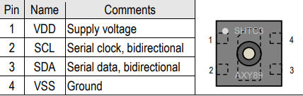
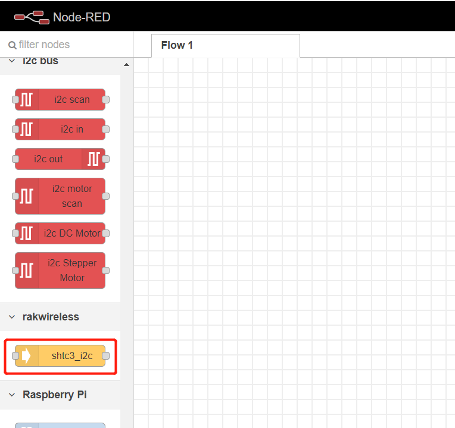
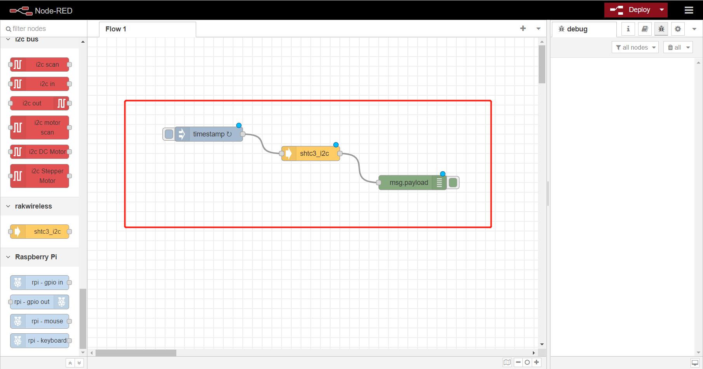

# Use shtc3 temperature and humidity sensor in RAK7391 board from NodeRED.

[TOC]

## 1. Introduction

This guide explains how to create a flow and then use the node **node-red-contrib-shtc3** to read the data of temperature and humidity  from shtc3 sensor in RAK7391 board. Shtc3 use `i2c-1` of RAK7391 board.  Its pin-map is showed as follows.



### 1.1 Requirements

You need to ensure that the user of system has I2C operation permission.


## 2. Preparation

### 2.1. Hardware

Since the shtc3 sensor is already in RAK7391 board, we needn't to prepare other hardware except RAK7391.

### 2.2. Software

Please install `node-red-contrib-shtc3` node with the following commands. If you use docker of Node-RED, you may need to replace `~/.node-red` with `/usr/src/node-red`，.

```
git clone -b dev https://git.rak-internal.net/product-rd/gateway/wis-developer/rak7391/node-red-nodes.git
```

```
cp -rf node-red-nodes/node-red-contrib-shtc3 ~/.node-red/node_modules
```

```
cd ~/.node-red/node_modules/node-red-contrib-shtc3 && npm install
```


## 3. Configure

Provides one node - `shtc3_i2c` in rakwireless category.



### shtc3_i2c

To get value of  temperature and humidity you just need to select the correct settings for your device and trigger the node.


- **Name**

  Define the msg name if you wish to change the name displayed on the node.

- **/dev/i2c-?**

  Default I2C Bus is 1.  `1` is for `'/dev/i2c-1'`.

- **i2c_Address**

  The Address fo shtc3 is 0x70 which can not be changed. 

- **Temperature Unit**

  You can select `Celsius` or `Fahrenheit` as you like.


## 4. Run example

After you deployed the Node-Red container using the [portainer app template](link to our portainer template) by Rakwireless, you can clone /copy the flow example. The example is under `sensors\rak1901\rak1901-shtc3-read` folder in the [`wisblock-node-red`](https://git.rak-internal.net/product-rd/gateway/wis-developer/rak7391/wisblock-node-red/-/tree/dev/) repository. Then you can import the  **rak1901-shtc3-read.json** file or just copy and paste the .json file contents into your new flow.

After the import is done, the new flow should look like this:



Hit the **Deploy** button on the top right to deploy the flow.

This is a simple flow with three node, where `inject` node supply a trigger event every 5 seconds, `shtc3_i2c`node read data of shtc3, and `debug` node print the temperature and humidity read from shtc3 sensor.

The result is as follows:


