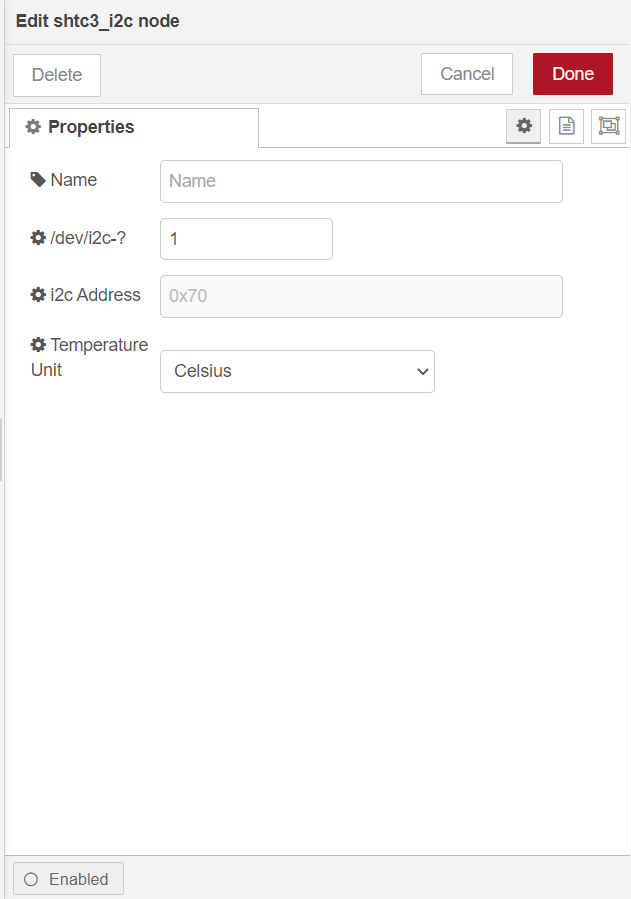

# Measure Temperature and Humidity Using WisBlock Sensor RAK1901(SHTC3) from Node-RED.

[TOC]

## 1. Introduction

This guide explains how to use the [Wisblock Sensor RAK1901](https://docs.rakwireless.com/Product-Categories/WisBlock/RAK1901/Overview/#product-description) to measure temperature and humidity through the I2C interface using Node-RED. 

### 1.1 RAK1901

The RAK1901 is a WisBlock sensor board that contains a SHTC3 chip, a Sensirion temperature and humidity sensor. The SHTC3 is a digital temperature and humidity sensor designed especially for battery-driven high-volume consumer electronics applications. The device comprises a sensing element and an IC interface which communicates through I2C from the sensing element to the application. While the RAK7391 comes with a SHTC3 soldered on board, you can use the same flow to read from both RAK1901 and the RAK7391's on-board SHTC3.  

## 2. Preparation

### 2.1 Access Setup

In this example, we are going to deploy a flow in Node-RED to measure temperature and humidity. To make the measurements, ensure you have access to I2C devices. 

If you are using Node-RED locally (in the host machine without using docker containers), you need to make sure the Node-RED user has access to the i2c bus (/dev/i2c-1 by default) on your host machine. You can enable I2C either by using **raspi-config** or just change `/boot/config.txt`.

If your Node-RED is deployed inside a container, you need to mount `/dev/i2c-1` to the Node-RED container, and also make sure the user inside the container is assigned to the right group so that it has access to I2C devices.

For detailed "docker run" command, docker-compose file, and information about how to use a pre-configured Portainer template, please check this [instruction](../../../README-Docker/README.md), we provide all the information you need to know about using containerized Node-RED.

### 2.2 Install node in Node-RED

Now we need to install the required nodes for the example flow. Browse to http://{host-ip}:1880 to access Node-Red's web interface. In this example, you need to install only one node: [@rakwireless/shtc3](https://www.npmjs.com/package/@rakwireless/shtc3).

To install this node , go to the top right **Menu**, and then select **Manage palette**. In the **User Settings** page, you need to select **Install**, and search the keyword **@rakwireless/shtc3 **.

### 2.3 Hardware

If you are using RAK7391, there is no extra hardwares required, as the SHTC3 is soldered on-board already. If you are going to use a use the RAK1901 on a Raspberry Pi or IO board, the easiest way is to use the RAK6421 WisBlock Hat that exposes all the Wisblock high-density connector pins.  The RAK1901 can be mounted to the HAT, and the HAT goes to the 40-pin headers located on Raspberry Pi 4B/IO board. 

* RAK1901 + Raspberry Pi +RAK6421 Pi-HAT

## 3. Flow configuration

Import the  [rak1901-shtc3-read](./rak1901-shtc3-read.json) file or just copy and paste the .json file contents into your new flow.

After the import is done, the new flow should look like this:

### 3.1 Nodes Configurations

* node-red-contrib-shtc3 

To get value of  temperature and humidity you need to select the correct bus number and i2c address for the SHTC3 chip.

- **Name**

  Define the msg name if you wish to change the name displayed on the node.

- **/dev/i2c-?**

  Default I2C Bus is 1.  `1` is for `'/dev/i2c-1'`.

- **i2c_Address**

  The Address fo shtc3 is 0x70 which can not be changed. 

- **Temperature Unit**

  You can select `Celsius` or `Fahrenheit` as you like.

## 4. Flow output

This is a simple flow with three node, where `inject` node supply a trigger event every 5 seconds, `shtc3_i2c`node read data of shtc3, and `debug` node print the temperature and humidity read from shtc3 sensor.

The result is as follows:

