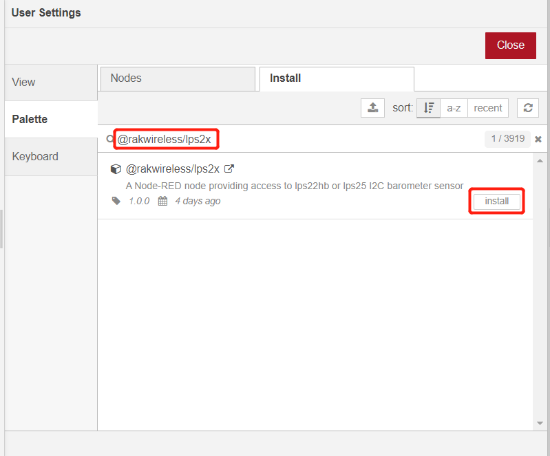
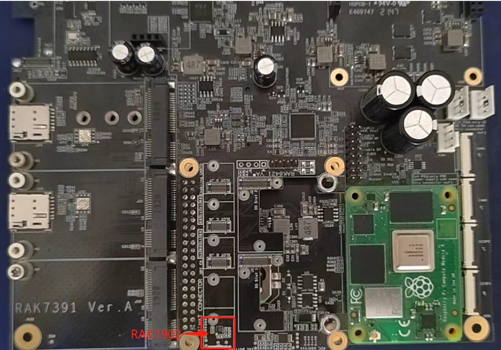
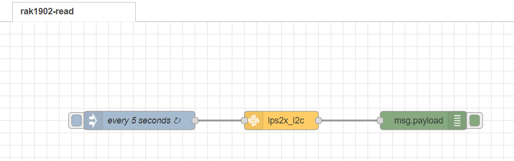
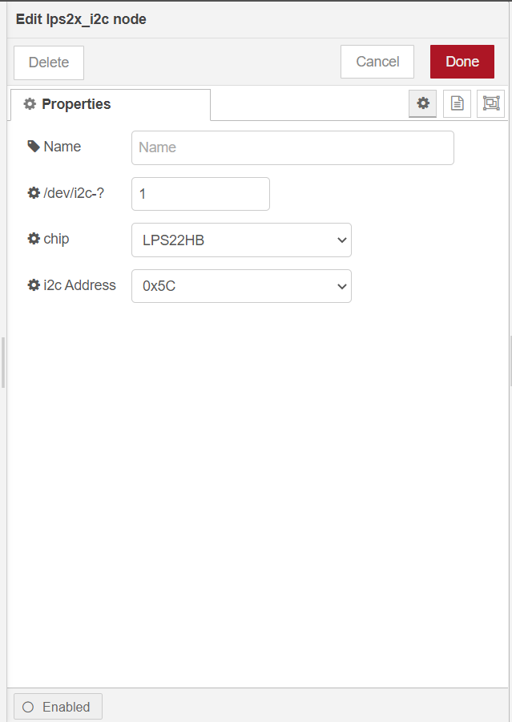
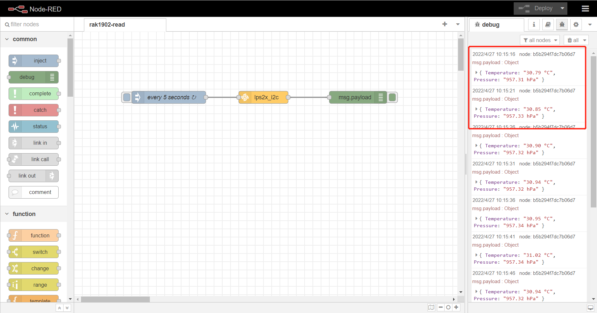

# Measure Use RAK1902 barometer sensor with RAK7391 board and RAK6421 Pi-Hat from NodeRED

[TOC]

## 1. Introduction

This guide explains how to use the [WisBlock barometric pressure sensor RAK1902](https://docs.rakwireless.com/Product-Categories/WisBlock/RAK1902/Datasheet/#overview) to measure barometric air pressure and temperature through I2C interface using Node-RED.

### 1.1 RAK1902

RAK1902 is a WisBlock Sensor based on the STMicroelectronics LPS22HB chip which extends the WisBlock system with barometric pressure sensing capabilities. A ready to use SW library and tutorial makes it easy to build up a barometric pressure data acquisition system.

RAK1902's pressure range from 260 to 1260 hPa makes it suitable for the use in weather prediction systems The relative accuracy of ±0.1 hPa is su­cient for most applications.

### 1.2 node-red-contrib-lps2x

The [node-red-contrib-lps2x](https://git.rak-internal.net/product-rd/gateway/wis-developer/rak7391/node-red-nodes/-/tree/master/node-red-contrib-lps2x) is used in this flow to configure the sensor. It supports lps22hb or lps25hb I2C barometer sensor, it allows users to change the bus number, the chipset, and also the i2c address. 

## 2. Preparation

### 2.1 Access Setup

Ensure you have access to I2C devices when using the sensor. The LPS22HB chip on RAK1902 supports I2C protocol, and the I2C address of the chip is configured to 0x5c.

If you are using Node-RED locally (in the host machine without using docker containers), you only need to  make sure the Node-RED user has access to the i2c bus (/dev/i2c-1 by default) on your host machine. 

If your Node-RED is deployed inside a container, you need to mount `/dev/i2c-1` to the Node-RED container, and also make sure the user inside the container is assigned to the right group so that it has access to I2C devices.

For detailed "docker run" command, docker-compose file, and information about how to use a pre-configured Portainer template, please check this [instruction](https://git.rak-internal.net/product-rd/gateway/wis-developer/rak7391/wisblock-node-red/-/blob/dev/README-Docker/README.md), we provide all the information you need to know about using containerized Node-RED.

### 2.2 Install nodes in Node-RED

Now we need to install the required nodes for the example flow. Browse to http://{host-ip}:1880 to access Node-Red's web interface. In this example, you need to install only one node: [node-red-contrib-lps2x](https://git.rak-internal.net/product-rd/gateway/wis-developer/rak7391/node-red-nodes/-/tree/master/node-red-contrib-lps2x).

To install this node , go to the top right **Menu**, and then select **Manage palette**. In the **User Settings** page, you need to select **Install**, and search the keyword **node-red-contrib-lps2x **. Now you should be able to install this node. This node is developed by RAKWireless, the source code is hosted in this [repo](https://git.rak-internal.net/product-rd/gateway/wis-developer/rak7391/node-red-nodes/-/tree/master/node-red-contrib-lps2x), and you can also check this [documentation](https://git.rak-internal.net/product-rd/gateway/wis-developer/rak7391/wisblock-node-red/-/blob/dev/README-Docker/README.md) about how to install the node manually using command line.

need to change this image once out node is published.

#### 2.3 Hardware

The easiest way to set up the hardware is to use the RAK6421 WisBlock Hat that exposes all the Wisblock high-density connector pins.  The RAK1902 can be mounted to the HAT, and the HAT goes to the 40-pin headers located on Raspberry Pi 4B/IO board/RAK7391. Based on your hardware selections, there are three ways to mount RAK12019:

1. Raspberry Pi model B + RAK6421 WisBlock Hat +  RAK1902

   

2. RAK7391 + RAK6421 WisBlock Hat +  RAK1902

   

   

## 3. Flow Configuration

After the installation of `node-red-contrib-lps2x` is completed, you can clone/copy the flow example. The example is under `sensor/rak1902/rak1902-read` folder in the [`wisblock-node-red`](https://git.rak-internal.net/product-rd/gateway/wis-developer/rak7391/wisblock-node-red/-/tree/dev/) repository. Then you can import the  **rak1902-read.json** file or just copy and paste the `.json` file contents into your new flow.

After the import is done, the new flow should look like this:

### 3.1 Node Configuration

Drag and release it to workspace,  then start to configue it. RAK1902 uses `i2c-1` of RAK7391 board and its i2c address is `0x5C`.

* node-red-contrib-lps2x

	

To get the temperature and pressure readings, users need to configure the following settings:

**Name**

Define the msg name if you wish to change the name displayed on the node.

**/dev/i2c-?**

The i2c bus number, the default value is `1` , it means `'/dev/i2c-1'`.

**Chip**

This node support two chipset: lps22hb and lps25hb.

**i2c_Address**

The i2c slave address for the chip, by default is set to `0x5c`.

## 4. Flow output

This is a simple flow with three node, where`lps2x_i2c` read RAK1902 sensor data ,  `inject` node trigger RAK1902  to get data every 5 seconds and `debug` node print the sensor data read from RAK1902 sensor.

The result is as follows:

