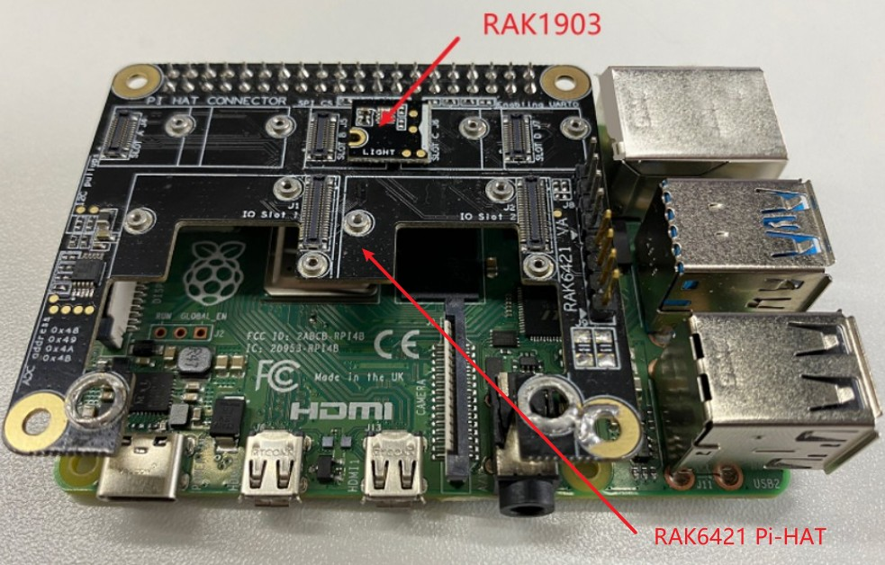
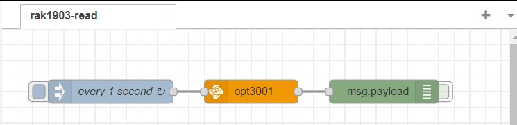
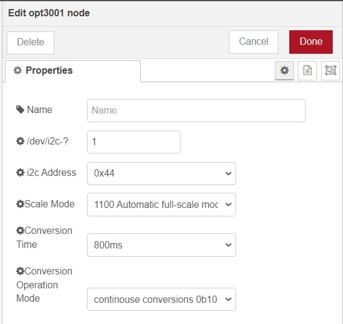
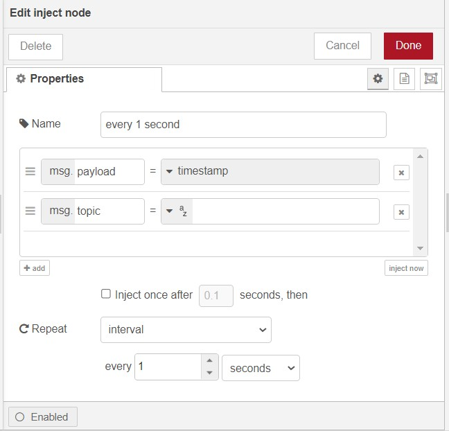
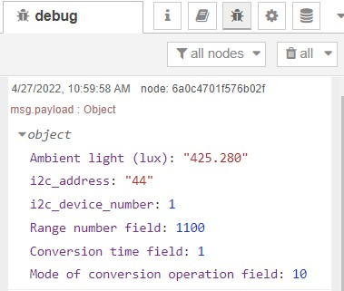

# Read ambient light using WisBlock sensor RAK1903 from Node-RED 

[TOC]

## 1 Introduction

This guide explains how to use the [RAK1903 WisBlock Ambient Light Sensor](https://docs.rakwireless.com/Product-Categories/WisBlock/RAK1903/Overview/#product-description) in combination with RAK6421 Wisblock Hat to do ambient light measuring.  

### 1.1 RAK1903

RAK1903 is a WisBlock Sensor which extends the WisBlock system with a [TI OPT3001DNPR light sensor](https://www.ti.com/product/OPT3001). The RAK1903 WisBlock Sensor module, part of the RAK Wireless Wisblock series, is a single-chip ambient light sensor, measuring the intensity of light in the visible range. The precise spectral response and strong IR rejection of the device enables the RAK1903 module to accurately measure the intensity of light as seen by human eyes regardless of light sources. The strong IR rejection also aids in maintaining high accuracy when the industrial design requires to mount the sensor under dark glass due to aesthetics reasons. The RAK1903 module is designed for systems that create light-based experiences for humans. It is an ideal replacement for photodiodes, photoresistors, or other ambient light sensors with less visible range matching and IR rejection. For more information about RAK1903, refer to the [Datasheet](https://docs.rakwireless.com/Product-Categories/WisBlock/RAK1903/Datasheet/).

### 1.2 I2C protocol

**I2C** (**Inter-Integrated Circuit**) is a synchronous, multi-controller/multi-target (controller/target), packet switched, single-ended, serial communication bus invented in 1982 by Philips Semiconductors. It is widely used for attaching lower-speed peripheral ICs to processors and microcontrollers in short-distance, intra-board communication. 

The RAK1903 supports the I2C serial bus and data transmission protocol, and it operates as a slave device on the I2C bus. Based on [OPT3001's datasheet](https://www.ti.com/lit/ds/symlink/opt3001.pdf?ts=1650948147469&ref_url=https%253A%252F%252Fwww.google.com%252F), this chip has four possible I2C address based on the ADDR pin configuration, which are 0x44, 0x45, 0x46, and 0x47. Only the I2C related pins, interrupt pins, VDD and GND are connected from this module to the WisBlock sensor connector. 

### 1.3 node-red-contrib-opt3001

The node we used in this flow is **[node-red-contrib-opt3001](https://git.rak-internal.net/product-rd/gateway/wis-developer/rak7391/node-red-nodes/-/tree/dev/node-red-contrib-opt3001)**. There are detailed instructions on how to install the node-red-contrib-opt3001 and how to configure it, please check this [guide](https://git.rak-internal.net/product-rd/gateway/wis-developer/rak7391/node-red-nodes/-/tree/dev/node-red-contrib-opt3001) on `node-red-contrib-opt3001` created by RAKwireless. 

The node-red-contrib-opt3001 node provides some basic configuration fields for users to configure, the user needs to define the i2c bus of the chip and the I2C address of the chip. Users also need to set the scale mode, conversion time, and conversion operation mode based on their own use cases. 


## 2 Preparation


### 2.1 Access setup

Ensure you have access to I2C devices when using the sensor. The opt3001 chip on RAK1903 supports I2C protocol, if you are using Node-RED in the host machine directly (without using the docker container), you won't need to change anything, just make sure the Node-RED user has access to the i2c bus (/dev/i2c-1 by default) on your host machine. 

If running Node-RED using docker, you need to mount `/dev/i2c-1` device to the Node-RED container using the docker command we provided below:

```
docker run -it -p 1880:1880 -v node_red_data:/data --name NodeRed --device /dev/i2c-1:/dev/i2c-1 --user node-red:998 nodered/node-red
```

you also need to make sure you have access to the GPIO devices  inside the container. If you use the Portainer template provided by us, you don't need to change anything, as we have already mounted the device for you in the template file.

#### 2.1.1 Docker compose

Since PiGPIO daemon requires users to have root access, we recommend the user to use the network connection to link out of the Node-RED container to the PiGPIO daemon running on another container to get rid of the permission issues. So that your Node-RED container's default user is set to "node-red", and the container has PiGPIO daemon running on is running in the privileged mode. The example docker-compose is provided below:

```
version: '3.9'

services:

  nodered:
    image: sheng2216/nodered-docker:1.1
    container_name: NodeRed
    user: node-red
    group_add:
      - 998
    ports:
      - "1880:1880"
    restart: unless-stopped
    volumes:
      - 'node-red-data:/data'
    devices:
      - "/dev/i2c-1:/dev/i2c-1"
    networks:
      - node-red

volumes:
  node-red-data:

networks:
  node-red:

```

To bring up the service, save the above file into a file called **docker-compose.yml**, and in the same directory, run `docker-compose up`. To stop the service, just press **ctrl+c** to exit and then run `docker-compose down` to stop the services, and also remove the networks defined.

In the docker-compose file provided above, the --device can mount the device to the container, --group-add 998 adds the I2C group (group id 998 in Rakpios) to run as. Notice that **998** in the compose file needs to be changed if you are not using Rakpios, it needs to match your system group setup. Before adding the node-red user to the i2c group, you need to get the group number via running the command below on your host:

```
cat /etc/group | grep i2c | awk -F: '{print $3}'
```

#### 2.1.2 Running under Docker Portainer

If you try to run a Node-RED container with Docker Portainer using the template provided by RAKwireless, you won't need to make any changes to the configurations, just deploy the Node-RED container using the template (shown below), 


in the template, we defined a customized Node-RED docker image for you to use, so you don't need to worry about the configuration or permission anymore. After the app is deployed, you can browse to http://{host-ip}:1880 to access Node-Red's web interface.

### 2.2 Hardware preparation 

The i2c address of RAK1903 is configured to 0x44, and connected to i2c bus 1. Please check opt3001's [datasheet](https://www.ti.com/lit/ds/symlink/opt3001.pdf?ts=1650948147469&ref_url=https%253A%252F%252Fwww.google.com%252F) for more information about how the device address is configured. 

The easiest way to set up the hardware is to use the RAK6421 WisBlock Hat that exposes all the Wisbock high-density connector pins.  The RAK1903 can be mounted to the HAT, and the HAT goes to the 40-pin headers located on Raspberry Pi 4B/IO board/RAK7391. Here is an example shows how RAK1903 is monted to the Pi-Hat on a Raspberry Pi model 4B :




## 3 Flow configuration

Whether you are using the Node-Red docker image provided by RAKwireless or the official latest image, or you host your Node-RED service on your host machine, you need to install the node `node-red-contrib-opt3001`  before you deploy the flow. 

### 3.1 Install nodes  

While the `node-red-contrib-opt3001` hasn't been published, so you need to install it in anther way. Please install `node-red-contrib-opt3001` node with the following commands. If you use docker of Node-RED, you may need to replace `~/.node-red` with `/usr/src/node-red`,

```
git clone -b dev https://git.rak-internal.net/product-rd/gateway/wis-developer/rak7391/node-red-nodes.git
```

then copy `node-red-contrib-opt3001` directory  to  the `node_modules` directory,

```
cp -rf node-red-nodes/node-red-contrib-opt3001 ~/.node-red/node_modules
```

lastly, change to the `node-red-contrib-3001` directory and install the node, 

```
cd ~/.node-red/node_modules/node-red-contrib-opt3001 && npm install
```

**Tips:**  After the installation of  `node-red-contrib-opt3001`  is finished, please restart your node-red service.  Otherwise, the node cannot be found/added to the new flow.

### 3.2 Deploy the Example Flow 

After you deploy the NodeRED container,  you can import  [**rak1903-read.json**](rak1903-read.json) flow. This is a very basic flow and it uses three sets of nodes: `inject` node, `opt3001` node,  and  `debug` node. After the import is done, the new flow should look like this:




As we mentioned in the node introduction section, the `node-red-node-pi-gpiod` node is used to pull the EN pin that must be pulled high before ASC121C021 can read analog input.

### 3.3 Nodes Configurations 

To get the correct ambient light readings from the opt3001 sensor, users need to define the i2c address and the i2c bus of the chip. Users also need to set the scale mode, conversion time, and conversion operation mode based on their own use cases.

**Name**

Define the msg name if you wish to change the name displayed on the node.

**/dev/i2c-?**

Default I2C Bus is 1.  `1` is for `'/dev/i2c-1'`.

**i2c_Address**

The Address by default is set to `0x44`, this is the I2C address of RAK1903, which is based on opt3001 ambient light sensor. 

**Scale Mode**

The option "Scale Mode" is for users to configure the scale range, according to [opt3001's datasheet](https://www.ti.com/lit/ds/symlink/opt3001.pdf?ts=1650948147469&ref_url=https%253A%252F%252Fwww.google.com%252F), "the OPT3001 has an automatic full-scale-range setting mode that eliminates the need for a user to predict and set the optimal range for the device. This mode is entered when the configuration register range number field (RN[3:0]) is set to 0b1100." In this node, automatic full-scale mode is enabled by default. Other possible value for this options are 0b1101, 0b1110, and 0b1111, they are reserved for future use. 

**Conversion Time**

The option "Conversion Time" controls "the length of the light to digital conversion process. The choices are 100 ms and 800 ms. A longer integration time allows for a lower noise measurement", based on  [opt3001's datasheet](https://www.ti.com/lit/ds/symlink/opt3001.pdf?ts=1650948147469&ref_url=https%253A%252F%252Fwww.google.com%252F). When the conversion time field is set to 0, the conversion time is set to 100 ms; when the conversion time is set to 1, the conversion time is set to 800 ms.

**Conversion Operation Mode**

The option "Conversion Operation Mode" options allows users to controls whether the device is operating in continuous conversion, single-shot, or low-power shutdown mode. According to [opt3001's datasheet](https://www.ti.com/lit/ds/symlink/opt3001.pdf?ts=1650948147469&ref_url=https%253A%252F%252Fwww.google.com%252F), in shutdown mode, upon power-up, the device only consumes operational level power after appropriately programming the device; while in single-shot mode, the mode of conversion operation field continues to read 0b01 when the device is actively converting.

For more information about opt3001's configuration register fields description, please check Table 10 in the [datasheet](https://www.ti.com/lit/ds/symlink/opt3001.pdf?ts=1650948147469&ref_url=https%253A%252F%252Fwww.google.com%252F).




- inject node

  The inject node connected to the `node-red-contrib-opt3001` is responsible for triggering the opt3001 node every 1 second:

  


### 3.4 Flow output

The output of the node is a payload contains the ambient light reading, the I2C address (in hexecimal), the I2C device number (bus number), range number field, conversion time field, and mode of conversion operation mode.  




## License

This project is licensed under MIT license.
