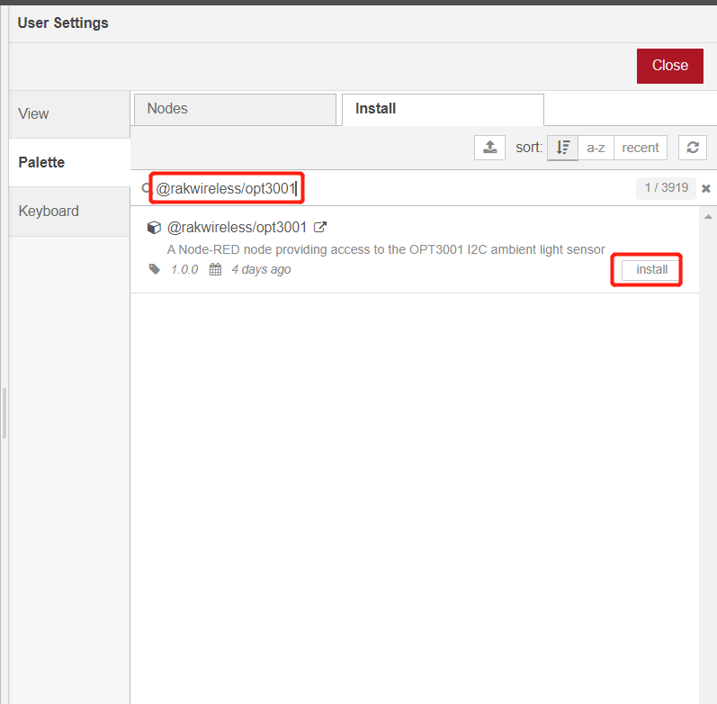

# Read ambient light using WisBlock sensor RAK1903 from Node-RED 

[TOC]

## 1 Introduction

This guide explains how to use the [RAK1903 WisBlock Ambient Light Sensor](https://docs.rakwireless.com/Product-Categories/WisBlock/RAK1903/Overview/#product-description) in combination with RAK6421 Wisblock Hat to do ambient light measuring.  

### 1.1 RAK1903

RAK1903 is a WisBlock Sensor which extends the WisBlock system with a [TI OPT3001DNPR light sensor](https://www.ti.com/product/OPT3001). The RAK1903 WisBlock Sensor module, part of the RAK Wireless Wisblock series, is a single-chip ambient light sensor, measuring the intensity of light in the visible range. The precise spectral response and strong IR rejection of the device enables the RAK1903 module to accurately measure the intensity of light as seen by human eyes regardless of light sources. The strong IR rejection also aids in maintaining high accuracy when the industrial design requires to mount the sensor under dark glass due to aesthetics reasons. The RAK1903 module is designed for systems that create light-based experiences for humans. It is an ideal replacement for photodiodes, photoresistors, or other ambient light sensors with less visible range matching and IR rejection. For more information about RAK1903, refer to the [Datasheet](https://docs.rakwireless.com/Product-Categories/WisBlock/RAK1903/Datasheet/).

The RAK1903 supports the I2C serial bus and data transmission protocol, and it operates as a slave device on the I2C bus. Based on [OPT3001's datasheet](https://www.ti.com/lit/ds/symlink/opt3001.pdf?ts=1650948147469&ref_url=https%253A%252F%252Fwww.google.com%252F), this chip has four possible I2C address based on the ADDR pin configuration, which are 0x44, 0x45, 0x46, and 0x47. On RAK1903, the address is set to `0x44` by default.

## 2 Preparation

### 2.1 Access setup

Ensure you have access to I2C devices when using the sensor. The opt3001 chip on RAK1903 supports I2C protocol.

If you are using Node-RED locally (in the host machine without using docker containers), you only need to  make sure the Node-RED user has access to the i2c bus (/dev/i2c-1 by default) on your host machine. 

If your Node-RED is deployed inside a container, you need to mount `/dev/i2c-1` to the Node-RED container, and also make sure the user inside the container is assigned to the right group so that it has access to I2C devices.

For detailed "docker run" command, docker-compose file, and information about how to use a pre-configured Portainer template, please check this [instruction](../../../README-Docker/README.md), we provide all the information you need to know about using containerized Node-RED.

### 2.2 Install node in Node-RED

Now we need to install the required nodes for the example flow. Browse to http://{host-ip}:1880 to access Node-Red's web interface. In this example, you need to install only one node: [@rakwireless/opt3001](https://www.npmjs.com/package/@rakwireless/opt3001).

To install this node , go to the top right **Menu**, and then select **Manage palette**. In the **User Settings** page, you need to select **Install**, and search the keyword **@rakwireless/opt3001**. 

### 2.3 Hardware  

The easiest way to set up the hardware is to use the RAK6421 WisBlock Hat that exposes all the Wisbock high-density connector pins.  The RAK1903 can be mounted to the HAT, and the HAT goes to the 40-pin headers located on Raspberry Pi 4B/IO board/RAK7391. Here is an example shows how RAK1903 is monted to the Pi-Hat on a Raspberry Pi model 4B :

## 3 Flow configuration

After you deploy the NodeRED container,  you can import  [**rak1903-read.json**](rak1903-read.json) flow. This is a very basic flow and it uses three sets of nodes: `inject` node, `opt3001` node,  and  `debug` node. After the import is done, the new flow should look like this:

### 3.1 Nodes Configurations 

* node-red-contrib-opt3001

  To get the correct ambient light readings from the opt3001 sensor, users need to define the i2c address and the i2c bus of the chip. Users also need to set the scale mode, conversion time, and conversion operation mode based on their own use cases.

  **Name**

  Define the msg name if you wish to change the name displayed on the node.

  **/dev/i2c-?**

  Default I2C Bus is 1.  `1` is for `'/dev/i2c-1'`.

  **i2c_Address**

  The Address by default is set to `0x44`, this is the I2C address of RAK1903, which is based on opt3001 ambient light sensor. 

  **Scale Mode**

  The option "Scale Mode" is for users to configure the scale range, according to [opt3001's datasheet](https://www.ti.com/lit/ds/symlink/opt3001.pdf?ts=1650948147469&ref_url=https%253A%252F%252Fwww.google.com%252F), "the OPT3001 has an automatic full-scale-range setting mode that eliminates the need for a user to predict and set the optimal range for the device. This mode is entered when the configuration register range number field (RN[3:0]) is set to 0b1100." In this node, automatic full-scale mode is enabled by default. Other possible value for this options are 0b1101, 0b1110, and 0b1111, they are reserved for future use. 

  **Conversion Time**

  The option "Conversion Time" controls "the length of the light to digital conversion process. The choices are 100 ms and 800 ms. A longer integration time allows for a lower noise measurement", based on  [opt3001's datasheet](https://www.ti.com/lit/ds/symlink/opt3001.pdf?ts=1650948147469&ref_url=https%253A%252F%252Fwww.google.com%252F). When the conversion time field is set to 0, the conversion time is set to 100 ms; when the conversion time is set to 1, the conversion time is set to 800 ms.

  **Conversion Operation Mode**

  The option "Conversion Operation Mode" options allows users to controls whether the device is operating in continuous conversion, single-shot, or low-power shutdown mode. According to [opt3001's datasheet](https://www.ti.com/lit/ds/symlink/opt3001.pdf?ts=1650948147469&ref_url=https%253A%252F%252Fwww.google.com%252F), in shutdown mode, upon power-up, the device only consumes operational level power after appropriately programming the device; while in single-shot mode, the mode of conversion operation field continues to read 0b01 when the device is actively converting.

  For more information about opt3001's configuration register fields description, please check Table 10 in the [datasheet](https://www.ti.com/lit/ds/symlink/opt3001.pdf?ts=1650948147469&ref_url=https%253A%252F%252Fwww.google.com%252F).

- inject node

  The inject node connected to the `node-red-contrib-opt3001` is responsible for triggering the opt3001 node every 1 second:

  

### 3.4 Flow output

The output of the node is a payload contains the ambient light reading, the I2C address (in hexecimal), the I2C device number (bus number), range number field, conversion time field, and mode of conversion operation mode.  

## License

This project is licensed under MIT license.
