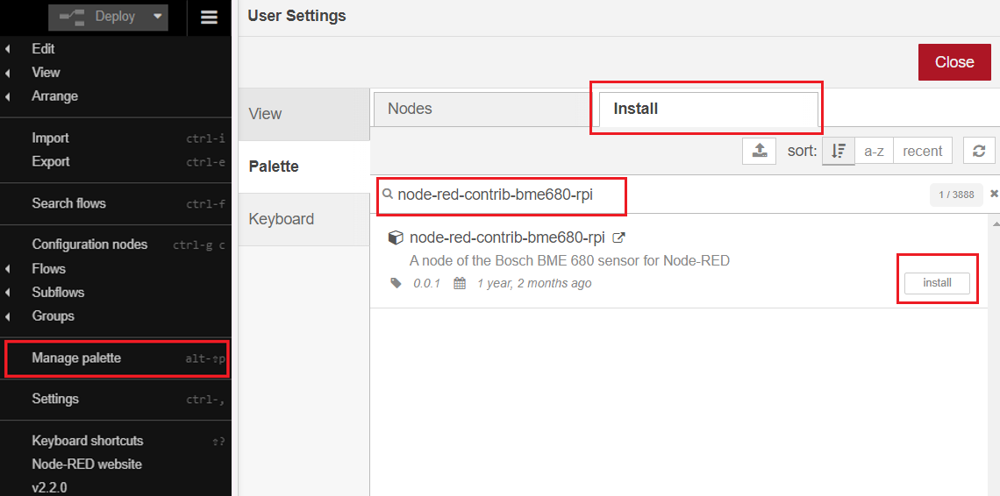
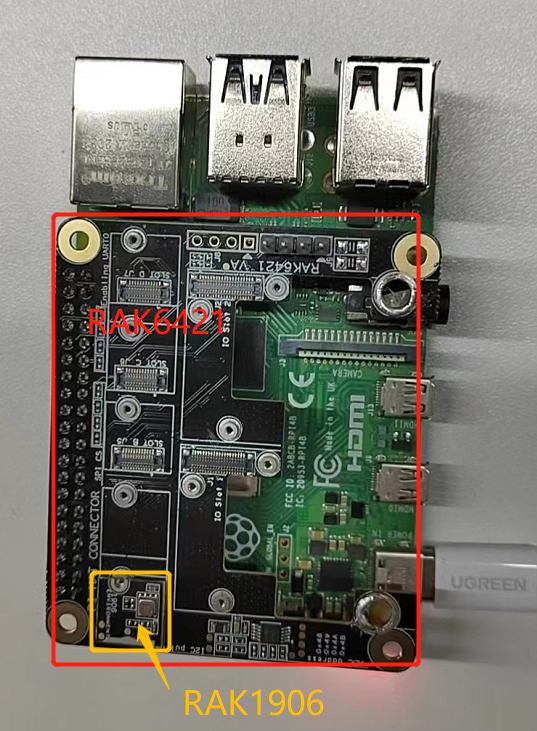
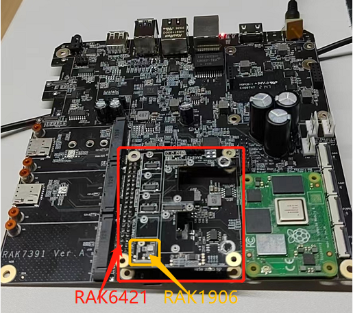
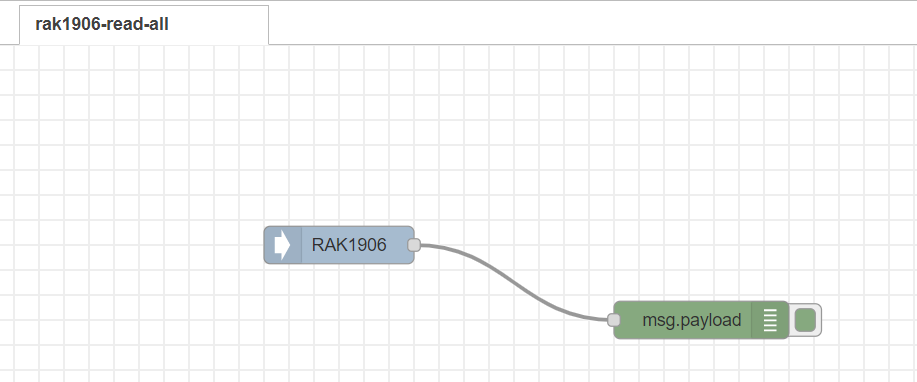
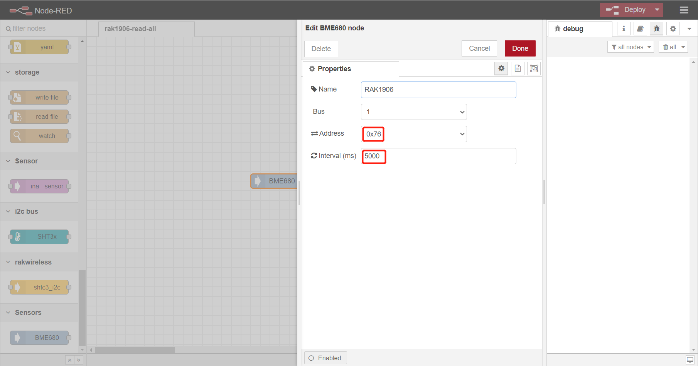
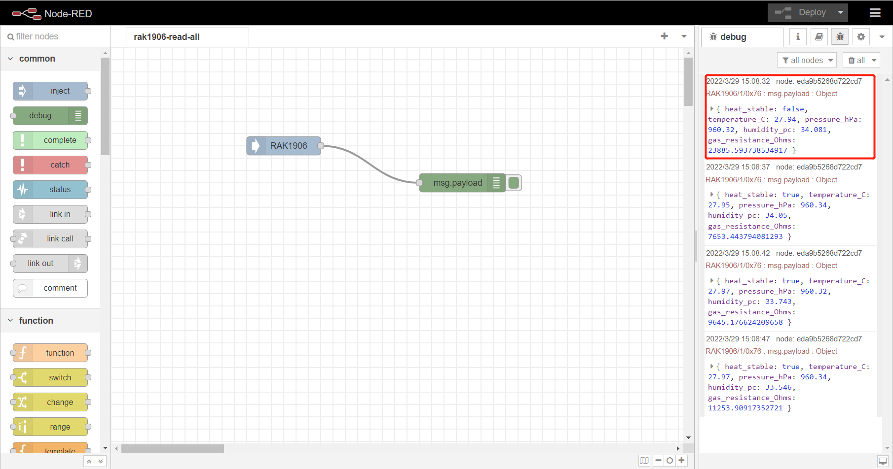

# Measure Environmental Data using RAK1906 environmental sensor from NodeRED

[TOC]

## 1. Introduction

This guide explains how to create a flow and then use **node-red-contrib-bme680-rpi** to read the data from RAK1906 environment sensor with RAK7391 board and RAK6421 Pi-Hat. 

### 1.1 RAK1906

The RAK1906 WisBlock Environmental Sensor module, part of the RAK WisBlock Sensor series, is a 4-in-1 digital sensor board that comprises gas, humidity pressure, and temperature sensor based on the Bosch® BME680 module. The RAK1906 is ideal for applications such as indoor air quality, home automation, and building IoT solutions. 

### 1.2 node-red-contrib-bme680-rpi

The **[node-red-contrib-bme680-rpi](https://flows.nodered.org/node/node-red-contrib-bme680-rpi)** support BEM680 I2C sensor, it returns environment data from [Bosch BME 680 multisensor](https://www.bosch-sensortec.com/products/environmental-sensors/gas-sensors/bme680/):

- temperature
- humidity
- air pressure
- gas resistance

## 2. Preparation

### 2.1 Access Setup

Ensure you have access to I2C devices when using the sensor. The BEM680 chip on RAK12019 supports I2C protocol.

If you are using Node-RED locally (in the host machine without using docker containers), you only need to  make sure the Node-RED user has access to the i2c bus (/dev/i2c-1 by default) on your host machine. 

If your Node-RED is deployed inside a container, you need to mount `/dev/i2c-1` to the Node-RED container, and also make sure the user inside the container is assigned to the right group so that it has access to I2C devices.

For detailed "docker run" command, docker-compose file, and information about how to use a pre-configured Portainer template, please check this [instruction](https://git.rak-internal.net/product-rd/gateway/wis-developer/rak7391/wisblock-node-red/-/blob/dev/README-Docker/README.md), we provide all the information you need to know about using containerized Node-RED.

### 2.2 Install node in Node-RED

Now we need to install the required nodes for the example flow. Browse to http://{host-ip}:1880 to access Node-Red's web interface. In this example, you need to install only one node: [node-red-contrib-bme680-rpi](https://flows.nodered.org/node/node-red-contrib-bme680-rpi).

To install this node , go to the top right **Menu**, and then select **Manage palette**. In the **User Settings** page, you need to select **Install**, and search the keyword **node-red-contrib-bme680-rpi **. Now you should be able to install this node. 

### 2.3 Hardware

The easiest way to set up the hardware is to use the RAK6421 WisBlock Hat that exposes all the Wisblock high-density connector pins.  The RAK1906 can be mounted to the HAT, and the HAT goes to the 40-pin headers located on Raspberry Pi 4B/IO board/RAK7391. Based on your hardware selections, there are three ways to mount RAK1906:

* Raspberry Pi model B + RAK6421 WisBlock Hat +  RAK1906

* Raspberry Pi CM4 + RAK7391 + RAK6421 WisBlock Hat + RAK1906

## 3. Flow configuration

After the installation of `node-red-contrib-bme680-rpi` is completed, you can clone/copy the flow example. The example is under `sensor/rak1906/rak1906-read-all` folder in the [`wisblock-node-red`](https://git.rak-internal.net/product-rd/gateway/wis-developer/rak7391/wisblock-node-red/-/tree/dev/) repository. Then you can import the  **rak1906-read-all.json** file or just copy and paste the `.json` file contents into your new flow.

After the import is done, the new flow should look like this:

### 3.1 Node Configurations

* node-red-contrib-bme680-rpi

RAK1906 uses `i2c-1` of RAK7391 board and its i2c address is `0x76`, then set interval as 5000 ms to get sensor data of RAK1906 periodically.

Hit the **Deploy** button on the top right to deploy the flow.

## 4. Run example

This is a simple flow with two node, where`BME680` named RAK1906 output sensor data every 5 seconds, and `debug` node print the sensor data read from RAK1906 sensor.

The result is as follows:

## License

This project is licensed under MIT license.
