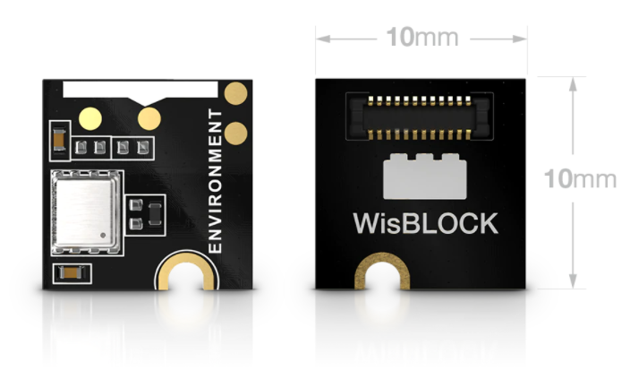
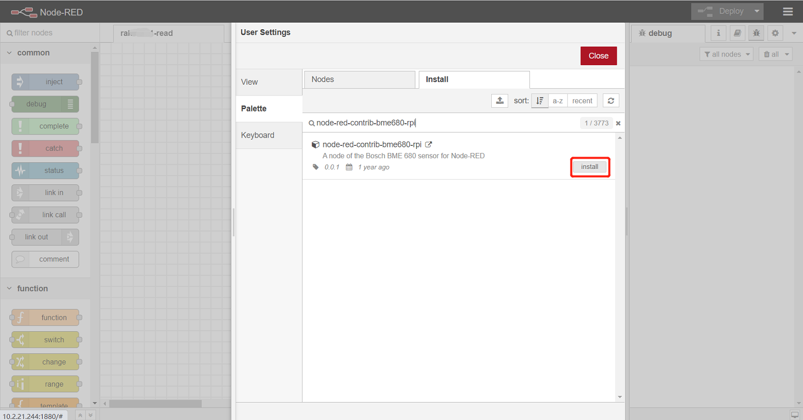
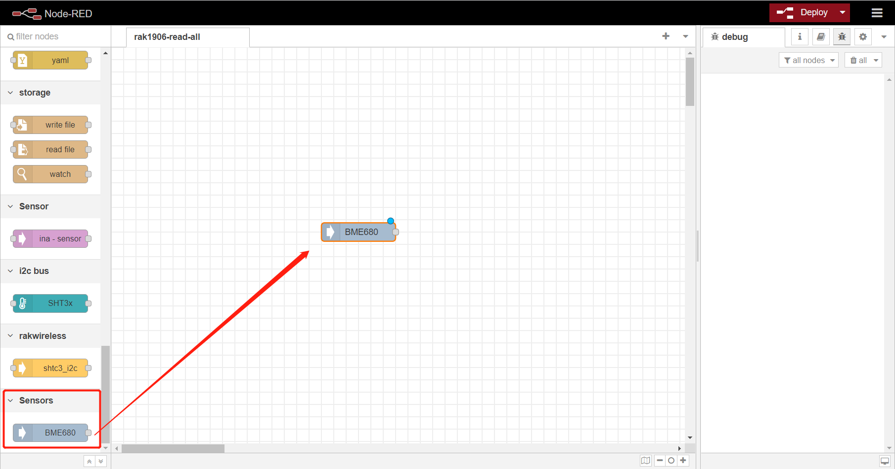
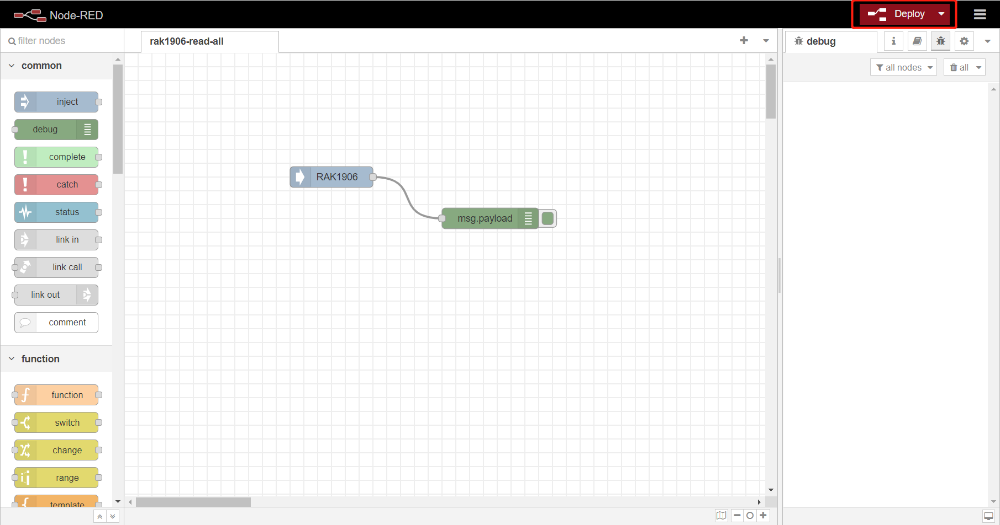

# Use RAK1906 environment sensor with RAK7391 board and RAK6421 Pi-Hat from NodeRED

[TOC]

## 1. Introduction

This guide explains how to create a flow and then use the node **node-red-contrib-bme680-rpi** to read the data from RAK1906 environment sensor with RAK7391 board and RAK6421 Pi-Hat. 

RAK1906 uses `i2c-1` of RAK7391 board.  

### 1.1 Requirements

You need to ensure that the user of system has I2C operation permission.

## 2. Preparation

### 2.1. Hardware

#### 2.1.1. Sensor hardware

WisBlock sensor RAK1906 uses the Bosch BME680 environment sensor which integrates high-linearity and high-accuracy gas, pressure, humidity and temperature sensors.

 

#### 2.1.2.  RAK6421 Pi-Hat

RAK6421 is a pi-hat  for Raspberry pi 3B/4B or RAK7391 which has 4 sensor slots and 2 IO slots of Wisblock. 

#### 2.1.3. Connection diagram

Firstly, connect RAK1906  to RAK6421 board. And then connect RAK6421 to RAK7391.

We can also connect RAK6421 to Raspberry pi 4B+.

### 2.2. Software

Please install `node-red-contrib-bme680-rpi` node from NodeRED `Manage Palette` menu as picture bellow.

## 3. Configure

After installation of BME680 node, we can find the node at left menu.

If you want to run example directly,  skip the following configure and go to section `4 Run example` . If you want to know how to configure, please continue.

Drag and release it to workspace,  then start to configue it. RAK1906 uses `i2c-1` of RAK7391 board and its i2c address is `0x76`.

And set interval as 5000 ms to get sensor data of RAK1906 periodically.

Then, drag a `debug`  node and connect it to RAK1906 to display sensor data.

Hit the **Deploy** button on the top right to deploy the flow.

## 4. Run example

We can also import the  **rak1906-read-all.json** file or just copy and paste the .json file contents into your new flow directly.

After the import is done, the new flow should look like this:

Hit the **Deploy** button on the top right to deploy the flow.

This is a simple flow with two node, where`BME680` named RAK1906 output sensor data every 5 seconds, and `debug` node print the sensor data read from RAK1906 sensor.

The result is as follows:

