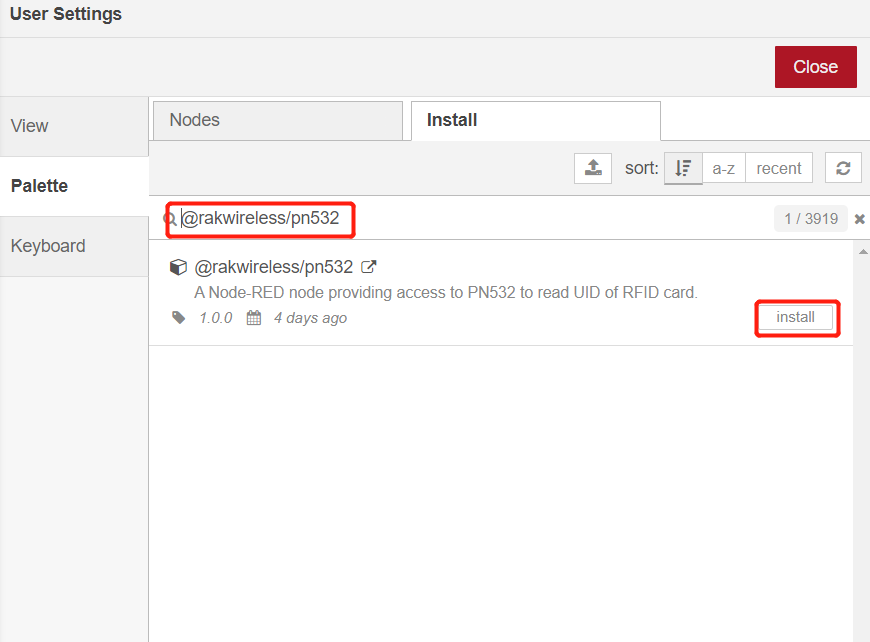
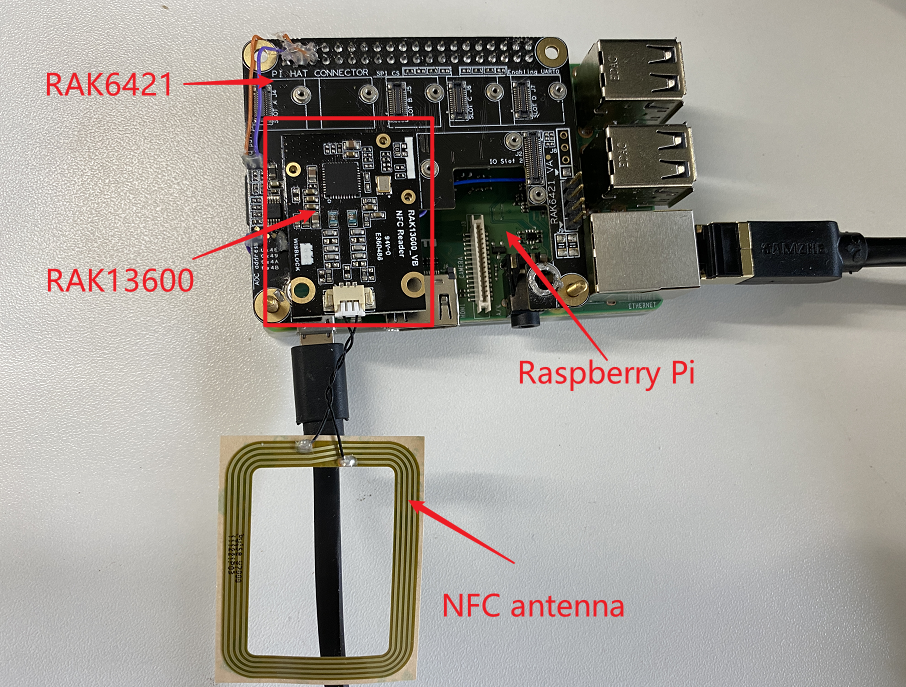

# Extend RAK13600 in RAK7391 board and test it with NodeRed

[TOC]

## 1. Introduction

This guide explains how to create a flow and then use the node [@rakwireless/pn532](https://www.npmjs.com/package/@rakwireless/pn532) to test [RAK13600](https://store.rakwireless.com/products/rak13600-wisblock-nfc-reader) that use it to read id of RFID card and transfers the id to owner's name of RFID.  

### 1.1 RAK13600

The RAK13600 module is designed as wireless module that allows you to scan NFC and RFID tags and devices. It includes an antenna coil that transmits and receives RF signals from the object being scanned. The RAK13600 is based on the popular NFC/RFID chip PN532. For more information about RAK13600, please check the [datasheet](https://docs.rakwireless.com/Product-Categories/WisBlock/RAK13600/Overview/#product-description). 

## 1.2 @rakwireless/pn532

[@rakwireless/pn532](https://www.npmjs.com/package/@rakwireless/pn532) is a node-red node providing access to PN532 to read UID of RFID card. It allows users to configure the I2C address of the chip, but the i2c address is fixed to 0x24. 

## 2. Preparation

### 2.1 Access Setup

Ensure you have access to I2C devices when using the sensor. The Address for pn532 on the RAK13600 is fixed to 0x24. 

You need to enable I2C first, either by using **raspi-config** or just change `/boot/config.txt`.

If you are using Node-RED locally (in the host machine without using docker containers), you only need to  make sure the Node-RED user has access to the i2c bus (/dev/i2c-1 by default) on your host machine.

If your Node-RED is deployed inside a container, you need to mount `/dev/i2c-1` to the Node-RED container, and also make sure the user inside the container is assigned to the right group so that it has access to I2C devices.

For detailed "docker run" command, docker-compose file, and information about how to use a pre-configured Portainer template, please check this [instruction](../../../README-Docker/README.md), we provide all the information you need to know about using containerized Node-RED.

### 2.2 Install node in Node-RED

To install a new node, go to the top-right **Menu**, and then select **Manage palette**. On the **User Settings** page, you need to select **Install**, and search the keyword `@rakwireless/pn532`. Now you should be able to install this node.

### 2.3 Hardware

WisBlock NFC Reader RAK13600 is an WisBlock IO module with an external NFC antenna to connect with the NFC devices.

 It needs to connect with NFC antenna as follows:

   

#### 2.3.1 Connection diagram

If you are going to use RAK13600 on a Raspberry Pi, the easiest way to set up the hardware is to use the RAK6421 WisBlock Hat that exposes all the Wisblock high-density connector pins.  The RAK13600 can be mounted to the HAT, and the HAT goes to the 40-pin headers located on Raspberry Pi 4B/IO board/RAK731; or you can mount RAK16000 on RAK7391's wisblock IO slot directly.

* RAK13600 + RAK6421 + Raspberry Pi

  

* RAK13600  + RAK7391 + CM4

## 3. Flow Configuration

You can import the  **rak13600-nfc-read.json** file or just copy and paste the .json file contents into your new flow.

After the import is done, the new flow should look like this:

#### 3.1 Node configuration

To get  UID of RFID card from PN532 you just need to select the correct settings for your device and trigger the node.

	

- **Name**

  Define the msg name if you wish to change the name displayed on the node.

- **/dev/i2c-?**

  Default I2C Bus is 1.  `1` is for `'/dev/i2c-1'`.

- **i2c_Address**

  The Address for pn532 is 0x24 which is fixed.
  
   

## 4. Flow Output

This is a simple flow  contains four nodes, where `inject` node trigger every 1 seconds,  `pn532_i2c` read id of RFID card, `decodeToUserName` function transfers id to owner of RFID card, and `debug` node print the read result.

The result  is shown as below.

