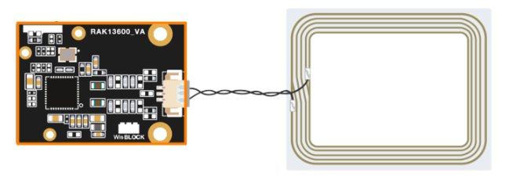
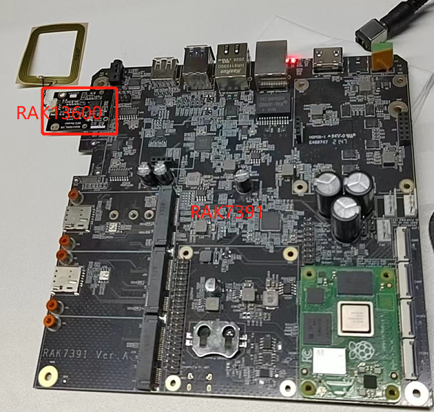
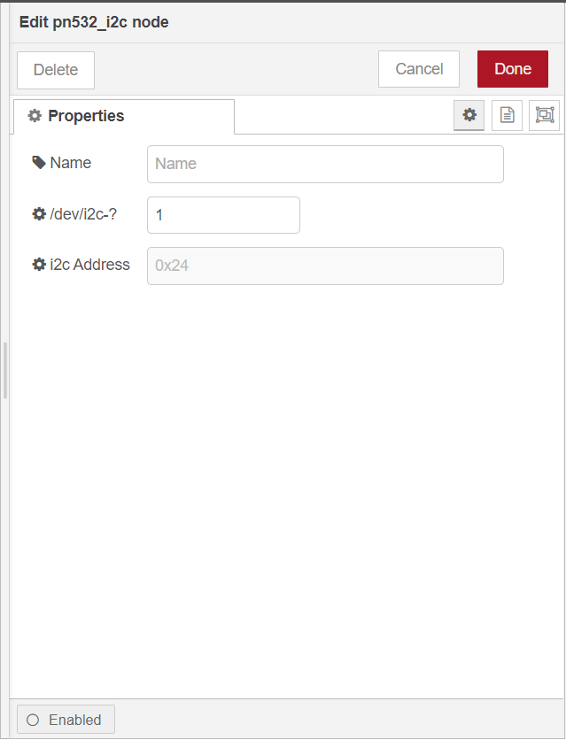
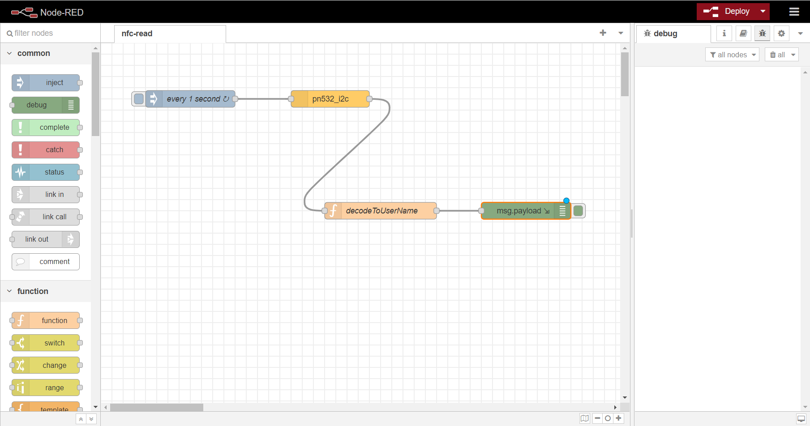

# Extend RAK16001 in RAK7391 board and test it with NodeRed

[TOC]

## 1. Introduction

This guide explains how to create a flow and then use the node **node-red-contrib-pn532-i2c** to test [RAK13600](https://store.rakwireless.com/products/rak13600-wisblock-nfc-reader) that use it to read id of RFID card and transfers the id to owner's name of RFID.  RAK13600 use `i2c-1` of RAK7391 board. 

### 1.1 Requirements

If you use docker to run Node-RED,  you need to ensure that the user has I2C operation permission.


## 2. Preparation

### 2.1. RAK13600

WisBlock NFC Reader RAK13600 enables reading and writing of NFC tags (RFID cards, NFC enabled devices like phones). It is an WisBlock IO module with an external NFC antenna to connect with the NFC devices.


 It needs to connect with NFC antenna as follows:

   


### 2.2. Connection diagram

Connect RAK13600  to RAK7391 board.




### 2.2. Software

Please install `node-red-contrib-pn532-i2c` node with the following commands. If you use docker of Node-RED, you may need to replace `~/.node-red` with `/usr/src/node-red`.

```
git clone -b dev https://git.rak-internal.net/product-rd/gateway/wis-developer/rak7391/node-red-nodes.git
```

```
cp -rf node-red-nodes/node-red-contrib-pn532-i2c ~/.node-red/node_modules
```

```
cd ~/.node-red/node_modules/node-red-contrib-pn532-i2c && npm install
```

**Tips:**  After `node-red-contrib-pn532-i2c` being installed,  **node-red should be restarted**, otherwise, the node cannot be found on the page.

## 3. Configure

- To get  UID of RFID card from PN532 you just need to select the correct settings for your device and trigger the node.

  	
  
  - **Name**
  
    Define the msg name if you wish to change the name displayed on the node.
  
  - **/dev/i2c-?**
  
    Default I2C Bus is 1.  `1` is for `'/dev/i2c-1'`.
  
  - **i2c_Address**
  
    The Address for pn532 is 0x24 which can not be changed. 

## 4. Run example

The example is under `wireless/rak13600` folder in the [`wisblock-node-red`](https://git.rak-internal.net/product-rd/gateway/wis-developer/rak7391/wisblock-node-red/-/tree/dev/) repository. Then you can import the  **rak13600-nfc-read.json** file or just copy and paste the .json file contents into your new flow.

After the import is done, the new flow should look like this:



Hit the **Deploy** button on the top right to deploy the flow.

This is a simple flow  contains four nodes, where `inject` node trigger every 1 seconds,  `pn532_i2c` read id of RFID card, `decodeToUserName` function transfers id to owner of RFID card, and `debug` node print the read result.

The result  is shown as below.


